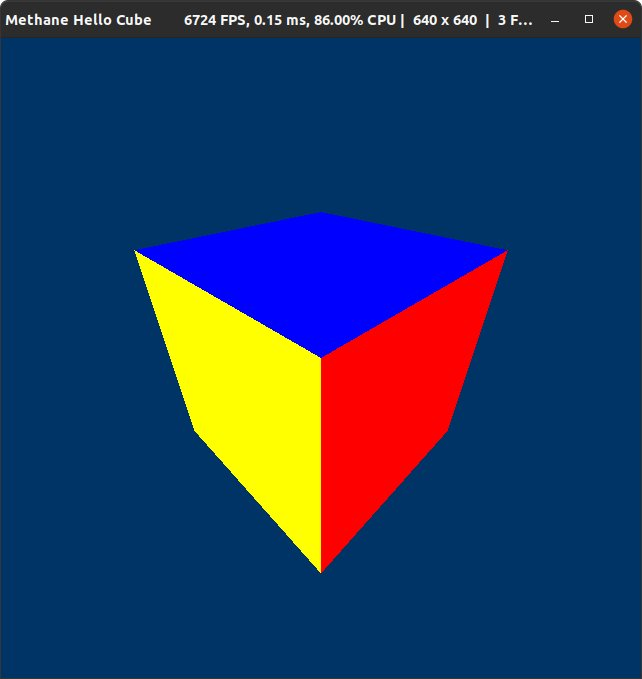
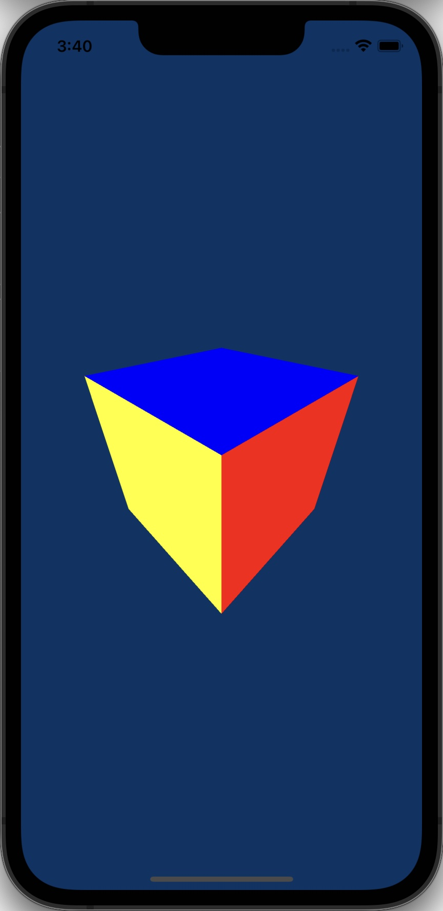

# Hello Cube Tutorial

| <pre><b>Windows (DirectX 12)       </pre></b>                   | <pre><b>Linux (Vulkan)             </pre></b>              | <pre><b>MacOS (Metal)              </pre></b>             | <pre><b>iOS (Metal)</pre></b>                           |
|-----------------------------------------------------------------|------------------------------------------------------------|-----------------------------------------------------------|---------------------------------------------------------|
|  |  |  |  |

This tutorial demonstrates colored cube rendering implemented in just 250 lines of code using Methane Kit:
- [HelloCubeApp.cpp](HelloCubeApp.cpp)
- [Shaders/HelloCube.hlsl](Shaders/HelloCube.hlsl)
- [Shaders/HelloCubeUniforms.h](Shaders/HelloCubeUniforms.h)

The tutorial demonstrates the following Methane Kit features and techniques in addition to those demonstrated in
[Hello Triangle](../01-HelloTriangle):
- **Simple version** (when the macro `UNIFORMS_ENABLED` is not defined):
  - Create vertex and index buffers on the GPU and fill them with data from the CPU.
  - Generate cube mesh vertices and indices data with a custom vertex layout.
  - Use time animation for camera rotation.
  - Create camera view and projection matrices.
  - Transform cube vertices with camera matrices on the CPU and update vertex buffers on the GPU.
- **Uniforms version** (when the macro `UNIFORMS_ENABLED` is defined):
  - Use a root constant uniforms buffer to upload the MVP matrix to the GPU and transform vertices on the GPU in the vertex shader.
  - Use program bindings to bind the uniforms buffer to the graphics pipeline and make it available to shaders.

## Application Controls

Common keyboard controls are enabled by the `Platform` and `Graphics` application controllers:
- [Methane::Platform::AppController](/Modules/Platform/App/README.md#platform-application-controller)
- [Methane::Graphics::AppController, AppContextController](/Modules/Graphics/App/README.md#graphics-application-controllers)

## Simple Cube Vertices Transformation on CPU

### Application and Frame Class Members

Application frame class `HelloCubeFrame` is derived from the base class `Graphics::AppFrame` and extends it with the render 
command list `render_cmd_list`, command list set `execute_cmd_list_set`, and volatile vertex buffer set `vertex_buffer_set` 
used for cube drawing.

```cpp
struct HelloCubeFrame final : AppFrame
{
    Rhi::BufferSet         vertex_buffer_set;
    Rhi::RenderCommandList render_cmd_list;
    Rhi::CommandListSet    execute_cmd_list_set;

    using AppFrame::AppFrame;
};
```

Application class `HelloCubeApp` is derived from the base template class [Graphics::App<HelloCubeFrame>](/Modules/Graphics/App):
- `m_cube_mesh` member of type `CubeMesh<CubeVertex>` generates and holds cube model vertices defined by `CubeVertex` struct with layout which contains positions and colors.
- `m_model_matrix` matrix is used for cube model scaling.
- `m_camera` is perspective camera model which is used to generate view and projection matrices.
- `m_proj_vertices` vertices vector is used to store transformed vertices in projection coordinates,
  which are then transferred to GPU vertex buffer.

```cpp
using GraphicsApp = App<HelloCubeFrame>;
class HelloCubeApp final : public GraphicsApp
{
private:
    struct CubeVertex
    {
        Mesh::Position position;
        Mesh::Color    color;

        inline static const Mesh::VertexLayout layout{
            Mesh::VertexField::Position,
            Mesh::VertexField::Color
        };
    };

    const CubeMesh<CubeVertex> m_cube_mesh{ CubeVertex::layout };
    const hlslpp::float4x4     m_model_matrix = hlslpp::float4x4::scale(15.F);
    Camera                     m_camera;
    std::vector<CubeVertex>    m_proj_vertices;

    ...
};
```

`HelloCubeApp` constructor calls the base constructor `GraphicsApp` with `Graphics::CombinedAppSettings` initialized using the 
helper function `Tutorials::GetGraphicsTutorialAppSettings`, which is called with predefined flags to enable the color buffer 
without depth and enable animations. `m_proj_vertices` is initialized with vertex data taken from the cube mesh generator.

The initial camera orientation is set with `Camera::ResetOrientation` via the `Camera::Orientation` struct with `eye`, `aim`, 
and `up` vectors. Then, we set up the camera rotation animation, which automatically updates the orientation before every 
iteration of update/render. The animation is set up simply by adding a `Data::TimeAnimation` object with a lambda function 
taking the `delta_seconds` argument used to calculate the rotation delta angle around the camera's `up` axis.

```cpp
HelloCubeApp()
    : GraphicsApp(
        []() {
            Graphics::CombinedAppSettings settings = Tutorials::GetGraphicsTutorialAppSettings(g_app_name, Tutorials::AppOptions::GetDefaultWithColorOnlyAndAnim());
            settings.graphics_app.SetScreenPassAccess({});
            return settings;
        }(),
        "Tutorial demonstrating colored rotating cube rendering with Methane Kit.")
{
    m_camera.ResetOrientation({ { 13.0F, 13.0F, 13.0F }, { 0.0F, 0.0F, 0.0F }, { 0.0F, 1.0F, 0.0F } });

    // Setup camera rotation animation
    GetAnimations().emplace_back(Data::MakeTimeAnimationPtr([this](double, double delta_seconds)
    {
        m_camera.Rotate(m_camera.GetOrientation().up, static_cast<float>(delta_seconds * 360.F / 8.F));
        return true;
    }));
}

```

### Graphics Resources Initialization

Application class `HelloCubeApp` keeps frame-independent resources in class members: render state `m_render_state`, 
per-frame vertex buffers, and index buffer used for triangle rendering `m_index_buffer` are initialized in the 
`HelloCubeApp::Init` method. Also, the camera view is resized according to frame size to maintain the correct aspect 
ratio of the projection.

The render state is created with the `GetRenderContext().CreateRenderState(...)` function, similar to the 
[HelloTriangle](../01-HelloTriangle) tutorial. The program is created as part of the state with the 
`GetRenderContext().CreateProgram(...)` function, taking `Rhi::Program::Settings`. This differs from the program 
settings in [HelloTriangle](../01-HelloTriangle) in the configuration of `Rhi::ProgramInputBufferLayouts`. In this 
tutorial, we use a single input vertex buffer with interleaved positions and colors, described by 
`Rhi::Program::InputBufferLayout` with an array of HLSL vertex shader input semantics, corresponding to the `CubeVertex` 
struct layout.

```cpp
class HelloCubeApp final : public GraphicsApp
{
private:
    ...

    Rhi::CommandQueue m_render_cmd_queue;
    Rhi::RenderState  m_render_state;
    Rhi::Buffer       m_index_buffer;
    
public:
    ...

    void Init() override
    {
        using enum rhi::ShaderType;
    
        GraphicsApp::Init();

        m_camera.Resize(GetRenderContext().GetSettings().frame_size);

        // Create render state with program
        m_render_state = GetRenderContext().CreateRenderState(
            Rhi::RenderState::Settings
            {
                GetRenderContext().CreateProgram(
                    Rhi::Program::Settings
                    {
                        Rhi::Program::ShaderSet
                        {
                            { Vertex, { Data::ShaderProvider::Get(), { "HelloCube", "CubeVS" } } },
                            { Pixel,  { Data::ShaderProvider::Get(), { "HelloCube", "CubePS" } } },
                        },
                        Rhi::ProgramInputBufferLayouts
                        {
                            Rhi::ProgramInputBufferLayout
                            {
                                Rhi::Program::InputBufferLayout::ArgumentSemantics { "POSITION" , "COLOR" }
                            }
                        },
                        Rhi::ProgramArgumentAccessors{ },
                        GetScreenRenderPattern().GetAttachmentFormats()
                    }
                ),
                GetScreenRenderPattern()
            }
        );

        ...
    }

    ...
};
```

Constant index buffer is created with `GetRenderContext().CreateBuffer()` and settings initialized using 
`Rhi::BufferSettings::ForIndexBuffer(...)` function, which takes index data size in bytes and index format. 
The data of the index buffer is set with the `IBuffer::SetData` call, which takes an array of sub-resources.
In the case of the index buffer, we need to provide only one default sub-resource with a data pointer and data size.

Volatile vertex buffers are created for each frame with `GetRenderContext().CreateBuffer(...)` and settings initialized 
using `Rhi::BufferSettings::ForVertexBuffer(...)` so that they can be updated independently: while one vertex buffer data 
is updated for the current frame, other frames are rendered using their own dedicated vertex buffers. Buffers are created 
in volatile mode, which enables more effective synchronous data updates (aka map-updates). Each vertex buffer is 
encapsulated in the buffer set with `Rhi::BufferSet(Rhi::BufferType::Vertex, { vertex_buffer })`, used for render command 
list encoding in `SetVertexBuffers(...)`.

Render command lists are created for each frame using the `m_render_cmd_queue.CreateRenderCommandList(...)` function, 
the same as in the [HelloTriangle](../01-HelloTriangle) tutorial.

```cpp
class HelloTriangleApp final : public GraphicsApp
{
    ...

    void Init() override
    {
        ...
        
        m_render_cmd_queue = GetRenderContext().GetRenderCommandKit().GetQueue();

        // Create index buffer for cube mesh
        m_index_buffer = GetRenderContext().CreateBuffer(Rhi::BufferSettings::ForIndexBuffer(m_cube_mesh.GetIndexDataSize(), GetIndexFormat(m_cube_mesh.GetIndex(0))));
        m_index_buffer.SetData(m_render_cmd_queue, {
            reinterpret_cast<Data::ConstRawPtr>(m_cube_mesh.GetIndices().data()),
            m_cube_mesh.GetIndexDataSize()
        });

        // Create per-frame command lists
        for(HelloCubeFrame& frame : GetFrames())
        {
            // Create vertex buffers for each frame
            Rhi::Buffer vertex_buffer = GetRenderContext().CreateBuffer(Rhi::BufferSettings::ForVertexBuffer(m_cube_mesh.GetVertexDataSize(), m_cube_mesh.GetVertexSize(), true));
            frame.vertex_buffer_set = Rhi::BufferSet(Rhi::BufferType::Vertex, { vertex_buffer });

            // Create command list for rendering
            frame.render_cmd_list = m_render_cmd_queue.CreateRenderCommandList(frame.screen_pass);
            frame.execute_cmd_list_set = Rhi::CommandListSet({ frame.render_cmd_list.GetInterface() }, frame.index);
        }

        GraphicsApp::CompleteInitialization();
    }
}
```

### Frame Rendering Cycle

Each rendering cycle is started with the `GraphicsApp::Update()` method used for updating the data for frame rendering. This
method is called just before `GraphicsApp::Render()` so that frame data is prepared while previous frames are rendered on the
GPU, just before waiting for the current frame buffer to be released from the previous rendering cycle. For simplicity, in this
tutorial, we transform vertex positions from model to projection coordinates on the CPU, while usually, it is done on the GPU.
This allows us to avoid using uniform buffers and program bindings for educational purposes. Vertex positions are updated using
the model-view-projection (MVP) matrix calculated as the multiplication of the model scaling matrix and the camera view-projection
matrix. Projected positions in `m_proj_vertices` are calculated as the multiplication of the original positions by the MVP matrix
and normalization by the W-coordinate. Vertex buffer data is updated on the GPU with the `frame.vertex_buffer_set[0].SetData(...)`
call.

```cpp
class HelloCubeApp final : public GraphicsApp
{
    ...

    bool Update() override
    {
        if (!GraphicsApp::Update())
            return false;

        // Update vertex buffer with camera Model-View-Projection matrix applied on CPU
        const hlslpp::float4x4 mvp_matrix = hlslpp::mul(m_model_matrix, m_camera.GetViewProjMatrix());
        for(size_t vertex_index = 0; vertex_index < m_proj_vertices.size(); ++vertex_index)
        {
            const hlslpp::float4 orig_position_vec(m_cube_mesh.GetVertices()[vertex_index].position.AsHlsl(), 1.F);
            const hlslpp::float4 proj_position_vec = hlslpp::mul(orig_position_vec, mvp_matrix);
            m_proj_vertices[vertex_index].position = Mesh::Position(proj_position_vec.xyz / proj_position_vec.w);
        }
        
        // Update vertex buffer with vertices in camera's projection view
        frame.vertex_buffer_set[0].SetData(m_render_cmd_queue, {
            reinterpret_cast<Data::ConstRawPtr>(m_proj_vertices.data()), // NOSONAR
            m_cube_mesh.GetVertexDataSize()
        });

        return true;
    }

    ...
};
```

Rendering is performed in the overridden `HelloCubeApp::Render` method. Scene rendering starts strictly after the base 
graphics application rendering logic is completed in `GraphicsApp::Render()`, as it waits for the previous iteration of 
the rendering cycle to complete and for the availability of all frame resources. Then, current frame resources are 
requested with `GraphicsApp::GetCurrentFrame()` and used for render commands encoding.

Cube rendering is done similarly to the triangle rendering in the previous tutorial, with the only difference being the 
setting of vertex and index buffers with `Rhi::RenderCommandList::SetVertexBuffers(...)` and 
`Rhi::RenderCommandList::SetIndexBuffers(...)` encoded before the `Rhi::RenderCommandList::DrawIndexed(...)` call. Note 
that the number of vertices is not passed explicitly for `DrawIndexed`, but is taken from the number of indices in the 
index buffer.

Execution of GPU rendering is started with the `Rhi::CommandQueue::Execute(...)` method called on the same command queue 
which was used to create the command list submitted for execution. The frame buffer with the result image is presented 
by the swap-chain with the `Rhi::RenderContext::Present()` method call.

```cpp
class HelloCubeApp final : public GraphicsApp
{
    ...

    bool Render() override
    {
        if (!GraphicsApp::Render())
            return false;

        const HelloCubeFrame& frame = GetCurrentFrame();

        // Issue commands for cube rendering
        META_DEBUG_GROUP_VAR(s_debug_group, "Cube Rendering");
        frame.render_cmd_list.ResetWithState(m_render_state, &s_debug_group);
        frame.render_cmd_list.SetViewState(GetViewState());
        frame.render_cmd_list.SetVertexBuffers(frame.vertex_buffer_set);
        frame.render_cmd_list.SetIndexBuffer(m_index_buffer);
        frame.render_cmd_list.DrawIndexed(Rhi::RenderPrimitive::Triangle);
        frame.render_cmd_list.Commit();

        // Execute command list on render queue and present frame to screen
        m_render_cmd_queue.Execute(frame.execute_cmd_list_set);
        GetRenderContext().Present();

        return true;
    }
};
```

Graphics render loop is started from `main(...)` entry function using `GraphicsApp::Run(...)` method which is also
parsing command line arguments.

```cpp
int main(int argc, const char* argv[])
{
    return HelloTriangleApp().Run({ argc, argv });
}
```

### Frame Resizing

Additionally, the camera view needs to be resized along with the window in the overridden method `HelloCubeApp::Resize(...)`
so that the projected image aspect ratio will be the same as the window.

```cpp
class HelloCubeApp final : public GraphicsApp
{
    ...

    bool Resize(const FrameSize& frame_size, bool is_minimized) override
    {
        // Resize screen color and depth textures
        if (!GraphicsApp::Resize(frame_size, is_minimized))
            return false;

        m_camera.Resize(frame_size);
        return true;
    }

    ...
}
```

### Simple Cube Rendering Shaders

This tutorial uses a simple HLSL shader \[`Shaders/HelloCube.hlsl`\]. Note that the semantic names of the `VSInput` structure
members, passed as an argument to the vertex shader function `CubeVS(VSInput input)`, match the input buffer layout arguments
`Rhi::ProgramInputBufferLayout::ArgumentSemantics{ "POSITION", "COLOR" }` passed in the settings of the `CreateProgram(...)`
call and also correspond to the `CubeVertex` struct layout.

```cpp
struct VSInput
{
    float3 position : POSITION;
    float3 color    : COLOR;
};

struct PSInput
{
    float4 position : SV_POSITION;
    float4 color    : COLOR;
};

PSInput CubeVS(VSInput input)
{
    PSInput output;
    output.position = float4(input.position, 1.F);
    output.color    = float4(input.color, 1.F);
    return output;
}

float4 CubePS(PSInput input) : SV_TARGET
{
    return input.color;
}
```

## Using Uniforms Buffer to Transform Cube Vertices on GPU

### Add Uniform Buffer in Vertex Shader

Now we modify cube rendering using uniform buffer containing single `struct Uniforms` with model-view-projection (MVP)
`float4x4` matrix, which is defined in header file [Shaders/HelloCubeUniforms.h](Shaders/HelloCubeUniforms.h).

```cpp
struct Uniforms
{
    float4x4 mvp_matrix;
};
```

Shaders source file \[`Shaders/HelloCube.hlsl`\] includes the uniforms header and defines a global variable `g_uniforms` of type 
`ConstantBuffer<Uniforms>`, which represents our uniform buffer. Note that the uniforms buffer is bound to register `b0` and is 
marked with the `META_ARG_FRAME_CONSTANT` space modifier, allowing different uniform buffer resources to be used for rendering 
different frames in flight. The MVP matrix from this buffer is used in the vertex shader `CubeVS` to transform vertices from 
model to projection coordinates on the GPU.

```cpp
#ifdef UNIFORMS_ENABLED
#include "HelloCubeUniforms.h"
#endif

...

#ifdef UNIFORMS_ENABLED
ConstantBuffer<Uniforms> g_uniforms : register(b0, META_ARG_FRAME_CONSTANT);
#endif

PSInput CubeVS(VSInput input)
{
    PSInput output;
#ifdef UNIFORMS_ENABLED
    output.position = mul(float4(input.position, 1.F), g_uniforms.mvp_matrix);
#else
    output.position = float4(input.position, 1.F);
#endif
    output.color    = float4(input.color, 1.F);
    return output;
}
```

In order to compile vertex shader with `UNIFORMS_ENABLED` macro definition, we add it to shader types
description in `CMakeLists.txt` inside `add_methane_shaders_source` function.

```cmake
add_methane_shaders_source(
    TARGET MethaneHelloCubeUniforms
    SOURCE Shaders/HelloCube.hlsl
    VERSION 6_0
    TYPES
        vert=CubeVS:UNIFORMS_ENABLED
        frag=CubePS
)
```

### Add Uniforms Buffer in Application Code

In C++ source file `HelloCubeApp.cpp`, the uniform header is included inside the namespace `hlslpp` to reuse matrix type 
definitions from `hlsl++.h`. It is wrapped in `#pragma pack(push, 16)` to use the same structure fields memory alignment 
as in HLSL shaders.

```cpp
namespace hlslpp
{
#pragma pack(push, 16)
#include "Shaders/HelloCubeUniforms.h"
#pragma pack(pop)
}
```

Frame structure contains `Rhi::ProgramBindings` member `program_bindings` required to set uniforms as root constant to shader uniforms.
Corresponding `uniforms_binding_ptr` member is used to save a pointer to the uniforms argument binding `Rhi::IProgramArgumentBinding*`
used to efficiently set the root constant buffer data in `HelloCubeApp::Update()` method.

```cpp
struct HelloCubeFrame final : AppFrame
{
    Rhi::ProgramBindings          program_bindings;
    Rhi::IProgramArgumentBinding* uniforms_binding_ptr = nullptr;
    
    ...
};
```

The compiled vertex shader is loaded from resources with respect to the macro definition `UNIFORMS_ENABLED`, which was 
used to compile it at build-time using the CMake function `add_methane_shaders_source`. `Rhi::ProgramArgumentAccessors{ ... }` 
overrides program argument accessor definitions. The uniform argument `g_uniforms` of the vertex shader is defined as a root 
constant buffer automatically managed by the program with a frame-constant access pattern. Note that the `FRAME_CONSTANT` 
access pattern defined in C++ should match the `META_ARG_FRAME_CONSTANT` space modifier defined in HLSL.

```cpp
class HelloCubeApp final : public GraphicsApp
{
    ...
    
    void Init() override
    {
        ...

        const Rhi::Shader::MacroDefinitions vertex_shader_definitions{ { "UNIFORMS_ENABLED", "" } };
        m_render_state = GetRenderContext().CreateRenderState(
            Rhi::RenderState::Settings
            {
                GetRenderContext().CreateProgram(
                    Rhi::Program::Settings
                    {
                        Rhi::Program::ShaderSet
                        {
                            { Vertex, { Data::ShaderProvider::Get(), { "HelloCube", "CubeVS" }, vertex_shader_definitions } },
                            { Pixel,  { Data::ShaderProvider::Get(), { "HelloCube", "CubePS" } } },
                        },
                        ...
                        Rhi::ProgramArgumentAccessors
                        {
                            META_PROGRAM_ARG_ROOT_BUFFER_FRAME_CONSTANT(Vertex, "g_uniforms")
                        },
                        ...
                    }
                ),
                GetScreenRenderPattern()
            }
        );
        
        ...
    }
};
```

We create a single vertex buffer `vertex_buffer`, as its content will not change during frame rendering, fill it with cube 
vertices data, and place it in the vertex buffer set `m_vertex_buffer_set`. Program bindings are created for each frame in 
`frame.program_bindings` with empty argument initializers, and a pointer to the `g_uniforms` argument binding is saved in 
`frame.uniforms_binding_ptr` to use later during frame updates in the `HelloCubeApp::Update()` method for setting data to 
the underlying root constant buffer.

```cpp
class HelloCubeApp final : public GraphicsApp
{
    ...
    
    void Init() override
    {
        ...

        // Create constant vertex buffer
        Rhi::Buffer vertex_buffer = GetRenderContext().CreateBuffer(Rhi::BufferSettings::ForVertexBuffer(m_cube_mesh.GetVertexDataSize(), m_cube_mesh.GetVertexSize()));
        vertex_buffer.SetData(m_render_cmd_queue, {
            reinterpret_cast<Data::ConstRawPtr>(m_cube_mesh.GetVertices().data()),
            m_cube_mesh.GetVertexDataSize()
        });
        m_vertex_buffer_set = Rhi::BufferSet(Rhi::BufferType::Vertex, { vertex_buffer });

        // Create per-frame command lists
        for(HelloCubeFrame& frame : GetFrames())
        {
            frame.program_bindings = m_render_state.GetProgram().CreateBindings({ }, frame.index);
            frame.uniforms_binding_ptr = &frame.program_bindings.Get({ Vertex, "g_uniforms" });
            
            ...
        }
    }
    
    ...
};
```

### Use Uniforms Buffer for Cube Rendering

In the `HelloCubeApp::Update()` method, we update the MVP matrix in the `Uniforms` structure using the argument binding with 
the `frame.uniforms_binding_ptr->SetRootConstant(...)` method. Uniform data is copied to the underlying root constant buffer 
managed by the program instance and is automatically uploaded to the GPU just before frame rendering starts. Note that the 
matrix is transposed to match the HLSL default row-vector, column-major matrix layout.

```cpp
class HelloCubeApp final : public GraphicsApp
{
    ...
    
    bool Update() override
    {
        if (!GraphicsApp::Update())
            return false;
        
        const hlslpp::float4x4 mvp_matrix = hlslpp::mul(m_model_matrix, m_camera.GetViewProjMatrix());
        const hlslpp::Uniforms shader_uniforms{ hlslpp::transpose(mvp_matrix) };
        
        const HelloCubeFrame& frame = GetCurrentFrame();
        frame.uniforms_binding_ptr->SetRootConstant(Rhi::RootConstant(shader_uniforms));
    }
    
    ...
};
```

Uniform buffer is bound to graphics pipeline with `frame.render_cmd_list.SetProgramBindings(...)` call
using previously created program bindings object `frame.program_bindings` in `HelloCubeApp::Render()` method.

```cpp
class HelloCubeApp final : public GraphicsApp
{
    ...
    
    bool Render() override
    {
        if (!GraphicsApp::Render())
            return false;

        const HelloCubeFrame& frame = GetCurrentFrame();

        // Issue commands for cube rendering
        META_DEBUG_GROUP_VAR(s_debug_group, "Cube Rendering");
        frame.render_cmd_list.ResetWithState(m_render_state, &s_debug_group);
        frame.render_cmd_list.SetViewState(GetViewState());
        frame.render_cmd_list.SetProgramBindings(frame.program_bindings); // <<< Bind uniforms root constant buffer
        frame.render_cmd_list.SetVertexBuffers(m_vertex_buffer_set);
        frame.render_cmd_list.SetIndexBuffer(m_index_buffer);
        frame.render_cmd_list.DrawIndexed(Rhi::RenderPrimitive::Triangle);
        frame.render_cmd_list.Commit();

        // Execute command list on render queue and present frame to screen
        m_render_cmd_queue.Execute(frame.execute_cmd_list_set);
        GetRenderContext().Present();

        return true;
    }
};
```

Instead of transforming cube vertices on the CPU and uploading all of them to the GPU, we now calculate and upload a single 
MVP matrix to the GPU using a root constant buffer. We bind it to the render pipeline using program bindings and use it to 
transform cube vertices to projection coordinates on the GPU in the vertex shader.

## CMake Build Configuration

CMake build configuration [CMakeLists.txt](CMakeLists.txt) of the application.

```cmake
add_methane_application(
    TARGET MethaneHelloCube
    NAME "Methane Hello Cube"
    DESCRIPTION "Tutorial demonstrating colored rotating cube rendering with Methane Kit."
    INSTALL_DIR "Apps"
    SOURCES
        HelloCubeApp.cpp
)

add_methane_shaders_source(
    TARGET MethaneHelloCube
    SOURCE Shaders/HelloCube.hlsl
    VERSION 6_0
    TYPES
        vert=CubeVS:UNIFORMS_ENABLED
        frag=CubePS
)

add_methane_shaders_library(MethaneHelloCube)

target_link_libraries(MethaneHelloCube
    PRIVATE
        MethaneAppsCommon
)
```

## Continue learning

Continue learning Methane Graphics programming in the next tutorial [Textured Cube](../03-TexturedCube), 
which is demonstrating textured cube rendering with phong lighting in pixel shader.
