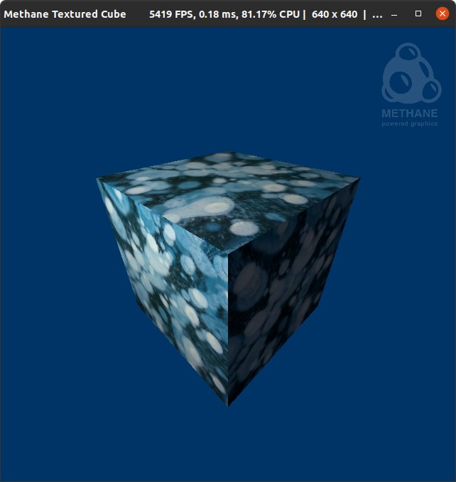
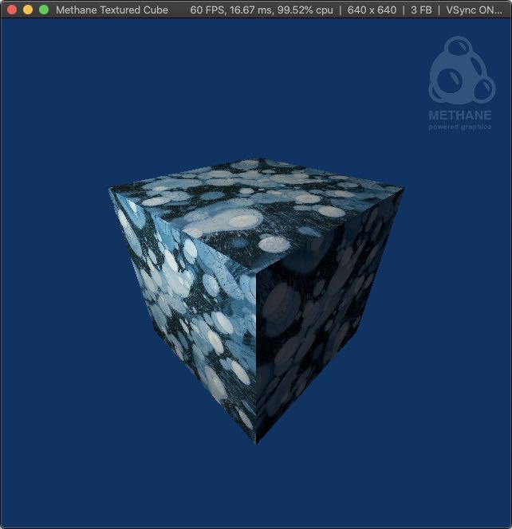
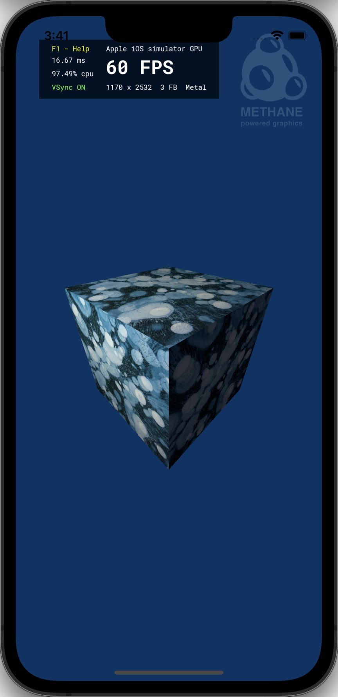

# Textured Cube Tutorial

| <pre><b>Windows (DirectX 12)       </pre></b>                         | <pre><b>Linux (Vulkan)             </pre></b>                    | <pre><b>MacOS (Metal)              </pre></b>                   | <pre><b>iOS (Metal)</pre></b>                                 |
|-----------------------------------------------------------------------|------------------------------------------------------------------|-----------------------------------------------------------------|---------------------------------------------------------------|
|  |  |  |  |

This tutorial demonstrates textured cube rendering using Methane Kit:
- [TexturedCubeApp.h](TexturedCubeApp.h)
- [TexturedCubeApp.cpp](TexturedCubeApp.cpp)
- [Shaders/TexturedCubeUniforms.h](Shaders/TexturedCubeUniforms.h)
- [Shaders/TexturedCube.hlsl](Shaders/TexturedCube.hlsl)

Tutorial demonstrates the following Methane Kit features additionally to demonstrated in [Hello Cube](../02-HelloCube):
- Use base user interface application for graphics UI overlay rendering
- Create 2D textures with data loaded data from images and creating samplers
- Bind buffers and textures to program arguments and configure argument access modifiers
- SRGB gamma-correction support in textures loader and color transformation in pixel shaders

## Application Controls

Common keyboard controls are enabled by the `Platform`, `Graphics` and `UserInterface` application controllers:
- [Methane::Platform::AppController](/Modules/Platform/App/README.md#platform-application-controller)
- [Methane::Graphics::AppController, AppContextController](/Modules/Graphics/App/README.md#graphics-application-controllers)
- [Methane::UserInterface::AppController](/Modules/UserInterface/App/README.md#user-interface-application-controllers)

## Application and Frame Class Definitions

Let's start from the application header file [TexturedCubeApp.h](TexturedCubeApp.h) which declares
application class `TexturedCubeApp` derived from the base class `UserInterface::App<TexturedCubeFrame>`
and frame class `TexturedCubeFrame` derived from the base class `Graphics::AppFrame` 
similar to how it was done in [HelloCube](../02-HelloCube) tutorial.
The difference here is the [UserInterface::App](../../Modules/UserInterface/App) base class used instead of
[Graphics::App](../../Modules/Graphics/App) class for visualization of optional UI elements and rendering it in screen overlay.

```cpp
#pragma once

#include <Methane/Kit.h>
#include <Methane/UserInterface/App.hpp>

namespace Methane::Tutorials
{

...

namespace gfx = Methane::Graphics;

struct TexturedCubeFrame final : gfx::AppFrame
{
    // Volatile frame-dependent resources for rendering to dedicated frame-buffer in swap-chain
    ...

    using gfx::AppFrame::AppFrame;
};

using UserInterfaceApp = UserInterface::App<TexturedCubeFrame>;

class TexturedCubeApp final : public UserInterfaceApp
{
public:
    TexturedCubeApp();
    ~TexturedCubeApp() override;

    // GraphicsApp overrides
    void Init() override;
    bool Resize(const gfx::FrameSize& frame_size, bool is_minimized) override;
    bool Update() override;
    bool Render() override;

protected:
    // IContextCallback override
    void OnContextReleased(gfx::Context& context) override;

private:
    bool Animate(double elapsed_seconds, double delta_seconds);

    // Global state members, rendering primitives and graphics resources 
    ...
};

} // namespace Methane::Tutorials
```

Methane Kit is designed to use [deferred rendering approach](https://docs.microsoft.com/en-us/windows/win32/direct3d11/overviews-direct3d-11-render-multi-thread-render) with triple buffering for minimized waiting for frame-buffers getting
released in swap-chain.
In order to prepare graphics resource states ahead of next frames rendering, `TexturedCubeFrame` structure keeps 
volatile frame dependent resources used for rendering to dedicated frame-buffer. It includes uniforms buffer and 
program bindings objects as well as render command list for render commands encoding
and a set of command lists submitted for execution on GPU via command queue.

```cpp
struct TexturedCubeFrame final : Graphics::AppFrame
{
    Ptr<gfx::IBuffer>           uniforms_buffer_ptr;
    Ptr<gfx::IProgramBindings>  program_bindings_ptr;
    Ptr<gfx::RenderCommandList> render_cmd_list_ptr;
    Ptr<gfx::CommandListSet>    execute_cmd_list_set_ptr;

    using gfx::AppFrame::AppFrame;
};
```

[Shaders/TexturedCubeUniforms.h](Shaders/TexturedCubeUniforms.h) header contains declaration of `Constants` and `Uniforms` structures with data saved in constants buffer `m_const_buffer_ptr` field of `TexturedCubeApp` class below and uniforms buffer `uniforms_buffer_ptr` field of `TexturedCubeFrame` structure above.
Structures from this header are reused in [HLSL shader code](#textured-cube-shaders) and 16-byte packing in C++ is used
gor common memory layout in HLSL and C++.

Uniform structures in [Shaders/TexturedCubeUniforms.h](Shaders/TexturedCubeUniforms.h):
```hlsl
struct Constants
{
    float4 light_color;
    float  light_power;
    float  light_ambient_factor;
    float  light_specular_factor;
};

struct Uniforms
{
    float3   eye_position;
    float3   light_position;
    float4x4 mvp_matrix;
    float4x4 model_matrix;
};
```

```cpp
namespace hlslpp
{
#pragma pack(push, 16)
#include "Shaders/TexturedCubeUniforms.h"
#pragma pack(pop)
}

class TexturedCubeApp final : public UserInterfaceApp
{
    ...

private:
    const float             m_cube_scale = 15.F;
    const hlslpp::Constants m_shader_constants{
        { 1.F, 1.F, 0.74F, 1.F },  // - light_color
        700.F,                     // - light_power
        0.04F,                     // - light_ambient_factor
        30.F                       // - light_specular_factor
    };
    hlslpp::Uniforms        m_shader_uniforms { };
    gfx::Camera             m_camera;
    Ptr<gfx::IRenderState>  m_render_state_ptr;
    Ptr<gfx::IBufferSet>    m_vertex_buffer_set_ptr;
    Ptr<gfx::IBuffer>       m_index_buffer_ptr;
    Ptr<gfx::IBuffer>       m_const_buffer_ptr;
    Ptr<gfx::ITexture>      m_cube_texture_ptr;
    Ptr<gfx::ISampler>      m_texture_sampler_ptr;

    const gfx::IResource::SubResources m_shader_uniforms_subresources{
        { reinterpret_cast<Data::ConstRawPtr>(&m_shader_uniforms), sizeof(hlslpp::Uniforms) }
    };
};
```

## Application Construction and Initialization

Application is created with constructor defined in [TexturedCubeApp.cpp](TexturedCubeApp.cpp).
Graphics application settings are generated by utility function `GetGraphicsTutorialAppSettings(...)` 
defined in [Methane/Samples/AppSettings.hpp](../../Common/Include/Methane/Samples/AppSettings.hpp).
Camera orientation is reset to the default state. Camera and light rotating animation is added to the animation pool bound to 
`TexturedCubeApp::Animate` function described below.

```cpp
TexturedCubeApp::TexturedCubeApp()
    : UserInterfaceApp(
        GetGraphicsTutorialAppSettings("Methane Textured Cube", g_default_app_options_color_only_and_anim), {},
        "Methane tutorial of textured cube rendering")
{
    m_shader_uniforms.light_position = hlslpp::float3(0.F, 20.F, -25.F);
    m_camera.ResetOrientation({ { 13.0F, 13.0F, -13.0F }, { 0.0F, 0.0F, 0.0F }, { 0.0F, 1.0F, 0.0F } });

    m_shader_uniforms.model_matrix = hlslpp::float4x4::scale(m_cube_scale);

    // Setup animations
    GetAnimations().emplace_back(std::make_shared<Data::TimeAnimation>(std::bind(&TexturedCubeApp::Animate, this, std::placeholders::_1, std::placeholders::_2)));
}
```

## Graphics Resources Initialization

Cube vertex structure is defined with fields for position, normal and texture coordinates, as well auxiliary
layout description used for automatic mesh vertex data generation.

```cpp
struct CubeVertex
{
    gfx::Mesh::Position position;
    gfx::Mesh::Normal   normal;
    gfx::Mesh::TexCoord texcoord;

    inline static const gfx::Mesh::VertexLayout layout{
        gfx::Mesh::VertexField::Position,
        gfx::Mesh::VertexField::Normal,
        gfx::Mesh::VertexField::TexCoord,
    };
};
```

Initialization of the `UserInterface::App` resources is done with base class `UserInterface::Init()` call.
Initial camera projection size is set with `m_camera.Resize(...)` call by passing frame size from the context settings,
initialized in the base class `Graphics::App::InitContext(...)`.

Vertices and indices data of the cube mesh are generated with `Graphics::CubeMesh<CubeVertex>` template class defined
using vertex structure with layout description defined above. Vertex and index buffers are created with 
`Graphics::IBuffer::CreateVertexBuffer(...)` and `Graphics::IBuffer::CreateIndexBuffer(...)` factory functions and generated data
is filled to buffers with `Graphics::IBuffer::SetData(...)` call, which is taking a collection of sub-resources,
where every subresource is derived from `Data::Chunk` and describes a continuous memory range 
as well as `Graphics::IResource::SubResource::Index` which is pointing to related part of resource.

Similarly constants buffer is created with `Graphics::IBuffer::CreateConstantBuffer(...)` and filled with data from member
variable `m_shader_constants`.

```cpp
void TexturedCubeApp::Init()
{
    UserInterfaceApp::Init();

    m_camera.Resize(GetRenderContext().GetSettings().frame_size);

    // Create vertex buffer for cube mesh
    const gfx::CubeMesh<CubeVertex> cube_mesh(CubeVertex::layout);
    const Data::Size vertex_data_size = cube_mesh.GetVertexDataSize();
    const Data::Size vertex_size      = cube_mesh.GetVertexSize();
    Ptr<gfx::IBuffer> vertex_buffer_ptr = gfx::IBuffer::CreateVertexBuffer(GetRenderContext(), vertex_data_size, vertex_size);
    vertex_buffer_ptr->SetData(
        { { reinterpret_cast<Data::ConstRawPtr>(cube_mesh.GetVertices().data()), vertex_data_size } },
        render_cmd_queue
    );
    m_vertex_buffer_set_ptr = gfx::IBufferSet::CreateVertexBuffers({ *vertex_buffer_ptr });

    // Create index buffer for cube mesh
    const Data::Size index_data_size = cube_mesh.GetIndexDataSize();
    m_index_buffer_ptr = gfx::IBuffer::CreateIndexBuffer(GetRenderContext(), index_data_size, gfx::GetIndexFormat(cube_mesh.GetIndex(0)));
    m_index_buffer_ptr->SetData(
        { { reinterpret_cast<Data::ConstRawPtr>(cube_mesh.GetIndices().data()), index_data_size } },
        render_cmd_queue
    );

    // Create constants buffer for frame rendering
    const auto constants_data_size = static_cast<Data::Size>(sizeof(m_shader_constants));
    m_const_buffer_ptr = gfx::IBuffer::CreateConstantBuffer(GetRenderContext(), constants_data_size);
    m_const_buffer_ptr->SetData(
        { { reinterpret_cast<Data::ConstRawPtr>(&m_shader_constants), constants_data_size } },
        render_cmd_queue
    );

    ...
}
```

Cube face texture is created using `Graphics::ImageLoader` class through the instance provided by 
`Graphics::App::GetImageLoader()` function. Texture is loaded from JPEG image embedded in application resources
by path in embedded file system `MethaneBubbles.jpg`. Image is added to application resources in build time and
[configured in CMakeLists.txt](#cmake-build-configuration). `Graphics::ImageLoader::Options` is passed to
image loading function to request mipmaps generation and using SRGB texture format.

ISampler object is created with `Graphics::ISampler::Create(...)` function which defines
parameters of texture sampling from shader.

```cpp
void TexturedCubeApp::Init()
{
    ...

    // Load texture image from file
    using namespace magic_enum::bitwise_operators;
    const gfx::ImageLoader::Options image_options = gfx::ImageLoader::Options::Mipmapped
                                                  | gfx::ImageLoader::Options::SrgbColorSpace;
    m_cube_texture_ptr = GetImageLoader().LoadImageToTexture2D(render_cmd_queue, "MethaneBubbles.jpg", image_options, "Cube Face Texture");

    // Create sampler for image texture
    m_texture_sampler_ptr = gfx::ISampler::Create(GetRenderContext(),
        gfx::ISampler::Settings
        {
            gfx::ISampler::Filter  { gfx::ISampler::Filter::MinMag::Linear },
            gfx::ISampler::Address { gfx::ISampler::Address::Mode::ClampToEdge }
        }
    );

    ...
}
```

`Graphics::Program` object is created in `Graphics::IRenderState::Settings` structure using `Graphics::IProgram::Create(...)` factory function.
Vertex and Pixel shaders are created and loaded from embedded resources as pre-compiled byte-code.
Program settings also includes additional description `Graphics::ProgramArgumentAccessors` of program arguments bound to graphics resources.
Argument description define specific access modifiers for program arguments used in `Graphics::IProgramBindings` object.
Also it is important to note that render state settings enables depth testing for correct rendering of cube faces.
Finally, render state is created using filled settings structure with `Graphics::IRenderState::Create(...)` factory function.

```cpp
void TexturedCubeApp::Init()
{
    ...

    // Create render state with program
    m_render_state_ptr = gfx::IRenderState::Create(GetRenderContext(),
        gfx::IRenderState::Settings
        {
            gfx::IProgram::Create(GetRenderContext(),
                gfx::IProgram::Settings
                {
                    gfx::IProgram::Shaders
                    {
                        gfx::IShader::CreateVertex(GetRenderContext(), { Data::ShaderProvider::Get(), { "TexturedCube", "CubeVS" } }),
                        gfx::IShader::CreatePixel( GetRenderContext(), { Data::ShaderProvider::Get(), { "TexturedCube", "CubePS" } }),
                    },
                    gfx::ProgramInputBufferLayouts
                    {
                        gfx::IProgram::InputBufferLayout
                        {
                            gfx::IProgram::InputBufferLayout::ArgumentSemantics { cube_mesh.GetVertexLayout().GetSemantics() }
                        }
                    },
                    gfx::ProgramArgumentAccessors
                    {
                        { { gfx::ShaderType::All,   "g_uniforms"  }, gfx::ProgramArgumentAccessor::Type::FrameConstant },
                        { { gfx::ShaderType::Pixel, "g_constants" }, gfx::ProgramArgumentAccessor::Type::Constant },
                        { { gfx::ShaderType::Pixel, "g_texture"   }, gfx::ProgramArgumentAccessor::Type::Constant },
                        { { gfx::ShaderType::Pixel, "g_sampler"   }, gfx::ProgramArgumentAccessor::Type::Constant },
                    },
                    GetScreenRenderPattern().GetAttachmentFormats()
                }
            ),
            GetScreenRenderPatternPtr()
        }
    );

    ...
}
```

Final part of initialization is related to frame-dependent resources, creating independent resource objects for each frame in swap-chain:
- Create uniforms buffer with `IBuffer::CreateConstantBuffer(...)` function.
- Create program arguments to resources bindings with `IProgramBindings::Create(..)` function.
- Create rendering command list with `RenderCommandList::Create(...)` and 
create set of command lists with `CommandListSet::Create(...)` for execution in command queue.

Finally at the end of `Init()` function `App::CompleteInitialization()` is called to complete graphics
resources initialization to prepare for rendering. It uploads graphics resources to GPU and initializes shader bindings on GPU.

```cpp
void TexturedCubeApp::Init()
{    
    ...

    // Create frame buffer resources
    const auto uniforms_data_size = static_cast<Data::Size>(sizeof(m_shader_uniforms));
    for(TexturedCubeFrame& frame : GetFrames())
    {
        // Create uniforms buffer with volatile parameters for frame rendering
        frame.uniforms_buffer_ptr = gfx::IBuffer::CreateConstantBuffer(GetRenderContext(), uniforms_data_size, false, true);

        // Configure program resource bindings
        frame.program_bindings_ptr = gfx::IProgramBindings::Create(m_render_state_ptr->GetSettings().program_ptr, {
            { { gfx::ShaderType::All,   "g_uniforms"  }, { { *frame.uniforms_buffer_ptr } } },
            { { gfx::ShaderType::Pixel, "g_constants" }, { { *m_const_buffer_ptr        } } },
            { { gfx::ShaderType::Pixel, "g_texture"   }, { { *m_cube_texture_ptr        } } },
            { { gfx::ShaderType::Pixel, "g_sampler"   }, { { *m_texture_sampler_ptr     } } },
        }, frame.index);
        
        // Create command list for rendering
        frame.render_cmd_list_ptr = gfx::RenderCommandList::Create(GetRenderContext().GetRenderCommandKit().GetQueue(), *frame.screen_pass_ptr);
        frame.execute_cmd_list_set_ptr = gfx::CommandListSet::Create({ *frame.render_cmd_list_ptr });
    }e.execute_cmd_list_set_ptr = gfx::CommandListSet::Create({ *frame.render_cmd_list_ptr }, frame.index);
    }

    UserInterfaceApp::CompleteInitialization();
}
```

`TexturedCubeApp::OnContextReleased` callback method releases all graphics resources before graphics context is released,
for example when graphics device is changed via [Graphics::AppContextController](../../Modules/Graphics/App/README.md#graphicsappcontextcontrollerincludemethanegraphicsappcontextcontrollerh)
with `LCtrl + X` shortcut.

```cpp
void TexturedCubeApp::OnContextReleased(gfx::Context& context)
{
    m_texture_sampler_ptr.reset();
    m_cube_texture_ptr.reset();
    m_const_buffer_ptr.reset();
    m_index_buffer_ptr.reset();
    m_vertex_buffer_set_ptr.reset();
    m_render_state_ptr.reset();

    UserInterfaceApp::OnContextReleased(context);
}
```

## Frame Rendering Cycle

Animation function bound to time-animation is called automatically as a part of every render cycle, just before `App::Update` function call.
This function rotates light position and camera in opposite directions.

```cpp
bool TexturedCubeApp::Animate(double, double delta_seconds)
{
    const float rotation_angle_rad = static_cast<float>(delta_seconds * 360.F / 4.F) * gfx::ConstFloat::RadPerDeg;
    hlslpp::float3x3 light_rotate_matrix = hlslpp::float3x3::rotation_axis(m_camera.GetOrientation().up, rotation_angle_rad);
    m_shader_uniforms.light_position = hlslpp::mul(m_shader_uniforms.light_position, light_rotate_matrix);
    m_camera.Rotate(m_camera.GetOrientation().up, static_cast<float>(delta_seconds * 360.F / 8.F));
    return true;
}
```

`TexturedCubeApp::Update()` function is called before `App::Render()` call to update shader uniforms with model-view-project (MVP)
matrices and eye position based on current camera orientation, updated in animation.

```cpp
bool TexturedCubeApp::Update()
{
    if (!UserInterfaceApp::Update())
        return false;

    // Update Model, View, Projection matrices based on camera location
    m_shader_uniforms.mvp_matrix   = hlslpp::transpose(hlslpp::mul(m_shader_uniforms.model_matrix, m_camera.GetViewProjMatrix()));
    m_shader_uniforms.eye_position = m_camera.GetOrientation().eye;
    
    return true;
}
```

`TexturedCubeApp::Render()` method is called after all. Initial base method `UserInterfaceApp::Render()` call waits for 
previously current frame buffer presenting is completed. When frame buffer is free, new frame rendering can be started:
1. Uniforms buffer is filled with new shader uniforms data updated in calls above.
2. Render command list encoding starts with `RenderCommandList::Reset(...)` call taking render state object and optional debug group,
which is defining named region in commands sequence.
    1. View state is set with viewports and scissor rects
    2. Program bindings are set
    3. Vertex buffers set is set
    4. Indexed draw call is issued
3. `UserInterface::App::RenderOverlay(...)` is called to record UI drawing command in render command list.
4. Render command list is committed and passed to `Graphics::ICommandQueue::Execute` call for execution on GPU.
5. `RenderContext::Present()` is called to schedule frame buffer presenting to screen.

```cpp
bool TexturedCubeApp::Render()
{
    if (!UserInterfaceApp::Render())
        return false;

    // Update uniforms buffer related to current frame
    const TexturedCubeFrame& frame = GetCurrentFrame();
    frame.uniforms_buffer_ptr->SetData(m_shader_uniforms_subresources);

    // Issue commands for cube rendering
    META_DEBUG_GROUP_CREATE_VAR(s_debug_group, "Cube Rendering");
    frame.render_cmd_list_ptr->ResetWithState(*m_render_state_ptr, s_debug_group.get());
    frame.render_cmd_list_ptr->SetViewState(GetViewState());
    frame.render_cmd_list_ptr->SetProgramBindings(*frame.program_bindings_ptr);
    frame.render_cmd_list_ptr->SetVertexBuffers(*m_vertex_buffer_set_ptr);
    frame.render_cmd_list_ptr->SetIndexBuffer(*m_index_buffer_ptr);
    frame.render_cmd_list_ptr->DrawIndexed(gfx::RenderCommandList::Primitive::Triangle);

    RenderOverlay(*frame.render_cmd_list_ptr);

    frame.render_cmd_list_ptr->Commit();

    // Execute command list on render queue and present frame to screen
    GetRenderContext().GetRenderCommandKit().GetQueue().Execute(*frame.execute_cmd_list_set_ptr);
    GetRenderContext().Present();

    return true;
}
```

Graphics render loop is started from `main(...)` entry function using `GraphicsApp::Run(...)` method which is also parsing command line arguments.

```cpp
int main(int argc, const char* argv[])
{
    return TexturedCubeApp().Run({ argc, argv });
}
```

## Textured Cube Shaders

HLSL 6 shaders [Shaders/Cube.hlsl](Shaders/Cube.hlsl) implement Phong shading with texturing.
SRGB gamma-correction is implemented with `ColorLinearToSrgb(...)` function from [Common/Shaders/Primitives.hlsl](../Common/Shaders/Primitives.hlsl)
 which is converting final color from linear-space to SRGB color-space.

```cpp
#include "TexturedCubeUniforms.h"
#include "..\..\..\Common\Shaders\Primitives.hlsl"

struct VSInput
{
    float3 position         : POSITION;
    float3 normal           : NORMAL;
    float2 texcoord         : TEXCOORD;
};

struct PSInput
{
    float4 position         : SV_POSITION;
    float3 world_position   : POSITION;
    float3 world_normal     : NORMAL;
    float2 texcoord         : TEXCOORD;
};

ConstantBuffer<Constants> g_constants : register(b1);
ConstantBuffer<Uniforms>  g_uniforms  : register(b2);
Texture2D                 g_texture   : register(t0);
SamplerState              g_sampler   : register(s0);

PSInput CubeVS(VSInput input)
{
    const float4 position = float4(input.position, 1.F);

    PSInput output;
    output.position       = mul(position, g_uniforms.mvp_matrix);
    output.world_position = mul(position, g_uniforms.model_matrix).xyz;
    output.world_normal   = normalize(mul(float4(input.normal, 0.F), g_uniforms.model_matrix).xyz);
    output.texcoord       = input.texcoord;

    return output;
}

float4 CubePS(PSInput input) : SV_TARGET
{
    const float3 fragment_to_light  = normalize(g_uniforms.light_position - input.world_position);
    const float3 fragment_to_eye    = normalize(g_uniforms.eye_position.xyz - input.world_position);
    const float3 light_reflected_from_fragment = reflect(-fragment_to_light, input.world_normal);

    const float4 texel_color    = g_texture.Sample(g_sampler, input.texcoord);
    const float4 ambient_color  = texel_color * g_constants.light_ambient_factor;
    const float4 base_color     = texel_color * g_constants.light_color * g_constants.light_power;

    const float  distance       = length(g_uniforms.light_position - input.world_position);
    const float  diffuse_part   = clamp(dot(fragment_to_light, input.world_normal), 0.0, 1.0);
    const float4 diffuse_color  = base_color * diffuse_part / (distance * distance);

    const float  specular_part  = pow(clamp(dot(fragment_to_eye, light_reflected_from_fragment), 0.0, 1.0), g_constants.light_specular_factor);
    const float4 specular_color = base_color * specular_part / (distance * distance);;

    return ColorLinearToSrgb(ambient_color + diffuse_color + specular_color);
}
```

## CMake Build Configuration

CMake build configuration [CMakeLists.txt](CMakeLists.txt) of the application
is powered by the included Methane CMake modules:
- [MethaneApplications.cmake](../../CMake/MethaneApplications.cmake) - defines function `add_methane_application`
- [MethaneShaders.cmake](../../CMake/MethaneShaders.cmake) - defines function `add_methane_shaders`
- [MethaneResources.cmake](../../CMake/MethaneResources.cmake) - defines functions `add_methane_embedded_textures` and `add_methane_copy_textures`

Shaders are compiled in build time and added as byte code to the application embedded resources.
Texture images are added to the application embedded resources too.

```cmake
include(MethaneApplications)
include(MethaneShaders)
include(MethaneResources)

add_methane_application(
    TARGET MethaneTexturedCube
    NAME "Methane Textured Cube"
    DESCRIPTION "Tutorial demonstrating textured rotating cube rendering with Methane Kit."
    INSTALL_DIR "Apps"
    SOURCES
        TexturedCubeApp.h
        TexturedCubeApp.cpp
        Shaders/TexturedCubeUniforms.h
)

set(TEXTURES_DIR ${RESOURCES_DIR}/Textures)
set(TEXTURES ${TEXTURES_DIR}/MethaneBubbles.jpg)
add_methane_embedded_textures(MethaneTexturedCube "${TEXTURES_DIR}" "${TEXTURES}")

add_methane_shaders_source(
    TARGET MethaneTexturedCube
    SOURCE Shaders/TexturedCube.hlsl
    VERSION 6_0
    TYPES
        frag=CubePS
        vert=CubeVS
)

add_methane_shaders_library(MethaneTexturedCube)

target_link_libraries(MethaneTexturedCube
    PRIVATE
        MethaneAppsCommon
)
```

## Continue learning

Continue learning Methane Graphics programming in the next tutorial [Shadow Cube](../04-ShadowCube), which is demonstrating
multi-pass rendering for drawing simple shadows.