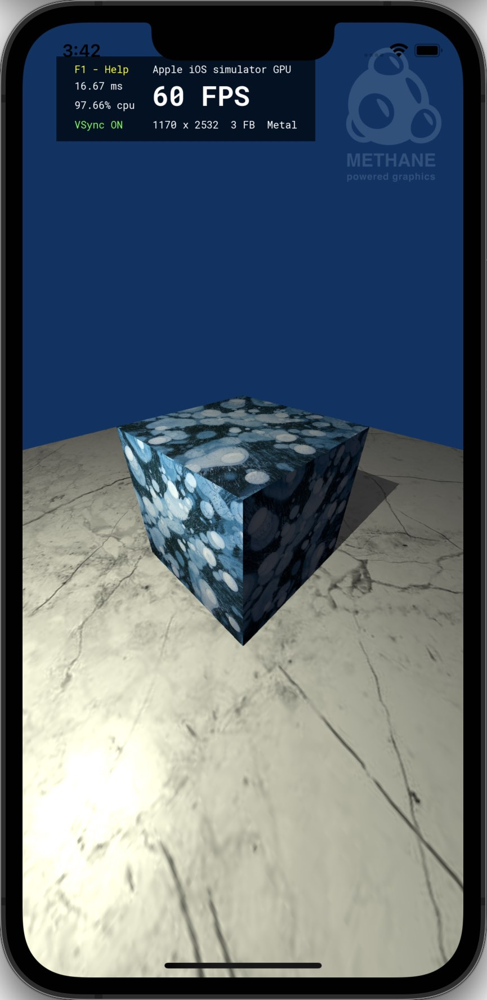

# Shadow Cube Tutorial

| <pre><b>Windows (DirectX 12)       </pre></b>                     | <pre><b>Linux (Vulkan)             </pre></b>                | <pre><b>MacOS (Metal)              </pre></b>               | <pre><b>iOS (Metal)</pre></b>                             |
|-------------------------------------------------------------------|--------------------------------------------------------------|-------------------------------------------------------------|-----------------------------------------------------------|
|  |  |  |  |

This tutorial demonstrates rendering shadow of the textured cube on the floor plane in two render passes using Methane Kit:
- [ShadowCubeApp.h](ShadowCubeApp.h)
- [ShadowCubeApp.cpp](ShadowCubeApp.cpp)
- [Shaders/ShadowCubeUniforms.h](Shaders/ShadowCubeUniforms.h)
- [Shaders/ShadowCube.hlsl](Shaders/ShadowCube.hlsl)

Tutorial demonstrates using of the following Methane Kit features additionally to features demonstrated in [TexturedCube](../03-TexturedCube) tutorial:
- Render with multiple render passes;
- Use texture as render target attachment in one pass and as an input program binding in another pass;
- Compile and loading shaders code with macro-definitions to render state programs;
- Use graphics extension `MeshBuffers` and `TexturedMeshBuffers` classes to simplify mesh rendering code;
- Simple shadows rendering technique. See detailed [technique description here](http://www.opengl-tutorial.org/ru/intermediate-tutorials/tutorial-16-shadow-mapping/)

## Application Controls

Common keyboard controls are enabled by the `Platform`, `Graphics` and `UserInterface` application controllers:
- [Methane::Platform::AppController](/Modules/Platform/App/README.md#platform-application-controller)
- [Methane::Graphics::AppController, AppContextController](/Modules/Graphics/App/README.md#graphics-application-controllers)
- [Methane::UserInterface::AppController](/Modules/UserInterface/App/README.md#user-interface-application-controllers)

## Application and Frame Class Definitions

`ShadowCubeApp` class is declared in header file [ShadowCubeApp.h](ShadowCubeApp.h) and the application class
is derived from [UserInterface::App](/Modules/UserInterface/App) base class, same as in [previous tutorial](../02-TexturedCube).
[Shaders/ShadowCubeUniforms.h](Shaders/ShadowCubeUniforms.h) header contains declaration of shader uniform structures shared between [HLSL shader code](#shadow-cube-shaders) and C++:
- `Constants` data structure is stored in the `m_scene_constants` member and is uploaded into the `Graphics::IBuffer` 
  object `m_const_buffer_ptr`, which has single instance in application since its data is constant for all frames.
- `SceneUniforms` data structure is stored in the `m_scene_uniforms` member and is uploaded into the `Graphics::IBuffer` 
  objects in the per-frame `ShadowCubeFrame` objects, each with it's own state of volatile uniform values.
- `MeshUniforms` data structure contains Model/MVP matrices and shadow MVP+Transform matrix stored in 4 instances:
uniforms for shadow and final passes stored in `gfx::TexturedMeshBuffers` objects one for cube mesh in `m_cube_buffers_ptr` 
and one for floor mesh in `m_floor_buffers_ptr`.

Uniform structures in [Shaders/ShadowCubeUniforms.h](Shaders/ShadowCubeUniforms.h):
```hlsl
struct Constants
{
    float4 light_color;
    float  light_power;
    float  light_ambient_factor;
    float  light_specular_factor;
};

struct SceneUniforms
{
    float4 eye_position;
    float3 light_position;
};

struct MeshUniforms
{
    float4x4 model_matrix;
    float4x4 mvp_matrix;
#ifdef ENABLE_SHADOWS
    float4x4 shadow_mvpx_matrix;
#endif
};
```

[MeshBuffers.hpp](../../Modules/Graphics/Extensions/Include/Methane/Graphics/MeshBuffers.hpp) implements auxiliary class
`TexturedMeshBuffers<UniformsType>` which is managing vertex, index, uniforms buffers and texture with data for particular
mesh drawing passed to constructor as a reference to [BaseMesh<VType>]((../../../Modules/Graphics/Primitives/Include/Methane/Graphics/Mesh/BaseMesh.hpp)) object.

Supplementary member `m_scene_uniforms_subresources` stores a pointer to the `m_scene_uniforms` in the `std::vector` 
type `gfx::IResource::SubResources` which is passed to `gfx::IBuffer::SetData(...)` method to update the buffer data on GPU.

Two `gfx::Camera` objects are used: one `m_view_camera` is usual perspective view camera, while the other `m_light_camera`
is a directional light camera with orthogonal projection used to generate transformation matrix from view to light
coordinate systems.

Also there are two `gfx::ISampler` objects: one is used for sampling cube and floor textures, while the other is used for
sampling shadow map texture.

```cpp
#pragma once

#include <Methane/Kit.h>
#include <Methane/UserInterface/App.hpp>

namespace hlslpp
{
#define ENABLE_SHADOWS
#pragma pack(push, 16)
#include "Shaders/ShadowCubeUniforms.h"
#pragma pack(pop)
}

namespace Methane::Tutorials
{

namespace gfx = Methane::Graphics;

struct ShadowCubeFrame final : gfx::AppFrame
{
    ...
};

using UserInterfaceApp = UserInterface::App<ShadowCubeFrame>;

class ShadowCubeApp final : public UserInterfaceApp
{
   ...

private:
    using TexturedMeshBuffersBase = gfx::TexturedMeshBuffers<hlslpp::MeshUniforms>;
    class TexturedMeshBuffers : public TexturedMeshBuffersBase
    {
    public:
        using TexturedMeshBuffersBase::TexturedMeshBuffersBase;

        void SetShadowPassUniforms(hlslpp::MeshUniforms&& uniforms) noexcept { m_shadow_pass_uniforms = std::move(uniforms); }

        [[nodiscard]] const hlslpp::MeshUniforms&        GetShadowPassUniforms() const noexcept               { return m_shadow_pass_uniforms; }
        [[nodiscard]] const gfx::IResource::SubResources& GetShadowPassUniformsSubresources() const noexcept   { return m_shadow_pass_uniforms_subresources; }

    private:
        hlslpp::MeshUniforms        m_shadow_pass_uniforms{};
        gfx::IResource::SubResources m_shadow_pass_uniforms_subresources{
            { reinterpret_cast<Data::ConstRawPtr>(&m_shadow_pass_uniforms), sizeof(hlslpp::MeshUniforms) } 
        };
    };

    struct RenderPassState
    {
        RenderPassState(bool is_final_pass, const std::string& command_group_name);
        void Release();

        const bool                             is_final_pass;
        const Ptr<gfx::ICommandListDebugGroup> debug_group_ptr;
        Ptr<gfx::IRenderState>                 render_state_ptr;
        Ptr<gfx::IViewState>                   view_state_ptr;
    };

    bool Animate(double elapsed_seconds, double delta_seconds);
    void RenderScene(const RenderPassState& render_pass, const ShadowCubeFrame::PassResources& render_pass_resources) const;

    const float                 m_scene_scale = 15.F;
    const hlslpp::Constants     m_scene_constants{
        { 1.F, 1.F, 0.74F, 1.F }, // - light_color
        700.F,                    // - light_power
        0.04F,                    // - light_ambient_factor
        30.F                      // - light_specular_factor
    };
    hlslpp::SceneUniforms       m_scene_uniforms{ };
    gfx::IResource::SubResources m_scene_uniforms_subresources{
        { reinterpret_cast<Data::ConstRawPtr>(&m_scene_uniforms), sizeof(hlslpp::SceneUniforms) }
    };
    gfx::Camera                 m_view_camera;
    gfx::Camera                 m_light_camera;
    Ptr<gfx::IBuffer>           m_const_buffer_ptr;
    Ptr<gfx::ISampler>          m_texture_sampler_ptr;
    Ptr<gfx::ISampler>          m_shadow_sampler_ptr;
    Ptr<TexturedMeshBuffers>    m_cube_buffers_ptr;
    Ptr<TexturedMeshBuffers>    m_floor_buffers_ptr;
    Ptr<gfx::IRenderPattern>     m_shadow_pass_pattern_ptr;
    RenderPassState             m_shadow_pass { false, "Shadow Render Pass" };
    RenderPassState             m_final_pass  { true,  "Final Render Pass" };
};

} // namespace Methane::Tutorials
```

`ShadowCubeFrame` struct contains frame-dependent volatile resources:
- Shadow & final pass resources in `shadow_pass` and `final_pass`:
  - Mesh resources for `cube` and `floor`:
    - Mesh uniforms buffer `uniforms_buffer_ptr`
    - Program bindings configuration `program_bindings_ptr`
  - Render target texture `rt_texture_ptr`
  - Render pass setup object `render_pass_ptr`
  - Render command list `cmd_list_ptr`
- Scene uniforms buffer in `scene_uniforms_buffer_ptr`
- Command list set for execution on frame, which contains command lists from shadow and final passes

```cpp
struct ShadowCubeFrame final : gfx::AppFrame
{
    struct PassResources
    {
        struct MeshResources
        {
            Ptr<gfx::IBuffer>          uniforms_buffer_ptr;
            Ptr<gfx::IProgramBindings> program_bindings_ptr;
        };

        MeshResources                cube;
        MeshResources                floor;
        Ptr<gfx::ITexture>           rt_texture_ptr;
        Ptr<gfx::IRenderPass>        render_pass_ptr;
        Ptr<gfx::IRenderCommandList> cmd_list_ptr;
    };

    PassResources             shadow_pass;
    PassResources             final_pass;
    Ptr<gfx::IBuffer>         scene_uniforms_buffer_ptr;
    Ptr<gfx::ICommandListSet> execute_cmd_list_set_ptr;

    using gfx::AppFrame::AppFrame;
};
```

## Graphics Resources Initialization

Initialization of textures, buffers and samplers is mostly the same as for `Textured Cube` tutorial, so we skip their
description here.

**Final pass** render state initialization has some differences:
- Pixel and vertex shaders are loaded for specific combination of macro definitions enabled during compilation done in build time.
  This macro definitions set is described in `gfx::IShader::MacroDefinitions` variable `textured_shadows_definitions` which
  is passed to `gfx::IShader::CreateVertex/CreatePixel` functions.
- Configuration of `rhi::ProgramArgumentAccessors` is more complex than for simple cube mesh and mostly describes
  Pixel-shader specific argument modifiers, except `g_mesh_uniforms` for Vertex-shader.
  `g_constants`, `g_shadow_sampler`, `g_texture_sampler` arguments are described with `Constant` modifier, while
  other arguments have no modifiers meaning that that can change during frames rendering.

```cpp
    // ========= Final Pass Render & View States =========

    const gfx::IShader::EntryFunction    vs_main{ "ShadowCube", "CubeVS" };
    const gfx::IShader::EntryFunction    ps_main{ "ShadowCube", "CubePS" };
    const gfx::IShader::MacroDefinitions textured_shadows_definitions{ { "ENABLE_SHADOWS", "" }, { "ENABLE_TEXTURING", "" } };

    // Create final pass rendering state with program
    gfx::IRenderState::Settings final_state_settings;
    final_state_settings.program_ptr = gfx::IProgram::Create(GetRenderContext(),
        gfx::IProgram::Settings
        {
            gfx::IProgram::Shaders
            {
                gfx::IShader::CreateVertex(GetRenderContext(), { Data::ShaderProvider::Get(), vs_main, textured_shadows_definitions }),
                gfx::IShader::CreatePixel(GetRenderContext(),  { Data::ShaderProvider::Get(), ps_main, textured_shadows_definitions }),
            },
            rhi::ProgramInputBufferLayouts
            {
                gfx::IProgram::InputBufferLayout
                {
                    gfx::IProgram::InputBufferLayout::ArgumentSemantics { cube_mesh.GetVertexLayout().GetSemantics() }
                }
            },
            rhi::ProgramArgumentAccessors
            {
                { { rhi::ShaderType::Vertex, "g_mesh_uniforms"  }, rhi::ProgramArgumentAccessor::Type::Mutable       },
                { { rhi::ShaderType::Pixel,  "g_scene_uniforms" }, rhi::ProgramArgumentAccessor::Type::FrameConstant },
                { { rhi::ShaderType::Pixel,  "g_constants"      }, rhi::ProgramArgumentAccessor::Type::Constant      },
                { { rhi::ShaderType::Pixel,  "g_shadow_map"     }, rhi::ProgramArgumentAccessor::Type::FrameConstant },
                { { rhi::ShaderType::Pixel,  "g_shadow_sampler" }, rhi::ProgramArgumentAccessor::Type::Constant      },
                { { rhi::ShaderType::Pixel,  "g_texture"        }, rhi::ProgramArgumentAccessor::Type::Mutable       },
                { { rhi::ShaderType::Pixel,  "g_texture_sampler"}, rhi::ProgramArgumentAccessor::Type::Constant      },
            },
            GetScreenRenderPattern().GetAttachmentFormats()
        }
    );
    final_state_settings.render_pattern_ptr = GetScreenRenderPatternPtr();
    final_state_settings.depth.enabled = true;

    m_final_pass.render_state_ptr = gfx::IRenderState::Create(GetRenderContext(), final_state_settings);
    m_final_pass.view_state_ptr = GetViewStatePtr();
```

`IRenderPattern` class is used to define specific color/depth/stencil attachments configuration including their formats, load and store actions,
without relation to specific resources used for attachments (this relation is set with `IRenderPass` objects).
**Shadow pass** pattern uses only depth attachment which is cleared on load and stored for further use in final screen render pass.
The pattern also defines render pass access to shader resources and is marked with intermediate pass flag.


```cpp
    // ========= Shadow Pass Render & View States =========

    // Create shadow-pass render pattern
    m_shadow_pass_pattern_ptr = gfx::IRenderPattern::Create(GetRenderContext(), {
        { // No color attachments
        },
        gfx::IRenderPattern::DepthAttachment(
            0U, context_settings.depth_stencil_format, 1U,
            gfx::IRenderPass::Attachment::LoadAction::Clear,
            gfx::IRenderPass::Attachment::StoreAction::Store,
            context_settings.clear_depth_stencil->first
        ),
        gfx::IRenderPass::StencilAttachment(),
        gfx::IRenderPass::Access::ShaderResources,
        false // intermediate render pass
    });
```

**Shadow pass** render state is using the same shader code, but compiled with a different macro definitions set `textured_definitions`
and thus the result program having different set of arguments available. Also note that the program include only 
Vertex shader since it will be used for rendering to depth buffer only without color attachment.

```cpp
    // Create shadow-pass rendering state with program
    const gfx::IShader::MacroDefinitions textured_definitions{ { "ENABLE_TEXTURING", "" } };
    gfx::IRenderState::Settings shadow_state_settings;
    shadow_state_settings.program_ptr = gfx::IProgram::Create(GetRenderContext(),
        gfx::IProgram::Settings
        {
            gfx::IProgram::Shaders
            {
                gfx::IShader::CreateVertex(GetRenderContext(), { Data::ShaderProvider::Get(), vs_main, textured_definitions }),
            },
            final_state_settings.program_ptr->GetSettings().input_buffer_layouts,
            rhi::ProgramArgumentAccessors
            {
                { { rhi::ShaderType::All, "g_mesh_uniforms"  }, rhi::ProgramArgumentAccessor::Type::Mutable },
            },
            m_shadow_pass_pattern_ptr->GetAttachmentFormats()
        }
    );
    shadow_state_settings.render_pattern_ptr = m_shadow_pass_pattern_ptr;
    shadow_state_settings.render_pattern_ptr = m_shadow_pass_pattern_ptr;
    shadow_state_settings.depth.enabled = true;

    m_shadow_pass.render_state_ptr = gfx::IRenderState::Create(GetRenderContext(), shadow_state_settings);
```

The Shadow-pass view state is bound to the size of the Shadow-map texture:

```cpp
    m_shadow_pass.view_state_ptr = gfx::IViewState::Create({
        { gfx::GetFrameViewport(g_shadow_map_size)    },
        { gfx::GetFrameScissorRect(g_shadow_map_size) }
    });
```

Frame-dependent resources are initialized for each frame in loop. Execution command list set includes two command lists:
one for shadow pass rendering and another for final pass rendering.

```cpp
    for(ShadowCubeFrame& frame : GetFrames())
    {
        // Create uniforms buffer with volatile parameters for the whole scene rendering
        frame.scene_uniforms_buffer_ptr = gfx::IBuffer::CreateConstantBuffer(GetRenderContext(), scene_uniforms_data_size, false, true);

        // ========= Shadow Pass Resources =========
        ...

        // ========= Final Pass Resources =========
        ...

        // Rendering command lists sequence
        frame.execute_cmd_list_set_ptr = gfx::ICommandListSet::Create({
            *frame.shadow_pass.cmd_list_ptr,
            *frame.final_pass.cmd_list_ptr
        }, frame.index);
    }
```

Shadow-map render target texture `frame.shadow_pass.rt_texture_ptr` is created for each frame using common setting with depth-stencil format taken from 
render context settings. Shadow-map texture settings also specify `Usage` bit-mask with `RenderTarget` and `ShaderRead`
flags to allow both rendering to this texture and sampling from it in a final pass:

```cpp
    using namespace magic_enum::bitwise_operators;
    const gfx::ITexture::Settings shadow_texture_settings = gfx::ITexture::Settings::DepthStencilBuffer(
        gfx::Dimensions(g_shadow_map_size),
        context_settings.depth_stencil_format,
        gfx::ITexture::Usage::RenderTarget | gfx::ITexture::Usage::ShaderRead
    );
```

Volatile uniform buffers `frame.shadow_pass.[floor|cube].uniforms_buffer_ptr` are created separately for cube and floor 
meshes both for shadow and final passes rendering. Program bindings are created both for cube and floor meshes, 
which are binding created uniform buffers to the `g_mesh_uniforms` program argument of `All` shader types
(taking into account that there's only Vertex shader in that program).

Shadow render pass `frame.shadow_pass.render_pass_ptr` is created without color attachments, but with depth attachment
bound to the shadow-map texture for the current frame `frame.shadow_pass.rt_texture_ptr`.
Depth attachment is crated with `Clear` load action to clear the depth texture with provided depth value, 
taken from render context settings `context_settings.clear_depth_stencil->first`; and `Store` action is used to retain
rendered depth texture content for the next render pass. Render command list is created bound to the shadow render pass.

```cpp
        // ========= Shadow Pass Resources =========

        // Create uniforms buffer for Cube rendering in Shadow pass
        frame.shadow_pass.cube.uniforms_buffer_ptr = gfx::IBuffer::CreateConstantBuffer(GetRenderContext(), mesh_uniforms_data_size, false, true);

        // Create uniforms buffer for Floor rendering in Shadow pass
        frame.shadow_pass.floor.uniforms_buffer_ptr = gfx::IBuffer::CreateConstantBuffer(GetRenderContext(), mesh_uniforms_data_size, false, true);

        // Shadow-pass resource bindings for cube rendering
        frame.shadow_pass.cube.program_bindings_ptr = gfx::IProgramBindings::Create(shadow_state_settings.program_ptr, {
            { { rhi::ShaderType::All, "g_mesh_uniforms"  }, { { *frame.shadow_pass.cube.uniforms_buffer_ptr } } },
        }, frame.index);

        // Shadow-pass resource bindings for floor rendering
        frame.shadow_pass.floor.program_bindings_ptr = gfx::IProgramBindings::Create(shadow_state_settings.program_ptr, {
            { { rhi::ShaderType::All, "g_mesh_uniforms"  }, { { *frame.shadow_pass.floor.uniforms_buffer_ptr } } },
        }, frame.index);

        // Create depth texture for shadow map rendering
        frame.shadow_pass.rt_texture_ptr = gfx::ITexture::CreateRenderTarget(GetRenderContext(), shadow_texture_settings);
        
        // Create shadow pass configuration with depth attachment
        frame.shadow_pass.render_pass_ptr = gfx::IRenderPass::Create(*m_shadow_pass_pattern_ptr, {
            { *frame.shadow_pass.rt_texture_ptr },
            context_settings.frame_size
        });
        
        // Create render pass and command list for shadow pass rendering
        frame.shadow_pass.cmd_list_ptr = gfx::IRenderCommandList::Create(GetRenderContext().GetRenderCommandKit().GetQueue(), *frame.shadow_pass.render_pass_ptr);
```

The same resources are created for the final render pass: uniform buffers for cube and floor meshes.
Program bindings are created for cube and floor rendering too but with more complex set of program arguments, because
final pass rendering program includes pixel and vertex shaders, but not only vertex shader like in shadow pass.

Render target texture is bound to frame screen texture i.e. frame buffer in swap-chain.
Final render pass is also bound to the screen render pass for the current frame, which is created by base graphics 
application class `Methane::Graphics::App`. Render command list is created bound to the final render pass.

```cpp
        // ========= Final Pass Resources =========

        // Create uniforms buffer for Cube rendering in Final pass
        frame.final_pass.cube.uniforms_buffer_ptr = gfx::IBuffer::CreateConstantBuffer(GetRenderContext(), mesh_uniforms_data_size, false, true);

        // Create uniforms buffer for Floor rendering in Final pass
        frame.final_pass.floor.uniforms_buffer_ptr = gfx::IBuffer::CreateConstantBuffer(GetRenderContext(), mesh_uniforms_data_size, false, true);

        // Final-pass resource bindings for cube rendering
        frame.final_pass.cube.program_bindings_ptr = gfx::IProgramBindings::Create(final_state_settings.program_ptr, {
            { { rhi::ShaderType::Vertex, "g_mesh_uniforms"  }, { { *frame.final_pass.cube.uniforms_buffer_ptr  } } },
            { { rhi::ShaderType::Pixel,  "g_scene_uniforms" }, { { *frame.scene_uniforms_buffer_ptr            } } },
            { { rhi::ShaderType::Pixel,  "g_constants"      }, { { *m_const_buffer_ptr                         } } },
            { { rhi::ShaderType::Pixel,  "g_shadow_map"     }, { { *frame.shadow_pass.rt_texture_ptr           } } },
            { { rhi::ShaderType::Pixel,  "g_shadow_sampler" }, { { *m_shadow_sampler_ptr                       } } },
            { { rhi::ShaderType::Pixel,  "g_texture"        }, { { m_cube_buffers_ptr->GetTexture()            } } },
            { { rhi::ShaderType::Pixel,  "g_texture_sampler"}, { { *m_texture_sampler_ptr                      } } },
        }, frame.index);

        // Final-pass resource bindings for floor rendering - patched a copy of cube bindings
        frame.final_pass.floor.program_bindings_ptr = gfx::IProgramBindings::CreateCopy(*frame.final_pass.cube.program_bindings_ptr, {
            { { rhi::ShaderType::Vertex, "g_mesh_uniforms"  }, { { *frame.final_pass.floor.uniforms_buffer_ptr } } },
            { { rhi::ShaderType::Pixel,  "g_texture"        }, { { m_floor_buffers_ptr->GetTexture()           } } },
        }, frame.index);

        // Bind final pass RT texture and pass to the frame buffer texture and final pass.
        frame.final_pass.rt_texture_ptr  = frame.screen_texture_ptr;
        frame.final_pass.render_pass_ptr = frame.screen_pass_ptr;
        
        // Create render pass and command list for final pass rendering
        frame.final_pass.cmd_list_ptr = gfx::IRenderCommandList::Create(GetRenderContext().GetRenderCommandKit().GetQueue(), *frame.final_pass.render_pass_ptr);
```

When render context is going to be released, all related resources must be released too. This is done in 
`ShadowCubeApp::OnContextReleased` callback method with a helper method `ShadowCubeApp::IRenderPass::Release()` 
releasing render pass pipeline states:

```cpp
void ShadowCubeApp::OnContextReleased(gfx::Context& context)
{
    m_final_pass.Release();
    m_shadow_pass.Release();

    m_floor_buffers_ptr.reset();
    m_cube_buffers_ptr.reset();
    m_shadow_sampler_ptr.reset();
    m_texture_sampler_ptr.reset();
    m_const_buffer_ptr.reset();
    m_shadow_pass_pattern_ptr.reset();

    UserInterfaceApp::OnContextReleased(context);
}

void ShadowCubeApp::IRenderPass::Release()
{
    render_state_ptr.reset();
    view_state_ptr.reset();
}
```
## Frame Rendering Cycle

Animation function bound to time-animation in constructor of `ShadowCubeApp` class is called automatically as a part of 
every render cycle, just before `App::Update` function call. This function rotates light position and camera in opposite directions.

```cpp
ShadowCubeApp::ShadowCubeApp()
{
    ...
    GetAnimations().emplace_back(std::make_shared<Data::TimeAnimation>(std::bind(&ShadowCubeApp::Animate, this, std::placeholders::_1, std::placeholders::_2)));
}

bool ShadowCubeApp::Animate(double, double delta_seconds)
{
    m_view_camera.Rotate(m_view_camera.GetOrientation().up, static_cast<float>(delta_seconds * 360.F / 8.F));
    m_light_camera.Rotate(m_light_camera.GetOrientation().up, static_cast<float>(delta_seconds * 360.F / 4.F));
    return true;
}
```

`ShadowCubeApp::Update()` function is called before `App::Render()` call to update shader uniforms:
- Scene uniforms structure is updated with eye and light positions calculated in `ShadowCubeApp::Animate` function.
- Cube and Floor mesh uniform structures are updated separately for Final and Render passes:
  - Shadow pass MVP matrix is calculated from the light point of view using `m_light_camera.GetViewProjMatrix()`
    and the shadow-MVPx matrix is not used for shadow-map rendering, so it is set to zero matrix.
  - Final pass MVP matrix is calculated from the observer point of view using `m_view_camera.GetViewProjMatrix()`.
    The shadow-MVPx matrix is used to calculate current pixel coordinates in the shadow-map texture, so we use
    MVP matrix used during shadow pass rendering multiplied by coordinates transformation matrix to convert 
    from homogenous [-1, 1] to texture coordinates [0,1].

```cpp
bool ShadowCubeApp::Update()
{
    if (!UserInterfaceApp::Update())
        return false;

    // Prepare homogenous [-1,1] to texture [0,1] coordinates transformation matrix
    static const hlslpp::float4x4 s_homogen_to_texture_coords_matrix = hlslpp::mul(hlslpp::float4x4::scale(0.5F, -0.5F, 1.F), hlslpp::float4x4::translation(0.5F, 0.5F, 0.F));

    // Update scene uniforms
    m_scene_uniforms.eye_position    = hlslpp::float4(m_view_camera.GetOrientation().eye, 1.F);
    m_scene_uniforms.light_position  = m_light_camera.GetOrientation().eye;

    hlslpp::float4x4 scale_matrix = hlslpp::float4x4::scale(m_scene_scale);

    // Cube model matrix
    hlslpp::float4x4 cube_model_matrix = hlslpp::mul(hlslpp::float4x4::translation(0.F, 0.5F, 0.F), scale_matrix); // move up by half of cube model height

    // Update Cube uniforms
    m_cube_buffers_ptr->SetFinalPassUniforms(hlslpp::MeshUniforms{
        hlslpp::transpose(cube_model_matrix),
        hlslpp::transpose(hlslpp::mul(cube_model_matrix, m_view_camera.GetViewProjMatrix())),
        hlslpp::transpose(hlslpp::mul(hlslpp::mul(cube_model_matrix, m_light_camera.GetViewProjMatrix()), s_homogen_to_texture_coords_matrix))
    });
    m_cube_buffers_ptr->SetShadowPassUniforms(hlslpp::MeshUniforms{
        hlslpp::transpose(cube_model_matrix),
        hlslpp::transpose(hlslpp::mul(cube_model_matrix, m_light_camera.GetViewProjMatrix())),
        hlslpp::float4x4()
    });

    // Update Floor uniforms
    m_floor_buffers_ptr->SetFinalPassUniforms(hlslpp::MeshUniforms{
        hlslpp::transpose(scale_matrix),
        hlslpp::transpose(hlslpp::mul(scale_matrix, m_view_camera.GetViewProjMatrix())),
        hlslpp::transpose(hlslpp::mul(hlslpp::mul(scale_matrix, m_light_camera.GetViewProjMatrix()), s_homogen_to_texture_coords_matrix))
    });
    m_floor_buffers_ptr->SetShadowPassUniforms(hlslpp::MeshUniforms{
        hlslpp::transpose(scale_matrix),
        hlslpp::transpose(hlslpp::mul(scale_matrix, m_light_camera.GetViewProjMatrix())),
        hlslpp::float4x4()
    });
    
    return true;
}
```

Scene rendering consists is done in `ShadowCubeApp::Render()` method in 4 steps:
1. 5 Volatile uniform buffers are updated with uniform structures data, previously calculated and filled 
   in `ShadowCubeApp::Update()` method.
2. Shadow pass rendering commands are encoded with `ShadowCubeApp::RenderScene(...)` method for the current scene 
   using already configured shadow render pass bound to shadow render command list and shadow-pass uniforms.
3. Final pass rendering commands are encoded with `ShadowCubeApp::RenderScene(...)` method for the same scene 
   using already configured final render pass bound to final render command list and final-pass uniforms.
4. Shadow and Final pass rendering command lists are sent for execution to GPU using render command queue from context 
   and frame present is scheduled.

```cpp
bool ShadowCubeApp::Render()
{
    if (!UserInterfaceApp::Render())
        return false;

    // Upload uniform buffers to GPU
    const ShadowCubeFrame& frame = GetCurrentFrame();
    frame.scene_uniforms_buffer_ptr->SetData(m_scene_uniforms_subresources, render_cmd_queue);
    frame.shadow_pass.floor.uniforms_buffer_ptr->SetData(m_floor_buffers_ptr->GetShadowPassUniformsSubresources(), render_cmd_queue);
    frame.shadow_pass.cube.uniforms_buffer_ptr->SetData(m_cube_buffers_ptr->GetShadowPassUniformsSubresources(), render_cmd_queue);
    frame.final_pass.floor.uniforms_buffer_ptr->SetData(m_floor_buffers_ptr->GetFinalPassUniformsSubresources(), render_cmd_queue);
    frame.final_pass.cube.uniforms_buffer_ptr->SetData(m_cube_buffers_ptr->GetFinalPassUniformsSubresources(), render_cmd_queue);

    // Record commands for shadow & final render passes
    RenderScene(m_shadow_pass, frame.shadow_pass);
    RenderScene(m_final_pass, frame.final_pass);

    // Execute rendering commands and present frame to screen
    GetRenderContext().GetRenderCommandKit().GetQueue().Execute(*frame.execute_cmd_list_set_ptr);
    GetRenderContext().Present();
    
    return true;
}
```

Scene rendering commands encoding is done similarly for both shadow and render passes:
1. Render command list is reset with state taken from render pass resources and already configured debug group description.
2. View state is set with viewports and scissor rects.
3. Cube and floor meshes drawing commands are encoded using
   [TexturedMeshBuffers<UniformsType>::Draw(...)](../../Modules/Graphics/Extensions/Include/Methane/Graphics/MeshBuffers.hpp)
   method which is doing:
   1. Setting program bindings to resources;
   2. Setting vertex buffer to draw;
   3. Encodes `DrawIndexed` command for a given mesh subset.
   4. Methane application overlay is rendered as a part of Final pass only using `Graphics::App::RenderOverlay(...)` method
   from base application class.
   5. Command list is committed making it ready for execution.

```cpp
void ShadowCubeApp::RenderScene(const IRenderPass &render_pass, const ShadowCubeFrame::PassResources& render_pass_resources) const
{
    gfx::IRenderCommandList& cmd_list = *render_pass_resources.cmd_list_ptr;

    // Reset command list with initial rendering state
    cmd_list.ResetWithState(*render_pass.render_state_ptr, render_pass.debug_group_ptr.get());
    cmd_list.SetViewState(*render_pass.view_state_ptr);

    // Draw scene with cube and floor
    m_cube_buffers_ptr->Draw(cmd_list, *render_pass_resources.cube.program_bindings_ptr);
    m_floor_buffers_ptr->Draw(cmd_list, *render_pass_resources.floor.program_bindings_ptr);

    if (render_pass.is_final_pass)
    {
        RenderOverlay(cmd_list);
    }

    cmd_list.Commit();
}
```

Graphics render loop is started from `main(...)` entry function using `GraphicsApp::Run(...)` method which is also parsing command line arguments.

```cpp
int main(int argc, const char* argv[])
{
    return ShadowCubeApp().Run({ argc, argv });
}
```

## Shadow Cube Shaders

HLSL 6 shaders [Shaders/ShadowCube.hlsl](Shaders/ShadowCube.hlsl) implement both shadow pass rendering and 
final pass with phong lighting, texturing and shadow map sampling all in one source file with help of `#ifdef ... #endif`
pre-processor guards. These code blocks are enabled with macro-definitions passed to shader compiler:
- `ENABLE_TEXTURING` macro-definition:
  - Adds `texcoord` vector to `VSInput` and `PSInput` argument structures; enables code for passing texture coordinates
    from vertex to pixel shader with interpolation.
  - Adds texture `g_texture` along with sampler `g_texture_sampler`
    and enables code path for its sampling in pixel shader `CubePS`.
- `ENABLE_SHADOWS` macro-definition:
  - Adds `shadow_position` vector to `PSInput` arguments structure and enables code path to calculate it 
    in vertex shader `CubeVS`;
  - Adds `shadow_mvpx_matrix` matrix to MeshUniforms structure of `g_mesh_uniforms` buffer;
  - Adds shadow-map texture `g_shadow_map` along with shadow-map sampler `g_shadow_sampler`
    and enables code path for shadow map sampling in pixel shader `CubePS`.

```cpp
#include "ShadowCubeUniforms.h"
#include "..\..\..\Common\Shaders\Primitives.hlsl"

struct VSInput
{
    float3 position         : POSITION;
    float3 normal           : NORMAL;
#ifdef ENABLE_TEXTURING
    float2 texcoord         : TEXCOORD;
#endif
};

struct PSInput
{
    float4 position         : SV_POSITION;
    float3 world_position   : POSITION0;
    float3 world_normal     : NORMAL;
#ifdef ENABLE_SHADOWS
    float4 shadow_position  : POSITION1;
#endif
#ifdef ENABLE_TEXTURING
    float2 texcoord         : TEXCOORD;
#endif
};

ConstantBuffer<Constants>     g_constants       : register(b1);
ConstantBuffer<SceneUniforms> g_scene_uniforms  : register(b2);
ConstantBuffer<MeshUniforms>  g_mesh_uniforms   : register(b3);

#ifdef ENABLE_SHADOWS
Texture2D    g_shadow_map      : register(t0);
SamplerState g_shadow_sampler  : register(s0);
#endif

#ifdef ENABLE_TEXTURING
Texture2D    g_texture         : register(t1);
SamplerState g_texture_sampler : register(s1);
#endif

PSInput CubeVS(VSInput input)
{
    const float4 position   = float4(input.position, 1.0F);

    PSInput output;
    output.position         = mul(position, g_mesh_uniforms.mvp_matrix);
    output.world_position   = mul(position, g_mesh_uniforms.model_matrix).xyz;
    output.world_normal     = normalize(mul(float4(input.normal, 0.0), g_mesh_uniforms.model_matrix).xyz);
#ifdef ENABLE_SHADOWS
    output.shadow_position  = mul(position, g_mesh_uniforms.shadow_mvpx_matrix);
#endif
#ifdef ENABLE_TEXTURING
    output.texcoord         = input.texcoord;
#endif

    return output;
}

float4 CubePS(PSInput input) : SV_TARGET
{
    const float3 fragment_to_light             = normalize(g_scene_uniforms.light_position - input.world_position);
    const float3 fragment_to_eye               = normalize(g_scene_uniforms.eye_position.xyz - input.world_position);
    const float3 light_reflected_from_fragment = reflect(-fragment_to_light, input.world_normal);

#ifdef ENABLE_SHADOWS
    const float3 light_proj_pos = input.shadow_position.xyz / input.shadow_position.w;
    const float  current_depth  = light_proj_pos.z - 0.0001F;
    const float  shadow_depth   = g_shadow_map.Sample(g_shadow_sampler, light_proj_pos.xy).r;
    const float  shadow_ratio   = current_depth > shadow_depth ? 1.0F : 0.0F;
#else
    const float  shadow_ratio   = 0.F;
#endif

#ifdef ENABLE_TEXTURING
    const float4 texel_color    = g_texture.Sample(g_texture_sampler, input.texcoord);
#else
    const float4 texel_color    = { 0.8F, 0.8F, 0.8F, 1.F };
#endif

    const float4 ambient_color  = texel_color * g_constants.light_ambient_factor;
    const float4 base_color     = texel_color * g_constants.light_color * g_constants.light_power;

    const float  distance       = length(g_scene_uniforms.light_position - input.world_position);
    const float  diffuse_part   = clamp(dot(fragment_to_light, input.world_normal), 0.0, 1.0);
    const float4 diffuse_color  = base_color * diffuse_part / (distance * distance);

    const float  specular_part  = pow(clamp(dot(fragment_to_eye, light_reflected_from_fragment), 0.0, 1.0), g_constants.light_specular_factor);
    const float4 specular_color = base_color * specular_part / (distance * distance);

    return ColorLinearToSrgb(ambient_color + (1.F - shadow_ratio) * (diffuse_color + specular_color));
}
```

## CMake Build Configuration

Shaders are compiled in build time and added as byte code to the application embedded resources.
Note that vertex shader `CubeVS` is built twice with different set of macro definitions:
one instance is used for shadow pass, the other is for final pass rendering.
Texture images are added to the application embedded resources too.

```cmake
include(MethaneApplications)
include(MethaneShaders)
include(MethaneResources)

add_methane_application(
    TARGET ${TARGET}
    NAME "Methane Shadow Cube"
    DESCRIPTION "Tutorial demonstrating shadow and final render passes done with Methane Kit."
    INSTALL_DIR "Apps"
    SOURCES
        ShadowCubeApp.h
        ShadowCubeApp.cpp
        Shaders/ShadowCubeUniforms.h
)

set(TEXTURES_DIR ${RESOURCES_DIR}/Textures)
set(TEXTURES
    ${TEXTURES_DIR}/MethaneBubbles.jpg
    ${TEXTURES_DIR}/MarbleWhite.jpg
)
add_methane_embedded_textures(MethaneShadowCube "${TEXTURES_DIR}" "${TEXTURES}")

add_methane_shaders_source(
    TARGET MethaneShadowCube
    SOURCE Shaders/ShadowCube.hlsl
    VERSION 6_0
    TYPES
        frag=CubePS:ENABLE_SHADOWS,ENABLE_TEXTURING
        vert=CubeVS:ENABLE_SHADOWS,ENABLE_TEXTURING
        vert=CubeVS:ENABLE_TEXTURING
)

add_methane_shaders_library(MethaneShadowCube)

target_link_libraries(MethaneShadowCube
    PRIVATE
        MethaneAppsCommon
)
```

## Continue learning

Continue learning Methane Graphics programming in the next tutorial [Typography](../05-Typography), which is demonstrating
text rendering using dynamic font atlas textures.