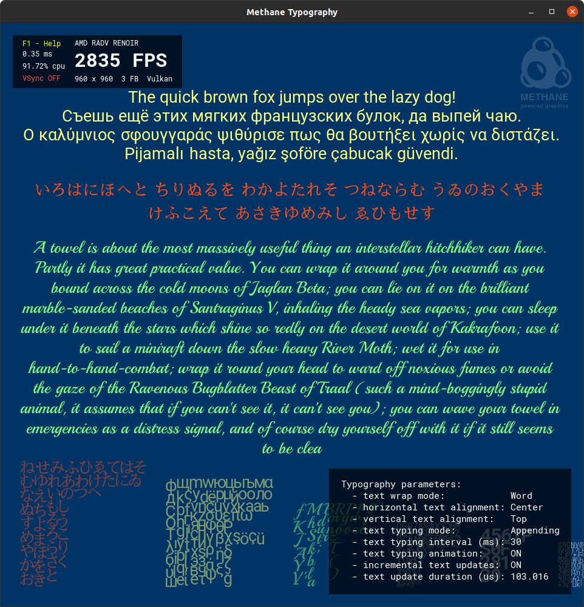
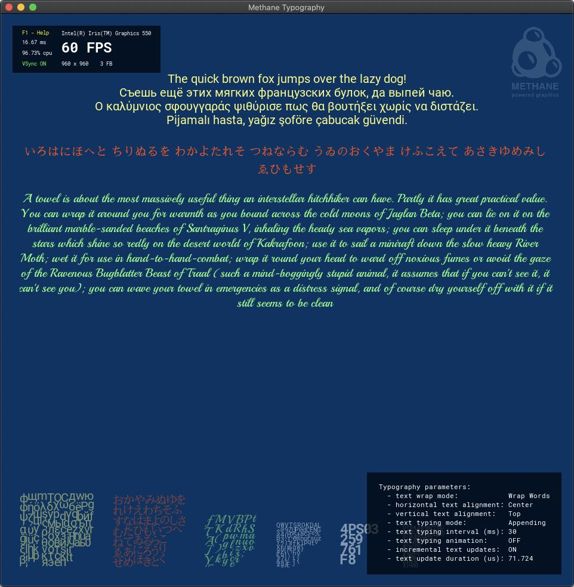
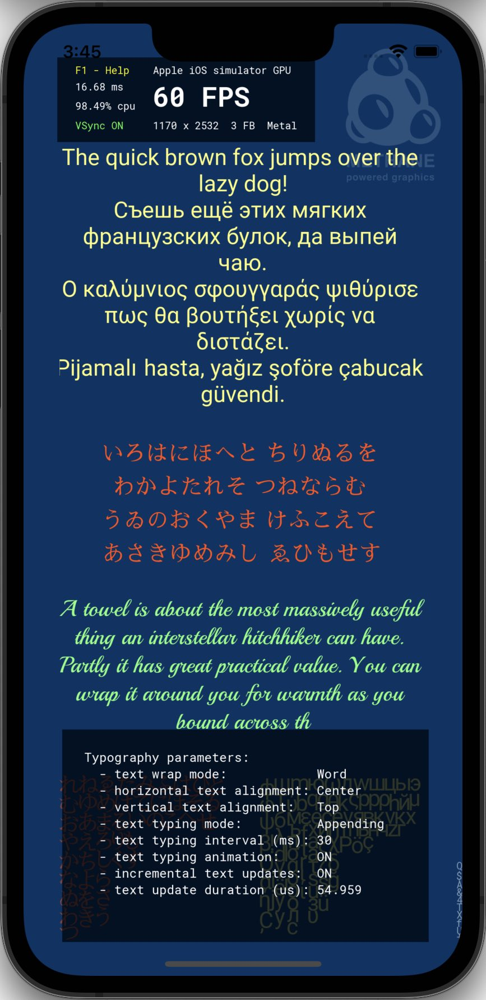

# Typography Tutorial

| <pre><b>Windows (DirectX 12)       </pre></b>                    | <pre><b>Linux (Vulkan)             </pre></b>               | <pre><b>MacOS (Metal)              </pre></b>              | <pre><b>iOS (Metal)</pre></b>                              |
|------------------------------------------------------------------|-------------------------------------------------------------|------------------------------------------------------------|------------------------------------------------------------|
|  |  |  |  |

This tutorial demonstrates animated text rendering with dynamic font atlas updates using Methane UI.
Three colored text blocks are animated with continuous characters typing. Each text block is rendered as a single mesh
displaying character glyphs from the font atlas texture to screen rectanglesq, which are generated on CPU 
using Freetype 2.0 library.

Font atlas texture can be updated dynamically by adding new character glyphs on demand,
as the user types text including any non-Ascii character sets. Text characters layout and mesh generation is done on CPU
using Methane implementation, without using 3rd-party libraries and supports horizontal and vertical text alignment in 
rectangular areas with wrapping by characters and words. Right-to-left and Arabic language characters layout is not supported yet.

## Application Controls

Keyboard actions are enabled with [TypographyAppController](TypographyAppController.h) class
derived from [Platform::Keyboard::ActionControllerBase](/Modules/Platform/Input/Include/Methane/Platform/KeyboardActionControllerBase.hpp):

| Typography App Action                                           | Keyboard Shortcut |
|-----------------------------------------------------------------|-------------------|
| Switch Text Wrap Mode (None, Anywhere, Word)                    | `W`               |
| Switch Text Horizontal Alignment (Left, Right, Center, Justify) | `H`               |
| Switch Text Vertical Alignment (Top, Bottom, Center)            | `V`               |
| Switch Incremental Text Update                                  | `U`               |
| Switch Typing Direction (Forward, Backward)                     | `D`               |
| Speedup Typing                                                  | `+`               |
| Slowdown Typing                                                 | `-`               |

Common keyboard controls are enabled by the `Platform`, `Graphics` and `UserInterface` application controllers:
- [Methane::Platform::AppController](/Modules/Platform/App/README.md#platform-application-controller)
- [Methane::Graphics::AppController, AppContextController](/Modules/Graphics/App/README.md#graphics-application-controllers)
- [Methane::UserInterface::AppController](/Modules/UserInterface/App/README.md#user-interface-application-controllers)

## Application and Frame Class Definitions

`TypographyApp` class is declared in header file [TypographyApp.h](TypographyApp.h),
and is derived from [UserInterface::App](../../Modules/UserInterface/App) base class, same as in [previous tutorial](../03-ShadowCube).
Base application class `UserInterface::App<TypographyFrame>` is using frame structure `TypographyFrame`, which defines only
render command list and execution command list set which wraps this command list.

`TypographyApp` class defines settings structure `TypographyApp::Settings`, getter of the current settings
`TypographyApp::GetSettings` and individual setters for each application setting:
- `TypographyApp::SetTextLayout` - allows to change word wrapping mode, horizontal and vertical text layouts for all text blocks;
- `TypographyApp::SetForwardTypingDirection` - changes text typing animation: appending new characters if `true`, or backspace deleting if `false`;
- `TypographyApp::SetTextUpdateInterval` - changes text typing time interval in milliseconds;
- `TypographyApp::SetIncrementalTextUpdate` - enables or disables incremental updating of text block mesh buffers.

Application setting getters can be changed by user in runtime with keyboard shortcuts, handled in [TypographyAppController.h](TypographyAppController.h).

`TypographyApp` class contains the following private members:
- `gui::Font` objects each one for unique font, size and color;
- `gui::Text` objects each for one text block;
- `gui::Badge` objects for rendering font atlas textures on screen;
- `std::vector<size_t>` displayed lengths of text in each text block incremented with animation;
- `Timer::TimeDuration` holds duration of the last text block update to be displayed on screen.

```cpp
#pragma once

#include <Methane/Kit.h>
#include <Methane/Data/Receiver.hpp>

namespace Methane::Tutorials
{

namespace gfx = Methane::Graphics;
namespace gui = Methane::UserInterface;

struct TypographyFrame final : gfx::AppFrame
{
    Ptr<gfx::RenderCommandList> render_cmd_list_ptr;
    Ptr<gfx::ICommandListSet>   execute_cmd_list_set_ptr;

    using gfx::AppFrame::AppFrame;
};

using UserInterfaceApp = UserInterface::App<TypographyFrame>;

class TypographyApp final
    : public UserInterfaceApp
    , private Data::Receiver<gui::IFontLibraryCallback>
    , private Data::Receiver<gui::IFontCallback>
{
public:
    struct Settings
    {
        gui::Text::Layout text_layout{ gui::Text::Wrap::Word, gui::Text::HorizontalAlignment::Center, gui::Text::VerticalAlignment::Top };
        bool              is_incremental_text_update  = true;
        bool              is_forward_typing_direction = true;
        double            typing_update_interval_sec  = 0.03;
    };

    TypographyApp();
    ~TypographyApp() override;

    // GraphicsApp overrides
    ...

    // UserInterface::App overrides
    std::string GetParametersString() override;

    // Settings accessors
    const Settings& GetSettings() const noexcept { return m_settings; }
    void SetTextLayout(const gui::Text::Layout& text_layout);
    void SetForwardTypingDirection(bool is_forward_typing_direction);
    void SetTextUpdateInterval(double text_update_interval_sec);
    void SetIncrementalTextUpdate(bool is_incremental_text_update);

private:
    ...

    Settings            m_settings;
    Ptrs<gui::Font>     m_fonts;
    Ptrs<gui::Text>     m_texts;
    Ptrs<gui::Badge>    m_font_atlas_badges;
    std::vector<size_t> m_displayed_text_lengths;
    double              m_text_update_elapsed_sec = 0.0;
    Timer::TimeDuration m_text_update_duration;
};

} // namespace Methane::Tutorials
```

## Graphics Resources Initialization

Fonts and text blocks are initialized in `TypographyApp::Init()` method in a `for` loop for each block index.
Text blocks are positioned one below another with `vertical_text_pos_in_dots` variable which holds vertical
position in DPI-independent Dot units.

```cpp
    const gfx::FrameSize frame_size_in_dots = GetFrameSizeInDots();
    const uint32_t frame_width_without_margins = frame_size_in_dots.GetWidth() - 2 * g_margin_size_in_dots;
    int32_t vertical_text_pos_in_dots = g_top_text_pos_in_dots;

    for(size_t block_index = 0; block_index < g_text_blocks_count; ++block_index)
    {
        const FontSettings& font_settings = g_font_settings[block_index];
        const size_t displayed_text_length = m_displayed_text_lengths[block_index];
        const std::u32string displayed_text_block = g_text_blocks[block_index].substr(0, displayed_text_length);

        // Add font to library
        m_fonts.push_back( ... );

        // Add text element
        m_texts.push_back( ... );

        vertical_text_pos_in_dots = m_texts.back()->GetRectInDots().GetBottom() + g_margin_size_in_dots;
    }
```

Font objects are used to create and render text blocks on screen. Font objects are loaded from `Data::FontProvider` singleton 
with specified font settings and are added to fonts library. `Data::FontProvider` loads `TTF` fonts from application
resources. Font settings include:
- Font description:
  - Font unique name for registration in fonts library
  - Font file path loaded with data provider
  - Font size in points
- Font resolution DPI
- Initial alphabet to be rendered and added to font atlas (it is also dynamically extended on demand)

```cpp
        // Add font to library
        m_fonts.push_back(
            gui::Font::Library::Get().AddFont(
                Data::FontProvider::Get(),
                gui::Font::Settings
                {
                    font_settings.desc,
                    GetUIContext().GetFontResolutionDpi(),
                    gui::Font::GetAlphabetFromText(displayed_text_block)
                }
            ).GetPtr()
        );
```

Each text block object is created using `UserInterface::Context` object acquired with `UserInterface::App::GetUIContext()`
method, font object which was created previously and text settings:
- Font name registered in fonts library
- Text string in UTF8 or UTF32 format
- Rectangle area in Dots or Pixels on screen for fit the text in
- Layout describing how the text will be fit into the rectangular area
  - Wrapping mode (No wrapping, Wrap anywhere, Wrap on word boundaries)
  - Horizontal alignment (Left, Right, Center)
  - Vertical alignment (Top, Bottom, Center)
- Color of text block
- Incremental text mesh update flag

```cpp
        // Add text element
        m_texts.push_back(
            std::make_shared<gui::Text>(GetUIContext(), *m_fonts.back(),
                gui::Text::SettingsUtf32
                {
                    font_settings.desc.name,
                    displayed_text_block,
                    gui::UnitRect
                    {
                        gui::Units::Dots,
                        gfx::Point2I { g_margin_size_in_dots, vertical_text_pos_in_dots },
                        gfx::FrameSize { frame_width_without_margins, 0U /* calculated height */ }
                    },
                    m_settings.text_layout,
                    gfx::Color4F(font_settings.color, 1.F),
                    m_settings.is_incremental_text_update
                }
            )
        );
```

Font objects hold a font atlas textures which are displayed on screen in this tutorial using `UserInterface::Badge` objects,
created in `TypographyTutorial::UpdateFontAtlasBadges()` method:

```cpp
oid TypographyApp::UpdateFontAtlasBadges()
{
    const Refs<gui::Font> font_refs = gui::Font::Library::Get().GetFonts();
    gfx::RenderContext& context = GetRenderContext();

    // Remove obsolete font atlas badges
    ...

    // Add new font atlas badges
    for(const Ref<gui::Font>& font_ref : font_refs)
    {
        const Ptr<gfx::Texture>& font_atlas_texture_ptr = font_ref.get().GetAtlasTexturePtr(context);
        if (!font_atlas_texture_ptr)
            continue;

        const auto font_atlas_ptr_it = std::find_if(m_font_atlas_badges.begin(), m_font_atlas_badges.end(),
                                                   [&font_atlas_texture_ptr](const Ptr<gui::Badge>& font_atlas_badge_ptr)
            {
                return std::addressof(font_atlas_badge_ptr->GetTexture()) == font_atlas_texture_ptr.get();
            }
        );

        if (font_atlas_ptr_it != m_font_atlas_badges.end())
            continue;

        m_font_atlas_badges.emplace_back(CreateFontAtlasBadge(font_ref.get(), font_atlas_texture_ptr));
    }

    LayoutFontAtlasBadges(GetRenderContext().GetSettings().frame_size);
}
```

Font atlas badge bound to atlas texture is created with helper method `TypographyApp::CreateFontAtlasBadge`:

```cpp
Ptr<gui::Badge> TypographyApp::CreateFontAtlasBadge(const gui::Font& font, const Ptr<gfx::Texture>& atlas_texture_ptr)
{
    const auto font_color_by_name_it = g_font_color_by_name.find(font.GetSettings().description.name);
    const gui::Color3F& font_color = font_color_by_name_it != g_font_color_by_name.end()
                                   ? font_color_by_name_it->second : g_misc_font_color;

    return std::make_shared<gui::Badge>(
        GetUIContext(), atlas_texture_ptr,
        gui::Badge::Settings
        {
            font.GetSettings().description.name + " Font Atlas",
            gui::UnitSize(gui::Units::Pixels, static_cast<const gfx::FrameSize&>(atlas_texture_ptr->GetSettings().dimensions)),
            gui::Badge::FrameCorner::BottomLeft,
            gui::UnitPoint(gui::Units::Dots, 16U, 16U),
            gui::Color4F(font_color, 0.5F),
            gui::Badge::TextureMode::RFloatToAlpha,
        }
    );
}
```

`TypographyApp::LayoutFontAtlasBadges` is positioning all created atlas badges in the left-bottom corner of the screen
located one after another starting with largest textures and ending with smallest.

## Frame Rendering Cycle

Animation function bound to time-animation in constructor of `TypographyApp` class is called automatically as a part of
every render cycle, just before `App::Update` function call. 
`TypographyApp::Animate` function updates text displayed in text blocks by adding or deleting characters and updates 
text block positions once in a equal time spans.

```cpp
TypographyApp::TypographyApp()
{
    ...
    
    GetAnimations().emplace_back(std::make_shared<Data::TimeAnimation>(std::bind(&ShadowCubeApp::Animate, this, std::placeholders::_1, std::placeholders::_2)));
}

bool TypographyApp::Animate(double elapsed_seconds, double)
{
    if (elapsed_seconds - m_text_update_elapsed_sec < m_settings.typing_update_interval_sec)
        return true;
    
    m_text_update_elapsed_sec = elapsed_seconds;
    
    int32_t vertical_text_pos_in_dots = g_top_text_pos_in_dots;
    for(size_t block_index = 0; block_index < g_text_blocks_count; ++block_index)
    {
        AnimateTextBlock(block_index, vertical_text_pos_in_dots);
    }
    
    UpdateParametersText();
    return true;
}
```

Each text rendering object is managing its own set of GPU resources for each frame in swap-chain:
- Vertex and index buffers
- Shader uniforms buffer
- Font atlas texture
- Program bindings

To update text resources on GPU to make them ready for frame rendering,
`Text::Update(...)` method is called for each text object in `TypographyApp::Update()`.

```cpp
bool TypographyApp::Update()
{
    if (!UserInterfaceApp::Update())
        return false;

    // Update text block resources
    for(const Ptr<gui::Text>& text_ptr : m_texts)
    {
        text_ptr->Update(GetFrameSize());
    }

    return true;
}
```

After updating text resources on GPU, the rendering is simple: `UserInterface::Text::Draw(...)` is called for each text object 
with per-frame render command list and debug group. Font atlas badges are rendered in the same way `UserInterface::Badge::Draw(...)`.

```cpp
bool TypographyApp::Render()
{
    if (!UserInterfaceApp::Render())
        return false;

    const TypographyFrame& frame = GetCurrentFrame();

    // Draw text blocks
    META_DEBUG_GROUP_CREATE_VAR(s_text_debug_group, "Text Blocks Rendering");
    for(const Ptr<gui::Text>& text_ptr : m_texts)
    {
        text_ptr->Draw(*frame.render_cmd_list_ptr, s_text_debug_group.get());
    }

    // Draw font atlas badges
    META_DEBUG_GROUP_CREATE_VAR(s_atlas_debug_group, "Font Atlases Rendering");
    for(const Ptr<gui::Badge>& badge_atlas_ptr : m_font_atlas_badges)
    {
        badge_atlas_ptr->Draw(*frame.render_cmd_list_ptr, s_atlas_debug_group.get());
    }

    RenderOverlay(*frame.render_cmd_list_ptr);

    // Commit command list with present flag
    frame.render_cmd_list_ptr->Commit();

    // Execute command list on render queue and present frame to screen
    GetRenderContext().GetRenderCommandKit().GetQueue().Execute(*frame.execute_cmd_list_set_ptr);
    GetRenderContext().Present();

    return true;
}
```

## CMake Build Configuration

`TTF` fonts are added to the application embedded resources with `add_methane_embedded_fonts` cmake-function.

```cmake
include(MethaneApplications)

add_methane_application(
    TARGET MethaneTypography
    NAME "Methane Typography"
    DESCRIPTION "Tutorial demonstrating dynamic text rendering and font atlases management with Methane Kit."
    INSTALL_DIR "Apps"
    SOURCES
        TypographyApp.h
        TypographyApp.cpp
        TypographyAppController.h
        TypographyAppController.cpp
)

set(FONTS
    ${RESOURCES_DIR}/Fonts/Roboto/Roboto-Regular.ttf
    ${RESOURCES_DIR}/Fonts/Playball/Playball-Regular.ttf
    ${RESOURCES_DIR}/Fonts/SawarabiMincho/SawarabiMincho-Regular.ttf
)
add_methane_embedded_fonts(MethaneTypography "${RESOURCES_DIR}" "${FONTS}")

target_link_libraries(MethaneTypography
    PRIVATE
        MethaneAppsCommon
)
```

## Continue learning

Continue learning Methane Graphics programming in the next tutorial [CubeMapArray](../06-CubeMapArray),
which is demonstrating cube-map array texturing and sky-box rendering.