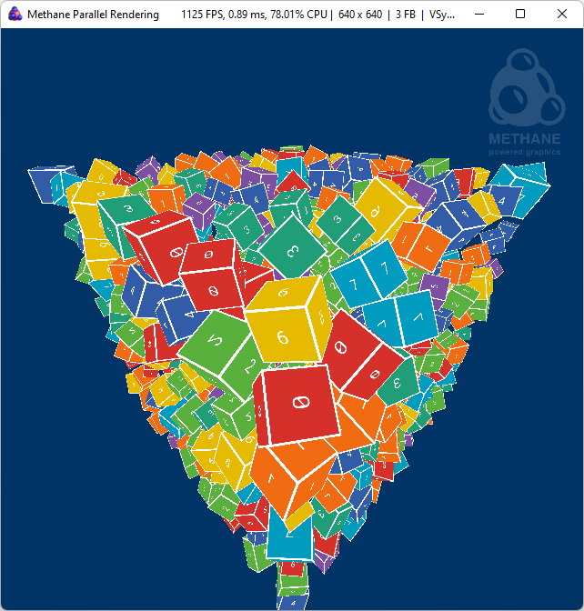
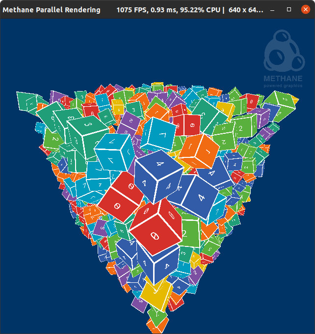
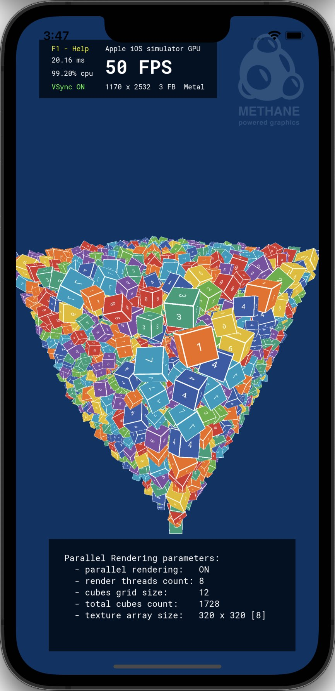

# Parallel Rendering Tutorial

| <pre><b>Windows (DirectX 12)       </pre></b>                                  | <pre><b>Linux (Vulkan)             </pre></b>                             | <pre><b>MacOS (Metal)              </pre></b>                            | <pre><b>iOS (Metal)</pre></b>                                          |
|--------------------------------------------------------------------------------|---------------------------------------------------------------------------|--------------------------------------------------------------------------|------------------------------------------------------------------------|
|  |  |  |  | 

This tutorial demonstrates multithreaded rendering with `Rhi::ParallelRenderCommandList` using Methane Kit:
  - [ParallelRenderingApp.h](ParallelRenderingApp.h)
  - [ParallelRenderingApp.cpp](ParallelRenderingApp.cpp)
  - [ParallelRenderingAppController.h](ParallelRenderingAppController.h)
  - [ParallelRenderingAppController.cpp](ParallelRenderingAppController.cpp)
  - [Shaders/ParallelRendering.hlsl](Shaders/ParallelRendering.hlsl)
  - [Shaders/ParallelRenderingUniforms.h](Shaders/ParallelRenderingUniforms.h)

Tutorial demonstrates the following techniques:
  - Creating render target texture 2D array;
  - Rendering text labels to the faces of texture 2D array via separate render passes
    using helper class [TextureLabeler](/Apps/Common/Include/TextureLabeler.h);
  - Using [MeshBuffers](/Modules/Graphics/Extensions/Include/Methane/Graphics/MeshBuffers.hpp) extension
    primitive to represent cube instances, create index and vertex buffers and render with a single Draw command.
  - Using single addressable uniforms buffer to store an array of uniform structures for
    all cube instance parameters at once and binding array elements in that buffer to the particular
    cube instance draws with byte offset in buffer memory.
  - Binding faces of the texture 2D array to the cube instances to display rendering thread number as text on cube faces.
  - Using [TaskFlow](https://github.com/taskflow/taskflow) library for task-based parallelism and parallel for loops.
  - Randomly distributing cubes between render threads and rendering them in parallel using `IParallelRenderCommandList` all to the screen render pass.
  - Use Methane instrumentation to profile application execution on CPU and GPU 
    using [Tracy](https://github.com/wolfpld/tracy) or [Intel GPA Trace Analyzer](https://software.intel.com/en-us/gpa/graphics-trace-analyzer).

## Application Controls

Keyboard actions are enabled with [ParallelRenderingAppController](ParallelRenderingAppController.h) class
derived from [Platform::Input::Keyboard::ActionControllerBase](/Modules/Platform/Input/ActionControllers/Include/Methane/Platform/Input/KeyboardActionControllerBase.hpp):

| Parallel Rendering App Action | Keyboard Shortcut |
|-------------------------------|-------------------|
| Switch Parallel Rendering     | `P`               |
| Increase Cubes Grid Size      | `+`               |
| Decrease Cubes Grid Size      | `-`               |
| Increase Render Threads Count | `]`               |
| Decrease Render Threads Count | `[`               |

Common keyboard controls are enabled by the `Platform`, `Graphics` and `UserInterface` application controllers:
- [Methane::Platform::AppController](/Modules/Platform/App/README.md#platform-application-controller)
- [Methane::Graphics::AppController, AppContextController](/Modules/Graphics/App/README.md#graphics-application-controllers)
- [Methane::UserInterface::AppController](/Modules/UserInterface/App/README.md#user-interface-application-controllers)

## Uniforms Binding with Buffer Views vs Root Constants

Parallel Rendering tutorial is compiled in two versions:
1. **ParallelRenderingRootConstants**: Program bindings using root constants for cube uniforms (macros `ROOT_CONSTANTS_ENABLED` is defined).
2. **ParallelRenderingBufferViews**: Program bindings use direct buffer views for cube uniforms (above macros is not defined).

FPS performance of the 2-nd version is roughly 30% higher than the 1-st version,
because of the additional memory copying overhead in case of using root constants.
This demonstration warns developers about the hidden performance impact of root constants usage,
while it is more convenient to use them for small uniform structures. In some cases when uniforms buffer
changes frequently and can be updated all at once, it is more efficient to manually manage uniforms buffer,
update is all at once and bind buffer views to the particular addresses in this buffer.

## Initialization

### Uniform Root Constants (Option-1)

```cpp
void ParallelRenderingApp::Init()
{
    ...
    
    // Create cube mesh
    gfx::CubeMesh<CubeVertex> cube_mesh(CubeVertex::layout);
    
    // Create render state with program
    rhi::RenderState::Settings render_state_settings
    {
        GetRenderContext().CreateProgram(
            rhi::Program::Settings
            {
                ...
                rhi::ProgramArgumentAccessors
                {
                    // Override argument binding: use root constant buffer for uniforms
                    META_PROGRAM_ARG_ROOT_BUFFER_MUTABLE(rhi::ShaderType::All, "g_uniforms")
                },
                GetScreenRenderPattern().GetAttachmentFormats()
            }
        ),
        GetScreenRenderPattern()
    };
    render_state_settings.depth.enabled = true;
    m_render_state = GetRenderContext().CreateRenderState( render_state_settings);
    
    // Create frame buffer resources
    tf::Taskflow program_bindings_task_flow;
    for(ParallelRenderingFrame& frame : GetFrames())
    {
        // Configure program resource bindings
        frame.cubes_program_bindings.resize(cubes_count);
        frame.cubes_uniform_argument_binding_ptrs.resize(cubes_count);
        frame.cubes_program_bindings[0] = render_state_settings.program.CreateBindings({
            { { rhi::ShaderType::Pixel, "g_texture_array" }, m_texture_array.GetResourceView()   },
            { { rhi::ShaderType::Pixel, "g_sampler"       }, m_texture_sampler.GetResourceView() },
        }, frame.index);
        frame.cubes_uniform_argument_binding_ptrs[0] = &frame.cubes_program_bindings[0].Get({ rhi::ShaderType::All, "g_uniforms" });
        
        // Duplicate program bindings for each cube and save pointer to uniforms argument binding for further modification
        program_bindings_task_flow.for_each_index(1U, cubes_count, 1U,
            [&frame](const uint32_t cube_index)
            {
                rhi::ProgramBindings& cube_program_bindings = frame.cubes_program_bindings[cube_index];
                cube_program_bindings = rhi::ProgramBindings(frame.cubes_program_bindings[0], {}, frame.index);
                frame.cubes_uniform_argument_binding_ptrs[cube_index] = &cube_program_bindings.Get({ rhi::ShaderType::All, "g_uniforms" });
            });
    }
    
    ...
}
```

### Uniform Buffer Views (Option-2)

```cpp
void ParallelRenderingApp::Init()
{
    ...
    
    // Create cube mesh
    gfx::CubeMesh<CubeVertex> cube_mesh(CubeVertex::layout);
    
    // Create render state with program
    rhi::RenderState::Settings render_state_settings
    {
        GetRenderContext().CreateProgram(
            rhi::Program::Settings
            {
                ...
                rhi::ProgramArgumentAccessors
                {
                    // Override argument binding: use uniform buffer address
                    META_PROGRAM_ARG_BUFFER_ADDRESS_MUTABLE(rhi::ShaderType::All, "g_uniforms")
                },
                GetScreenRenderPattern().GetAttachmentFormats()
            }
        ),
        GetScreenRenderPattern()
    };
    render_state_settings.depth.enabled = true;
    m_render_state = GetRenderContext().CreateRenderState( render_state_settings);
    
    // Create frame buffer resources
    const Data::Size uniform_data_size = MeshBuffers::GetUniformSize();
    tf::Taskflow program_bindings_task_flow;
    for(ParallelRenderingFrame& frame : GetFrames())
    {
        // Create buffer for uniforms array related to all cube instances
        frame.cubes_array.uniforms_buffer = GetRenderContext().CreateBuffer(
            rhi::BufferSettings::ForConstantBuffer(m_cube_array_buffers_ptr->GetUniformsBufferSize(), true, true));
        
        frame.cubes_array.program_bindings_per_instance.resize(cubes_count);
        frame.cubes_array.program_bindings_per_instance[0] = render_state_settings.program.CreateBindings({
            {
                { rhi::ShaderType::All,   "g_uniforms"      },
                frame.cubes_array.uniforms_buffer.GetBufferView(
                    m_cube_array_buffers_ptr->GetUniformsBufferOffset(0U), uniform_data_size)
            },
            { { rhi::ShaderType::Pixel, "g_texture_array" }, m_texture_array.GetResourceView()   },
            { { rhi::ShaderType::Pixel, "g_sampler"       }, m_texture_sampler.GetResourceView() },
        }, frame.index);
        
        // Duplicate program bindings for each cube and save pointer to uniforms argument binding for further modification
        program_bindings_task_flow.for_each_index(1U, cubes_count, 1U,
            [&frame, &cube_array_buffers, uniform_data_size](const uint32_t cube_index)
            {
                rhi::ProgramBindings& cube_program_bindings = frame.cubes_array.program_bindings_per_instance[cube_index];
                cube_program_bindings = rhi::ProgramBindings(frame.cubes_array.program_bindings_per_instance[0], {
                    {
                        { rhi::ShaderType::All, "g_uniforms" },
                        frame.cubes_array.uniforms_buffer.GetBufferView(
                            cube_array_buffers.GetUniformsBufferOffset(cube_index),
                            uniform_data_size)
                    }
                }, frame.index);
            });
    }
    ...
}
```

### Create Parallel Render Command List

```cpp
void ParallelRenderingApp::Init()
{
    ...
    
    // Create parallel command list for rendering to the screen pass
    frame.parallel_render_cmd_list = render_cmd_queue.CreateParallelRenderCommandList(frame.screen_pass);
    frame.parallel_render_cmd_list.SetParallelCommandListsCount(m_settings.GetActiveRenderThreadCount());
    frame.parallel_render_cmd_list.SetValidationEnabled(false);
    frame.execute_cmd_list_set = rhi::CommandListSet({ frame.parallel_render_cmd_list.GetInterface() }, frame.index);
    
    ...
}
```

### Rotating Cube Parameters Initialization

```cpp
struct CubeParameters
{
    hlslpp::float4x4 model_matrix;
    double           rotation_speed_y = 0.25f;
    double           rotation_speed_z = 0.5f;
    uint32_t         thread_index = 0;
};

std::vector<CubeParameters> ParallelRenderingApp::InitializeCubeArrayParameters() const
{
    const uint32_t cubes_count     = m_settings.GetTotalCubesCount();
    const auto     cbrt_count      = static_cast<size_t>(std::floor(std::cbrt(static_cast<float>(cubes_count))));
    const size_t   cbrt_count_sqr  = cbrt_count * cbrt_count;
    const float    cbrt_count_half = static_cast<float>(cbrt_count - 1) / 2.F;

    const float ts = g_scene_scale / static_cast<float>(cbrt_count);
    const float median_cube_scale = ts / 2.F;
    const float cube_scale_delta = median_cube_scale / 3.F;

    std::mt19937 rng(1234U); // NOSONAR - using pseudorandom generator is safe here
    std::uniform_real_distribution<float>   cube_scale_distribution(median_cube_scale - cube_scale_delta, median_cube_scale + cube_scale_delta);
    std::uniform_real_distribution<double>  rotation_speed_distribution(-0.8F, 0.8F);
    std::uniform_int_distribution<uint32_t> thread_index_distribution(0U, m_settings.render_thread_count);

    std::vector<CubeParameters> cube_array_parameters(cubes_count);

    // Position all cubes in a cube grid and assign to random threads
    tf::Taskflow task_flow;
    tf::Task init_task = task_flow.for_each_index(0U, cubes_count, 1U,
        [&rng, &cube_array_parameters, &cube_scale_distribution, &rotation_speed_distribution, &thread_index_distribution,
         ts, cbrt_count, cbrt_count_sqr, cbrt_count_half](const uint32_t cube_index)
        {
            const float tx = static_cast<float>(cube_index % cbrt_count) - cbrt_count_half;
            const float ty = static_cast<float>(cube_index % cbrt_count_sqr / cbrt_count) - cbrt_count_half;
            const float tz = static_cast<float>(cube_index / cbrt_count_sqr) - cbrt_count_half;
            const float cs = cube_scale_distribution(rng);

            const hlslpp::float4x4 scale_matrix = hlslpp::float4x4::scale(cs);
            const hlslpp::float4x4 translation_matrix = hlslpp::float4x4::translation(tx * ts, ty * ts, tz * ts);

            CubeParameters& cube_params = cube_array_parameters[cube_index];
            cube_params.model_matrix = hlslpp::mul(scale_matrix, translation_matrix);
            cube_params.rotation_speed_y = rotation_speed_distribution(rng);
            cube_params.rotation_speed_z = rotation_speed_distribution(rng);

            // Distribute cubes randomly between threads
            cube_params.thread_index = thread_index_distribution(rng);
        });

    // Sort cubes parameters by thread index
    // to make sure that actual cubes distribution by render threads will match thread_index in parameters
    // NOTE-1: thread index is displayed on cube faces as text label using an element of Texture 2D Array.
    // NOTE-2: Sorting also improves rendering performance because it ensures using one texture for all cubes per thread.
    tf::Task sort_task = task_flow.sort(cube_array_parameters.begin(), cube_array_parameters.end(),
                   [](const CubeParameters& left, const CubeParameters& right)
                   { return left.thread_index < right.thread_index; });

    // Fixup even distribution of cubes between threads
    const auto cubes_count_per_thread = static_cast<uint32_t>(std::ceil(static_cast<double>(cubes_count) / m_settings.render_thread_count));
    tf::Task even_task = task_flow.for_each_index(0U, cubes_count, 1U,
        [&cube_array_parameters, cubes_count_per_thread](const uint32_t cube_index)
        {
            cube_array_parameters[cube_index].thread_index = cube_index / cubes_count_per_thread;
        });

    init_task.precede(sort_task);
    sort_task.precede(even_task);

    // Execute parallel initialization of cube array parameters
    GetRenderContext().GetParallelExecutor().run(task_flow).get();
    return cube_array_parameters;
}
```

## Update Cube Uniforms

```cpp
bool ParallelRenderingApp::Update()
{
    if (!UserInterfaceApp::Update())
        return false;
    
    const ParallelRenderingFrame& frame  = GetCurrentFrame();

    // Update MVP-matrices for all cube instances so that they are positioned in a cube grid
    tf::Taskflow task_flow;
    task_flow.for_each_index(0U, static_cast<uint32_t>(m_cube_array_parameters.size()), 1U,
        [this, &frame](const uint32_t cube_index)
        {
            const CubeParameters& cube_params = m_cube_array_parameters[cube_index];

            hlslpp::Uniforms uniforms{};
            uniforms.mvp_matrix = hlslpp::transpose(hlslpp::mul(cube_params.model_matrix, m_camera.GetViewProjMatrix()));
            uniforms.texture_index = cube_params.thread_index;

#ifdef ROOT_CONSTANTS_ENABLED
            frame.cubes_uniform_argument_binding_ptrs[cube_index]->SetRootConstant(rhi::RootConstant(uniforms));
#else
            m_cube_array_buffers_ptr->SetFinalPassUniforms(std::move(uniforms), cube_index);
#endif
        });

    GetRenderContext().GetParallelExecutor().run(task_flow).get();
    return true;
}
```

## Parallel Rendering

```cpp
bool ParallelRenderingApp::Render()
{
    if (!UserInterfaceApp::Render())
        return false;

    const ParallelRenderingFrame& frame  = GetCurrentFrame();
    const rhi::CommandQueue render_cmd_queue = GetRenderContext().GetRenderCommandKit().GetQueue();

#ifdef ROOT_CONSTANTS_ENABLED
    const auto& cubes_program_bindings = frame.cubes_program_bindings;
#else
    // Update uniforms buffer related to current frame
    frame.cubes_array.uniforms_buffer.SetData(render_cmd_queue, m_cube_array_buffers_ptr->GetFinalPassUniformsSubresource());
    const auto& cubes_program_bindings = frame.cubes_array.program_bindings_per_instance;
#endif

    // Render cube instances of 'CUBE_MAP_ARRAY_SIZE' count
    META_DEBUG_GROUP_VAR(s_debug_group, "Parallel Cubes Rendering");
    frame.parallel_render_cmd_list.ResetWithState(m_render_state, &s_debug_group);
    frame.parallel_render_cmd_list.SetViewState(GetViewState());

    const std::vector<rhi::RenderCommandList>& render_cmd_lists = frame.parallel_render_cmd_list.GetParallelCommandLists();
    const uint32_t instance_count_per_command_list = Data::DivCeil(m_cube_array_buffers_ptr->GetInstanceCount(), static_cast<uint32_t>(render_cmd_lists.size()));

    // Generate thread tasks for each of parallel render command lists to encode cubes rendering commands
    tf::Taskflow render_task_flow;
    render_task_flow.for_each_index(0U, static_cast<uint32_t>(render_cmd_lists.size()), 1U,
        [this, &cubes_program_bindings, &render_cmd_lists, instance_count_per_command_list](const uint32_t cmd_list_index)
        {
            const uint32_t begin_instance_index = cmd_list_index * instance_count_per_command_list;
            const uint32_t end_instance_index = std::min(begin_instance_index + instance_count_per_command_list, m_cube_array_buffers_ptr->GetInstanceCount());
            RenderCubesRange(render_cmd_lists[cmd_list_index], cubes_program_bindings, begin_instance_index, end_instance_index);
        }
    );

    // Execute rendering in multiple threads
    GetRenderContext().GetParallelExecutor().run(render_task_flow).get();

    RenderOverlay(frame.parallel_render_cmd_list.GetParallelCommandLists().back());
    frame.parallel_render_cmd_list.Commit();

    // Execute command lists on render queue and present frame to screen
    render_cmd_queue.Execute(frame.execute_cmd_list_set);
    GetRenderContext().Present();
    return true;
}
```

```cpp
void ParallelRenderingApp::RenderCubesRange(const rhi::RenderCommandList& render_cmd_list,
                                            const std::vector<rhi::ProgramBindings>& program_bindings_per_instance,
                                            uint32_t begin_instance_index, const uint32_t end_instance_index) const
{
    // Resource barriers are not set for vertex and index buffers, since it works with automatic state propagation from Common state
    render_cmd_list.SetVertexBuffers(m_cube_array_buffers_ptr->GetVertexBuffers(), false);
    render_cmd_list.SetIndexBuffer(m_cube_array_buffers_ptr->GetIndexBuffer(), false);

    for (uint32_t instance_index = begin_instance_index; instance_index < end_instance_index; ++instance_index)
    {
        // Constant argument bindings are applied once per command list, mutables are applied always
        // Bound resources are retained by command list during its lifetime, but only for the first binding instance (since all binding instances use the same resource objects)
        rhi::ProgramBindingsApplyBehaviorMask bindings_apply_behavior;
        bindings_apply_behavior.SetBitOn(rhi::ProgramBindingsApplyBehavior::ConstantOnce);
        if (instance_index == begin_instance_index)
            bindings_apply_behavior.SetBitOn(rhi::ProgramBindingsApplyBehavior::RetainResources);

        render_cmd_list.SetProgramBindings(program_bindings_per_instance[instance_index], bindings_apply_behavior);
        render_cmd_list.DrawIndexed(rhi::RenderPrimitive::Triangle);
    }
}
```

## Parallel Rendering Shaders

Shader is similar to one used in the previous tutorial [CubeMapArray](../06-CubeMapArray), it renders simple cube mesh
using a given MVP matrix and texture index and samples a texture array by this index.
The trick in rendering huge amount of cubes is in parallel recording of the command lists which set uniforms 
via program bindings and issues draw commands.

```cpp
#include "ParallelRenderingUniforms.h"

struct VSInput
{
    float3 position    : POSITION;
    float2 texcoord    : TEXCOORD;
};

struct PSInput
{
    float4 position    : SV_POSITION;
    float2 texcoord    : TEXCOORD;
};

ConstantBuffer<Uniforms>  g_uniforms      : register(b0, META_ARG_MUTABLE);
Texture2DArray            g_texture_array : register(t0, META_ARG_CONSTANT);
SamplerState              g_sampler       : register(s0, META_ARG_CONSTANT);

PSInput CubeVS(VSInput input)
{
    PSInput output;
    output.position = mul(float4(input.position, 1.F), g_uniforms.mvp_matrix);
    output.texcoord = input.texcoord;
    return output;
}

float4 CubePS(PSInput input) : SV_TARGET
{
    return g_texture_array.Sample(g_sampler, float3(input.texcoord, g_uniforms.texture_index));
}
```

## Continue learning

Continue learning Methane Graphics programming in the next tutorial [ConsoleCompute](../08-ConsoleCompute),
which is demonstrating computing on GPU in pure console application.
