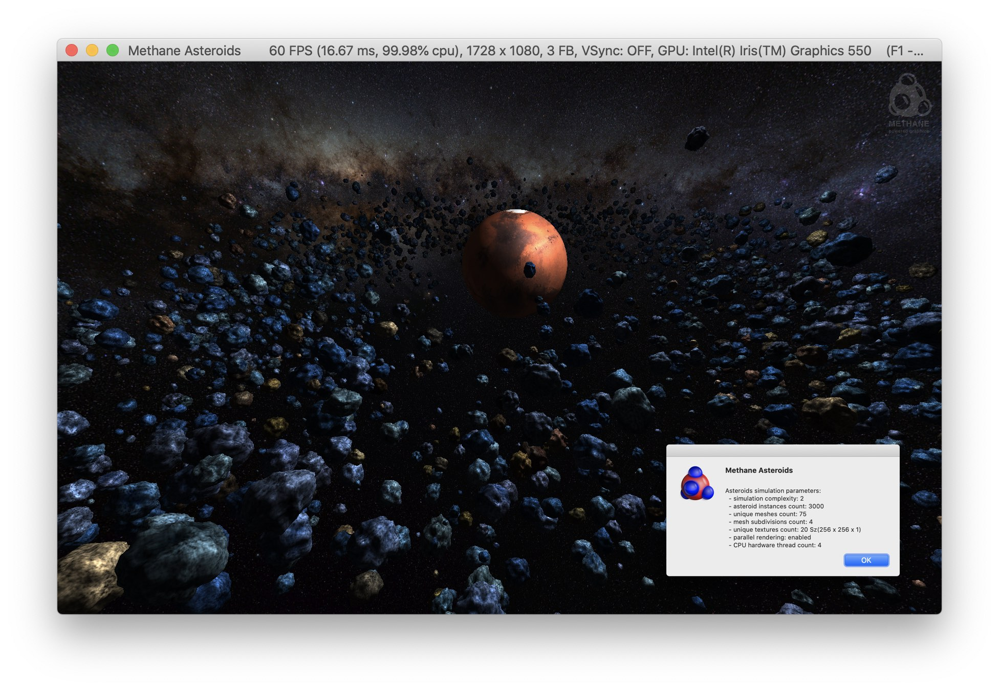
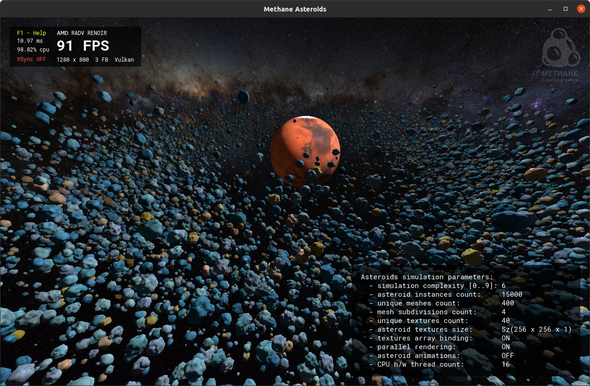

# Asteroids Sample

| Windows (DirectX 12) | MacOS (Metal) | Linux (Vulkan)                                            |
| -------------------- | ------------- |-----------------------------------------------------------|
|  |  |  | 

Asteroids sample demonstrates multi-threaded rendering of large number of heterogenous asteroid meshes with [ParallelRenderCommandList](/Modules/Graphics/Core/Include/Methane/Graphics/ParallelRenderCommandList.h).
Thousands of unique asteroid instances (1000-50000) are drawn with individual Draw-calls in parallel with a random combination of:
- random-generated mesh (from array of up to 1000 unique meshes)
- random generated perlin-noise array texture each with 3 projections (from array of up to 50 unique textures)
- random combination of coloring (from 72 color combinations)

Methane Asteroids sample was inspired by [Intel Asteroids D3D12](https://github.com/GameTechDev/asteroids_d3d12),
but implemented from scratch in a cross-platform style using Methane Kit.

## Features

Default parameters of asteroids simulation are selected depending on CPU HW cores count and are displayed 
in right-bottom panel switched by `F3` key.
Overall complexity can be reduced / increased by pressing `[` / `]` keys.
Sample renders galaxy background using [SkyBox](/Modules/Graphics/Extensions/Include/Methane/Graphics/SkyBox.h)
graphics extension and planet using generated [Sphere mesh](/Modules/Graphics/Primitives/Include/Methane/Graphics/Mesh/SphereMesh.hpp) with spherical texture coordinates.
It also uses interactive [Arc-Ball camera](/Modules/Graphics/Camera/Include/Methane/Graphics/ArcBallCamera.h)
rotated with mouse `LMB` and light rotated with `RMB` with keyboard shotcuts also available by pressing `F1` key.

## Application Controller 

Keyboard actions are enabled with [AsteroidsAppController](AsteroidsAppController.h) 
derived from [Platform::Keyboard::ActionControllerBase](/Modules/Platform/Input/Include/Methane/Platform/KeyboardActionControllerBase.hpp):

| Asteroids App Action                | Keyboard Shortcut   |
|-------------------------------------|---------------------|
| Switch Parallel Rendering           | `P`                 |
| Switch Mesh LODs Coloring           | `L`                 |
| Increase Mesh LOD Complexity        | `'`                 |
| Decrease Mesh LOD Complexity        | `;`                 |
| Increase Scene Complexity           | `]`                 |
| Decrease Scene Complexity           | `[`                 |
| Set Scene Complexity 0 - 9          | `0..9`              |

## Optimizations

Sample includes the following optimizations and features:
- Asteroid meshes use **dynamically selected LODs** depending on estimated screen size.
This allows to greatly reduce GPU overhead. Use `L` key to enable LODs coloring and `'` / `;` keys to increase / reduce overall mesh level of details.
- **Parallel rendering** of asteroids array with individual draw-calls allows to be less CPU bound.
Multi-threading can be switched off for comparing with single-threaded rendering by pressing `P` key.
- **Parallel updating** of asteroid transformation matrices in [AsteroidsArray::Update](AsteroidsArray.cpp#L352) and 
encoding asteroid meshes rendering in [MeshBuffers::DrawParallel](/Modules/Graphics/Extensions/Include/Methane/Graphics/MeshBuffers.hpp#L160)
are implemented using [Taskflow](https://github.com/taskflow/taskflow/) library which enables effective usage of the thread-pool via `parallel_for` primitive.
- All asteroid textures are bound to program uniform all at once as an **array of textures** to minimize number of program binding calls between draws.
Particular texture is selected on each draw call using index parameter in constants buffer.
Note that each asteroid texture is a texture 2d array itself with 3 mip-mapped textures used for triplanar projection.
- **Inverted depth buffer** (with values from 1 in foreground to 0 in background and greater-or-equal compare function)
is used to minimize frame buffer overdrawing by rendering in order from foreground to background: asteroids array with planet
are drawen first and sky-box afterwards.

## Instrumentation and Profiling

Integrated instrumentation of the Methane Kit library and Asteroids sample enables profiling with the following tools:
- [Tracy Profiler](https://github.com/wolfpld/tracy)
- [Intel GPA Trace Analyzer](https://software.intel.com/en-us/gpa/graphics-trace-analyzer)
- [Intel VTune Profiler](https://software.intel.com/content/www/us/en/develop/tools/vtune-profiler.html)

<i>Trace of Asteroids multi-threaded execution on CPU viewed in <a href="https://github.com/wolfpld/tracy">Tracy Profiler</a></i>

<i>Trace of Asteroids multi-threaded execution on CPU viewed in <a href="https://software.intel.com/en-us/gpa/graphics-trace-analyzer">Intel GPA Trace Analyzer</a></i>

