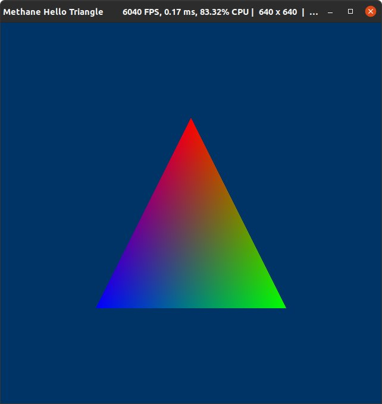

# Hello Triangle Tutorial

| Windows (DirectX 12) | MacOS (Metal) | Linux (Vulkan) |
| -------------------- | ------------- | -------------- |
|  |  |  |

This tutorial demonstrates colored triangle rendering implemented in just 130 lines of code using Methane Kit:
- [HelloTriangleApp.cpp](HelloTriangleApp.cpp)
- [Shaders/HelloTriangle.hlsl](Shaders/HelloTriangle.hlsl)

Tutorial demonstrates the following Methane Kit features and techniques:
- Using of the base graphics application for deferred frames rendering.
- Loading shaders, creating program and render state.
- Using render command lists for encoding draw commands.
- Executing command lists on GPU and presenting frame buffers on screen.
- Configuring cross-platform application build with shaders compilation to embedded resources.

## Application and Frame Class Definitions

Application class `HelloTriangleApp` is derived from the base template class [Graphics::App<HelloTriangleFrame>](/Modules/Graphics/App) 
which implements base platform and graphics application infrastructure with support of deferred frames rendering.

Application frame class `HelloTriangleFrame` is derived from the base class `Graphics::AppFrame` and extends it 
with render command list `render_cmd_list_ptr` and command list set `execute_cmd_list_set_ptr` submitted 
for rendering to frame buffer `index`. Application is initialized with default settings using `Graphics::AppSettings` structure,
which is initialized with convenience function `Samples::GetGraphicsAppSettings(...)`. 
Destroying of application along with its resources is delayed until all rendering is completed on GPU.

```cpp
#include <Methane/Kit.h>
#include <Methane/Graphics/App.hpp>

using namespace Methane;
using namespace Methane::Graphics;

struct HelloTriangleFrame final : AppFrame
{
    Ptr<RenderCommandList> render_cmd_list_ptr;
    Ptr<CommandListSet>    execute_cmd_list_set_ptr;
    using AppFrame::AppFrame;
};

using GraphicsApp = App<HelloTriangleFrame>;
class HelloTriangleApp final : public GraphicsApp
{
public:
    HelloTriangleApp()
        : GraphicsApp(
            []() {
                Graphics::AppSettings settings = Samples::GetGraphicsAppSettings("Methane Hello Triangle", Samples::g_default_app_options_color_only);
                settings.graphics_app.SetScreenPassAccess(RenderPass::Access::None);
                return settings;
            }())
    { }

    ~HelloTriangleApp() override
    {
        WaitForRenderComplete();
    }

    ...
};
```

## Graphics Resources Initialization

Application class `HelloTriangleApp` keeps frame independent resources in private class members.
In this tutorial it is only render state `m_render_state_ptr` which is initialized in `HelloTriangleApp::Init` method.
Render state is created with `RenderState::Create(...)` factory by passing render context and setting, which encapsulate 
program created inline with `Program::Create(...)`. Program is created with a set of vertex and pixel shaders
created with `Shader::CreateVertex` and `Shader::CreatePixel` factory methods taking `Data::Provider` and 
`Shader::EntryPoint` structure consisting of file and function names. Compiled shader data is embedded in executable resources
and is accessed via shader data provider singleton available with `Data::ShaderProvider::Get()`.
Program also defines input buffer layout using argument semantic names from HLSL shaders. Methane graphics abstraction 
uses shader reflection to automatically identify argument types and offset sizes to build underlying DirectX, Metal or Vulkan
layout description. Render target color formats are also required for program creation, these formats are taken from 
`RenderPattern` object provided by the base class `Graphics::App` and describing general configuration of color/depth/stencil
attachments used for final drawing to window on screen. `RenderState::Settings` requires a pointer to `RenderPattern`
object and also contains settings of rasterizer, depth, stencil, blending states which are left with default values 
for simplicity of this tutorial.

Render command lists are created for each frame using `RenderCommandList::Create(...)` factory function which is taking
`CommandQueue` and `RenderPass` as its arguments. So the created command list can be used for rendering only to that particular
render pass. Finally, at the end of `Init()` function `GraphicsApp::CompleteInitialization()` is called to complete graphics
resources initialization and prepare for rendering.

```cpp
class HelloTriangleApp final : public GraphicsApp
{
private:
    Ptr<RenderState> m_render_state_ptr;
    
public:
    ...

    void Init() override
    {
        GraphicsApp::Init();

        m_render_state_ptr = RenderState::Create(GetRenderContext(),
            RenderState::Settings
            {
                Program::Create(GetRenderContext(),
                    Program::Settings
                    {
                        Program::Shaders
                        {
                            Shader::CreateVertex(GetRenderContext(), { Data::ShaderProvider::Get(), { "HelloTriangle", "TriangleVS" } }),
                            Shader::CreatePixel(GetRenderContext(),  { Data::ShaderProvider::Get(), { "HelloTriangle", "TrianglePS" } }),
                        },
                        Program::InputBufferLayouts{ },
                        Program::ArgumentAccessors{ },
                        GetScreenRenderPattern().GetAttachmentFormats()
                    }
                ),
                GetScreenRenderPatternPtr()
            }
        );

        for (HelloTriangleFrame& frame : GetFrames())
        {
            frame.render_cmd_list_ptr      = RenderCommandList::Create(GetRenderContext().GetRenderCommandKit().GetQueue(), *frame.screen_pass_ptr);
            frame.execute_cmd_list_set_ptr = CommandListSet::Create({ *frame.render_cmd_list_ptr }, frame.index);
        }

        GraphicsApp::CompleteInitialization();
    }

    ...
};
```

## Frame Rendering Cycle

Rendering is implemented in overridden `HelloTriangleApp::Render` method. Base graphics application
rendering is executed first with `GraphicsApp::Render()` and rendering is continued only when it succeedes,
it waits for previous iteration of rendering cycle completion and availability of all frame resources.
Then current frame resources are requested with `GraphicsApp::GetCurrentFrame()` and used for render commands encoding.

To begin encoding, command list has to be reset with render state using `CommandList::Reset(...)` method.
Default view state is set with full frame viewport and scissor rect using `RenderCommandList::SetViewState(...)`.
Drawing of 3 vertices is submitted as `Triangle` primitive using `RenderCommandList::Draw` call.
Vertex buffers are not used for simplification, so the vertex shader will receive only `vertex_id` and 
will need to provide vertex coordinates based on that. Finally, `CommandList::Commit` method is called 
to complete render commands encoding.

Execution of GPU rendering is started with `CommandQueue::Execute(...)` method called on the same command queue
which was used to create the command list submitted for execution. Frame buffer with the result image is presented by
swap-chain with `RenderContext::Present()` method call.

```cpp
class HelloTriangleApp final : public GraphicsApp
{
    ...

    bool Render() override
    {
        if (!GraphicsApp::Render())
            return false;

        const HelloTriangleFrame& frame = GetCurrentFrame();
        frame.render_cmd_list_ptr->ResetWithState(*m_render_state_ptr);
        frame.render_cmd_list_ptr->SetViewState(GetViewState());
        frame.render_cmd_list_ptr->Draw(RenderCommandList::Primitive::Triangle, 3);
        frame.render_cmd_list_ptr->Commit();

        GetRenderContext().GetRenderCommandKit().GetQueue().Execute(*frame.execute_cmd_list_set_ptr);
        GetRenderContext().Present();

        return true;
    }
};
```

Graphics render loop is started from `main(...)` entry function using `GraphicsApp::Run(...)` method which is also parsing command line arguments.

```cpp
int main(int argc, const char* argv[])
{
    return HelloTriangleApp().Run({ argc, argv });
}
```

## Colored Triangle Shaders

This tutorial uses simple HLSL shader [Shaders/Triangle.hlsl](Shaders/Triangle.hlsl) which is taking vertex positions
and colors from inline constant arrays based on vertex_id argument passed to vertex shader. 

```cpp
struct PSInput
{
    float4 position : SV_POSITION;
    float4 color    : COLOR;
};

PSInput TriangleVS(uint vertex_id : SV_VertexID)
{
    const float4 positions[3] = {
        {  0.0F,  0.5F, 0.0F, 1.F },
        {  0.5F, -0.5F, 0.0F, 1.F },
        { -0.5F, -0.5F, 0.0F, 1.F },
    };

    const float4 colors[3] = {
        { 1.0F, 0.0F, 0.0F, 1.F },
        { 0.0F, 1.0F, 0.0F, 1.F },
        { 0.0F, 0.0F, 1.0F, 1.F },
    };

    PSInput output;
    output.position = positions[vertex_id];
    output.color    = colors[vertex_id];
    return output;
}

float4 TrianglePS(PSInput input) : SV_TARGET
{
    return input.color;
}
```

Shaders configuration file [Shaders/Triangle.cfg](Shaders/Triangle.cfg) 
is created in pair with every shaders file and describes shader types along with entry points and 
optional sets of macro definitions used to pre-build shaders to bytecode at build time:

```ini
vert=TriangleVS
frag=TrianglePS
```

## CMake Build Configuration

Finally CMake build configuration [CMakeLists.txt](CMakeLists.txt) of the application
is powered by the included Methane CMake modules:
- [MethaneApplications.cmake](/CMake/MethaneApplications.cmake) - defines function `add_methane_application`
- [MethaneShaders.cmake](/CMake/MethaneShaders.cmake) - defines function `add_methane_shaders`
- [MethaneResources.cmake](/CMake/MethaneResources.cmake) - defines functions `add_methane_embedded_textures` and `add_methane_copy_textures`

```cmake
include(MethaneApplications)
include(MethaneShaders)

add_methane_application(MethaneHelloTriangle
    "HelloTriangleApp.cpp"
    "${RESOURCES_DIR}"
    "Apps/"
    "Methane Hello Triangle"
    "Tutorial demonstrating colored triangle rendering with Methane Kit."
)

add_methane_shaders(MethaneHelloTriangle
    "${CMAKE_CURRENT_SOURCE_DIR}/Shaders/HelloTriangle.hlsl"
    "6_0"
)

target_link_libraries(${TARGET}
    PRIVATE
        MethaneAppsCommon
)
```

Now you have all in one application executable/bundle running on Windows & MacOS, which is rendering colored triangle in window with support of resizing the frame buffer.

## Continue learning

Continue learning Methane Graphics programming in the next tutorial [Hello Cube](../02-HelloCube), 
which is demonstrating cube mesh drawing using vertex and index buffers with camera projection applied on CPU.
