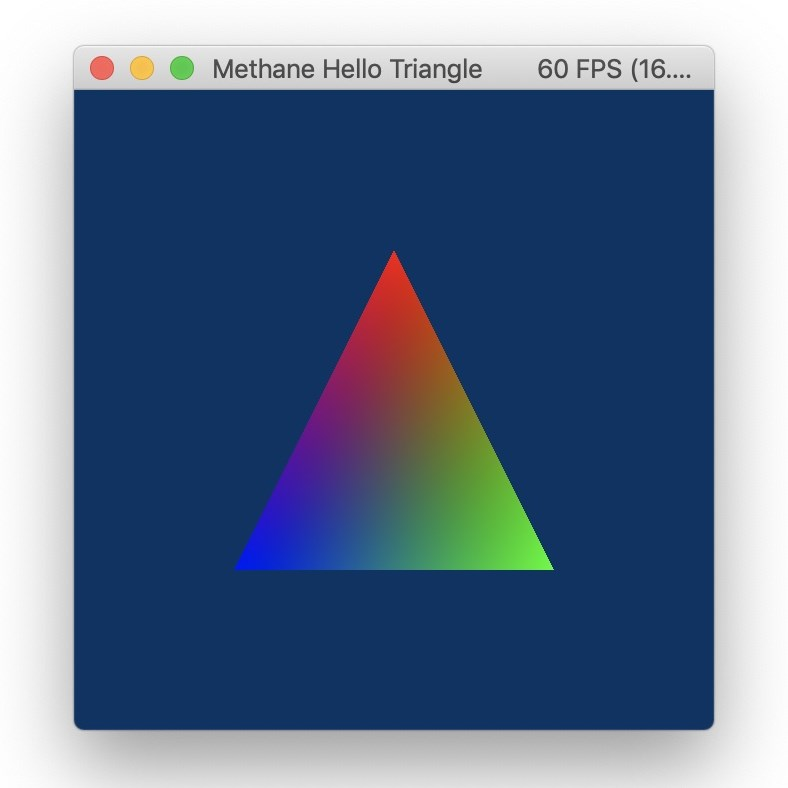

# Hello Triangle Tutorial

| Windows (DirectX 12) | MacOS (Metal) |
| -------------------- | ------------- |
|  |  |

This tutorial application demonstrates colored triangle rendering implemented in just 120 lines of code using Methane Kit - see [HelloTriangleAppSimple.cpp](HelloTriangleAppSimple.cpp).

Application class `HelloTriangleApp` is derived from the base template class `Graphics::App<HelloTriangleFrame>` 
which implements some routine aspect of the graphics application:
- Render context initialization available with `GraphicsApp::GetRenderContext()` method 
- Per-frame resources management from `Graphics::AppFrame` class: frame buffer `sp_screen_texture` and screen render pass `sp_screen_pass`.
It includes initialization, frame resizing and releasing on context reset.

Application frame class `HelloTriangleFrame` is derived from base class `Graphics::AppFrame` and extends it 
with render command list `sp_render_cmd_list` and command list set `sp_execute_cmd_list_set` submitted 
for rendering to frame buffer `index`. Application is initialized with default settings using `AppSettings` structure.
Destroying of application along with its resources is delayed until all rendering is completed on GPU.

```cpp
#include <Methane/Kit.h>

using namespace Methane;
using namespace Methane::Graphics;

struct HelloTriangleFrame final : AppFrame
{
    Ptr<RenderCommandList> sp_render_cmd_list;
    Ptr<CommandListSet>    sp_execute_cmd_list_set;
    using AppFrame::AppFrame;
};

using GraphicsApp = App<HelloTriangleFrame>;
class HelloTriangleApp final : public GraphicsApp
{
public:
    HelloTriangleApp() : GraphicsApp(
        {                                        // Application settings:
            {                                    // platform_app:
                "Methane Hello Triangle",        // - name
                0.8, 0.8,                        // - width, height
            },                                   //
            {                                    // graphics_app:
                RenderPass::Access::None,        // - screen_pass_access
                false,                           // - animations_enabled
            },                                   //
            {                                    // render_context:
                FrameSize(),                     // - frame_size placeholder: set in InitContext
                PixelFormat::BGRA8Unorm,         // - color_format
                PixelFormat::Unknown,            // - depth_stencil_format
                Color4f(0.0f, 0.2f, 0.4f, 1.0f), // - clear_color
            }
        })
    { }

    ~HelloTriangleApp() override
    {
        GetRenderContext().WaitForGpu(Context::WaitFor::RenderComplete);
    }

    ...
};
```

Application class `HelloTriangleApp` keeps frame independent resources in class members: render state `m_sp_render_state` and 
set of vertex buffers used for triangle rendering `m_sp_vertex_buffer_set` - they are initialized in `HelloTriangleApp::Init` method. 
Vertex buffer is created with `Buffer::CreateVertexBuffer(...)` factory and filled with vertex data using `Buffer::SetData(...)`
function via `Resource::SubResource` representing initialization data chunk.

Render state is created with `RenderState::Create(...)` factory by passing render context and setting, which encapsulate 
program created inline with `Program::Create(...)`. Program is created with a set of vertex and pixel shaders
created with `Shader::CreateVertex` and `Shader::CreatePixel` factory methods taking `Data::Provider` and 
`Shader::EntryPoint` structure consisting of file and function names. Compiled shader data is embedded in executable resources
and is accessed via shader data provider singleton available with `Data::ShaderProvider::Get()`.
Program also defines input buffer layout using argument semantic names from HLSL shaders. Methane graphics abstraction 
uses shader reflection to identify argument types and offset sizes to build underlying DirectX or Metal layout description.
Note that render target color formats matching formats of the render pass color attachments are also required for program creation.

Render command lists are created for each frame using `RenderCommandList::Create(...)` factory function which is taking
render context and render pass as its arguments. So the created command list can be used for rendering only to that particular
render pass. Finally at the end of `Init()` function `GraphicsApp::CompleteInitialization()` is called to complete graphics
resources initialization to prepare for rendering.

```cpp
class HelloTriangleApp final : public GraphicsApp
{
private:
    Ptr<RenderState> m_sp_render_state;
    Ptr<BufferSet>   m_sp_vertex_buffer_set;
    
public:
    ...

    void Init() override
    {
        GraphicsApp::Init();

        struct Vertex { Vector3f position; Vector3f color; };
        const std::array<Vertex, 3> triangle_vertices{ {
            { { 0.0f,   0.5f,  0.0f }, { 1.0f, 0.0f, 0.0f } },
            { { 0.5f,  -0.5f,  0.0f }, { 0.0f, 1.0f, 0.0f } },
            { { -0.5f, -0.5f,  0.0f }, { 0.0f, 0.0f, 1.0f } },
        } };

        const Data::Size vertex_buffer_size = static_cast<Data::Size>(sizeof(triangle_vertices));
        Ptr<Buffer> sp_vertex_buffer = Buffer::CreateVertexBuffer(GetRenderContext(), vertex_buffer_size, static_cast<Data::Size>(sizeof(Vertex)));
        sp_vertex_buffer->SetData(
            Resource::SubResources
            {
                Resource::SubResource { reinterpret_cast<Data::ConstRawPtr>(triangle_vertices.data()), vertex_buffer_size }
            }
        );
        m_sp_vertex_buffer_set = BufferSet::CreateVertexBuffers({ *sp_vertex_buffer });

        m_sp_render_state = RenderState::Create(GetRenderContext(),
            RenderState::Settings
            {
                Program::Create(GetRenderContext(),
                    Program::Settings
                    {
                        Program::Shaders
                        {
                            Shader::CreateVertex(GetRenderContext(), { Data::ShaderProvider::Get(), { "Triangle", "TriangleVS" } }),
                            Shader::CreatePixel(GetRenderContext(),  { Data::ShaderProvider::Get(), { "Triangle", "TrianglePS" } }),
                        },
                        Program::InputBufferLayouts
                        {
                            Program::InputBufferLayout
                            {
                                Program::InputBufferLayout::ArgumentSemantics { "POSITION", "COLOR" },
                            }
                        },
                        Program::ArgumentDescriptions { },
                        PixelFormats { GetRenderContext().GetSettings().color_format }
                    }
                )
            }
        );

        for (HelloTriangleFrame& frame : GetFrames())
        {
            frame.sp_render_cmd_list      = RenderCommandList::Create(GetRenderContext().GetRenderCommandQueue(), *frame.sp_screen_pass);
            frame.sp_execute_cmd_list_set = CommandListSet::Create({ *frame.sp_render_cmd_list });
        }

        GraphicsApp::CompleteInitialization();
    }

    void OnContextReleased(Context& context) override
    {
        m_sp_vertex_buffer_set.reset();
        m_sp_render_state.reset();

        GraphicsApp::OnContextReleased(context);
    }

    ...
};
```

Rendering is implemented in overridden `HelloTriangleApp::Render` method. First, base graphics application
rendering logic is called with `GraphicsApp::Render()` and rendering is continued only when it allows.
Then current frame resources are requested with `GraphicsApp::GetCurrentFrame()` and used for render commands encoding to 
the current frame buffer.

Command list has to be reset with active render state using `CommandList::Reset(...)` method called before any render commands encoding.
Default view state is set with full frame viewport and scissor rect using `RenderCommandList::SetViewState`.
Then vertex buffers are set and drawn as `Triangle` primitives using `RenderCommandList::SetVertexBuffers` and `RenderCommandList::Draw` calls.
And finally `CommandList::Commit` method is called to complete render commands encoding.

Execution of GPU rendering is started with `CommandQueue::Execute(...)` method called on the same command queue
which was used to create the command list submitted for execution. Frame buffer with the result image is presented by
swap-chain with `RenderContext::Present()` method call.

```cpp
class HelloTriangleApp final : public GraphicsApp
{
    ...

    bool Render() override
    {
        if (!GraphicsApp::Render())
            return false;

        HelloTriangleFrame& frame = GetCurrentFrame();
        frame.sp_render_cmd_list->Reset(m_sp_render_state);
        frame.sp_render_cmd_list->SetViewState(GetViewState());
        frame.sp_render_cmd_list->SetVertexBuffers(*m_sp_vertex_buffer_set);
        frame.sp_render_cmd_list->Draw(RenderCommandList::Primitive::Triangle, 3);
        frame.sp_render_cmd_list->Commit();

        GetRenderContext().GetRenderCommandQueue().Execute(*frame.sp_execute_cmd_list_set);
        GetRenderContext().Present();

        return true;
    }
};
```

Graphics render loop is started from `main(...)` entry function using `GraphicsApp::Run(...)` method which is also parsing command line arguments.

```cpp
int main(int argc, const char* argv[])
{
    return HelloTriangleApp().Run({ argc, argv });
}
```

This tutorial uses simple HLSL shader [Shaders/Triangle.hlsl](Shaders/Triangle.hlsl).
Note that semantic names of `VSInput` structure members, passed as argument to vertex shader function `TriangleVS(VSInput input)`, 
are matching to input buffer layout arguments `Program::InputBufferLayout::ArgumentSemantics { "POSITION", "COLOR" }`
passed in Settings of `Program::Create(...)` call.

```cpp
struct VSInput
{
    float3 position : POSITION;
    float3 color    : COLOR;
};

struct PSInput
{
    float4 position : SV_POSITION;
    float4 color    : COLOR;
};

PSInput TriangleVS(VSInput input)
{
    PSInput output;
    output.position = float4(input.position, 1.f);
    output.color    = float4(input.color, 1.f);
    return output;
}

float4 TrianglePS(PSInput input) : SV_TARGET
{
    return input.color;
}
```

Shaders configuration file [Shaders/Triangle.cfg](Shaders/Triangle.cfg) 
is created in pair with every shaders file and describes shader types along with entry points and 
optional sets of macro definitions used to pre-build shaders to bytecode at build time:

```ini
frag=TrianglePS
vert=TriangleVS
```

Finally CMake build configuration [CMakeLists.txt](CMakeLists.txt) of the application
is powered by the included Methane CMake modules:
- [MethaneApplications.cmake](../../CMake/MethaneApplications.cmake) - defines function `add_methane_application`
- [MethaneShaders.cmake](../../CMake/MethaneShaders.cmake) - defines function `add_methane_shaders`
- [MethaneResources.cmake](../../CMake/MethaneResources.cmake) - defines functions `add_methane_embedded_textures` and `add_methane_copy_textures`

```cmake
include(MethaneApplications)
include(MethaneShaders)

add_methane_application(MethaneHelloTriangle
    "HelloTriangleAppSimple.cpp"
    "${RESOURCES_DIR}"
    "Apps/Tutorials"
    "Methane Hello Triangle"
)

add_methane_shaders(MethaneHelloTriangle
    "${CMAKE_CURRENT_SOURCE_DIR}/Shaders/Triangle.hlsl"
    "6_0"
)
```

Now you have all in one application executable/bundle running on Windows & MacOS, which is rendering colored triangle in window with support of resizing the frame buffer.
