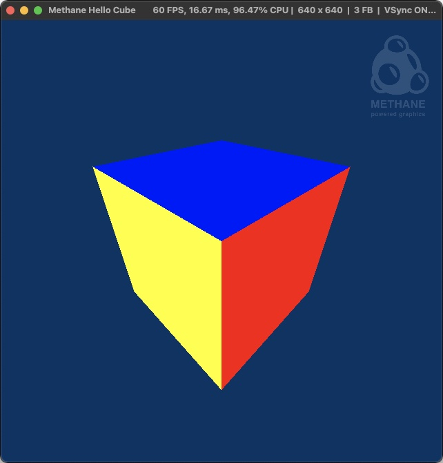

# Hello Cube Tutorial

| Windows (DirectX 12) | MacOS (Metal) | Linux (Vulkan) |
| -------------------- | ------------- | -------------- |
|  |  |  |

This tutorial demonstrates colored cube rendering implemented in just 220 lines of code using Methane Kit:
- [HelloCubeApp.cpp](HelloCubeApp.cpp)
- [Shaders/HelloCube.hlsl](Shaders/HelloCube.hlsl)

Tutorial demonstrates the following Methane Kit features and techniques:
- Creating vertex and index buffers on GPU and filling them with data from CPU.
- Generating cube mesh vertices and indices data with custom vertex layout.
- Using time animation for camera rotation.
- Creating camera view and projection matrices.
- Transforming cube vertices with camera matrices on CPU and updating vertex buffers on GPU

## Application and Frame Class Members

Application Frame class `HelloCubeFrame` is derived from the base class `Graphics::AppFrame` and extends it
with render command list `render_cmd_list_ptr`, command list set `execute_cmd_list_set_ptr` and volatile 
vertex buffer set `vertex_buffer_set_ptr` used for cube drawing.

```cpp
struct HelloCubeFrame final : AppFrame
{
    Ptr<BufferSet>         vertex_buffer_set_ptr;
    Ptr<RenderCommandList> render_cmd_list_ptr;
    Ptr<CommandListSet>    execute_cmd_list_set_ptr;

    using AppFrame::AppFrame;
};
```

Application class `HelloCubeApp` is derived from the base template class [Graphics::App<HelloCubeFrame>](/Modules/Graphics/App).
- `m_cube_mesh` member of type `CubeMesh<CubeVertex>` generates and holds cube model vertices defined by `CubeVertex` struct with layout which contains positions and colors.
- `m_model_matrix` matrix is used for cube model scaling.
- `m_proj_vertices` vertices vector is used to store transformed vertices in projection coordinates,
which are then transfered to GPU vertex buffer.
- `m_camera` is perspective camera model which is used to generate view and projection matrices.


```cpp
using GraphicsApp = App<HelloCubeFrame>;
class HelloCubeApp final : public GraphicsApp
{
private:
    struct CubeVertex
    {
        Mesh::Position position;
        Mesh::Color    color;

        inline static const Mesh::VertexLayout layout{
            Mesh::VertexField::Position,
            Mesh::VertexField::Color
        };
    };

    const CubeMesh<CubeVertex> m_cube_mesh{ CubeVertex::layout };
    const hlslpp::float4x4     m_model_matrix = hlslpp::float4x4::scale(15.F);
    std::vector<CubeVertex>    m_proj_vertices;
    Camera                     m_camera;

    ...
};
```

`HelloCubeApp` constructor calls base constructor `GraphicsApp` with `Graphics::AppSettings` initialized
using helper function `GetGraphicsAppSettings` which is called with predefined flags to enable color buffer 
without depth and enable animations. `m_proj_vertices` is initialized with vertices data taken from cube mesh generator.

Initial camera orientation is set with `Camera::ResetOrientation` via `Camera::Orientation` struct with
`eye`, `aim` and `up` vectors. Then we setup camera rotation animation which automatically updates the orientation
before every iteration of update/render. Animation is setup simply by adding `Data::TimeAnimation` object with
lamda function taking `delta_seconds` argument used to calculate the rotation delta angle around camera's `up` axis.

```cpp
HelloCubeApp()
    : GraphicsApp(
        []() {
            Graphics::AppSettings settings = Samples::GetGraphicsAppSettings("Methane Hello Cube", Samples::g_default_app_options_color_only_and_anim);
            settings.graphics_app.SetScreenPassAccess(RenderPass::Access::None);
            return settings;
        }())
    , m_proj_vertices(m_cube_mesh.GetVertices())
{
    m_camera.ResetOrientation({ { 13.0F, 13.0F, 13.0F }, { 0.0F, 0.0F, 0.0F }, { 0.0F, 1.0F, 0.0F } });

    // Setup camera rotation animation
    GetAnimations().emplace_back(std::make_shared<Data::TimeAnimation>(
        [this](double, double delta_seconds)
        {
            m_camera.Rotate(m_camera.GetOrientation().up, static_cast<float>(delta_seconds * 360.F / 8.F));
            return true;
        }));
}
```

## Graphics Resources Initialization

Application class `HelloCubeApp` keeps frame independent resources in class members: render state `m_render_state_ptr` and
set of vertex buffers used for triangle rendering `m_index_buffer_ptr` - they are initialized in `HelloCubeApp::Init` method.
But first of all, camera view is resized according to render context size to maintain the correct aspect ratio of the projection. 

Render state is created with `RenderState::Create(...)` function similarly as in [HelloTriangle](../01-HelloTriangle) tutorial.
Program is created as a part of the state with `Program::Create(...)` function which takes `Program::Settings`, which differ
from program settings in [HelloTriangle](../01-HelloTriangle) with configuration of `Program::InputBufferLayouts`. In this tutorial
we use single input vertex buffer with interleaved positions and colors, which is described by `Program::InputBufferLayout` with
an array of HLSL vertex shader input semantics, which correspond to `CubeVertex` struct layout.

```cpp
class HelloCubeApp final : public GraphicsApp
{
private:
    ...

    Ptr<RenderState> m_render_state_ptr;
    Ptr<Buffer>      m_index_buffer_ptr;
    
public:
    ...

    void Init() override
    {
        GraphicsApp::Init();

        m_camera.Resize(GetRenderContext().GetSettings().frame_size);

        // Create render state with program
        m_render_state_ptr = RenderState::Create(GetRenderContext(),
            RenderState::Settings
            {
                Program::Create(GetRenderContext(),
                    Program::Settings
                    {
                        Program::Shaders
                        {
                            Shader::CreateVertex(GetRenderContext(), { Data::ShaderProvider::Get(), { "HelloCube", "CubeVS" } }),
                            Shader::CreatePixel( GetRenderContext(), { Data::ShaderProvider::Get(), { "HelloCube", "CubePS" } }),
                        },
                        Program::InputBufferLayouts
                        {
                            Program::InputBufferLayout
                            {
                                Program::InputBufferLayout::ArgumentSemantics { "POSITION" , "COLOR" }
                            }
                        },
                        Program::ArgumentAccessors{ },
                        GetScreenRenderPattern().GetAttachmentFormats()
                    }
                ),
                GetScreenRenderPatternPtr()
            }
        );

        ...
    }

    ...
};
```

Constant index buffer is created with `Buffer::CreateIndexBuffer(...)` function which takes index data size in bytes and index format.
The data of index buffer in set with `Buffer::SetData` call wich takes an array of sub-resources. In case of index buffer we need to
provide only one default sub-resource with data pointer and data size.

Volatile vertex buffers are created with `Buffer::CreateVertexBuffer(...)` one for each frame buffer so that they can be updated independently:
while one vertex buffer is used for current frame rendering, other vertex buffers can be updated asynchronously. Buffers are created in volatile mode,
which enables more effective synchonous data updates (aka map-updates). Each vertex buffer is encapsulated in the buffer set with 
`BufferSet::CreateVertexBuffers(...)` used for command list encoding.

Render command lists are created for each frame using `RenderCommandList::Create(...)` function, same as in [HelloTriangle](../01-HelloTriangle)
tutorial.

```cpp
class HelloTriangleApp final : public GraphicsApp
{
    ...

    void Init() override
    {
        ...

        // Create index buffer for cube mesh
        m_index_buffer_ptr = Buffer::CreateIndexBuffer(GetRenderContext(), m_cube_mesh.GetIndexDataSize(), GetIndexFormat(m_cube_mesh.GetIndex(0)));
        m_index_buffer_ptr->SetData({ { reinterpret_cast<Data::ConstRawPtr>(m_cube_mesh.GetIndices().data()), m_cube_mesh.GetIndexDataSize() } }); // NOSONAR

        // Create per-frame command lists
        for(HelloCubeFrame& frame : GetFrames())
        {
            // Create vertex buffers for each frame
            Ptr<Buffer> vertex_buffer_ptr = Buffer::CreateVertexBuffer(GetRenderContext(), m_cube_mesh.GetVertexDataSize(), m_cube_mesh.GetVertexSize(), true);
            frame.vertex_buffer_set_ptr = BufferSet::CreateVertexBuffers({ *vertex_buffer_ptr });

            // Create command list for rendering
            frame.render_cmd_list_ptr = RenderCommandList::Create(GetRenderContext().GetRenderCommandKit().GetQueue(), *frame.screen_pass_ptr);
            frame.execute_cmd_list_set_ptr = CommandListSet::Create({ *frame.render_cmd_list_ptr });
        }

        GraphicsApp::CompleteInitialization();
    }
```

## Frame Rendering Cycle

Each rendering cycle is started with `GraphicsApp::Update()` method used for updating the data for frame rendering.
This method is called just before `GraphicsApp::Render()` so that frame data is prepared while previous frames are rendering on GPU,
just before waiting for current frame buffer is released from previous rendering cycle. For the purpose of simplicity,
in this tutorial we transform vertex positions from model to projection coordinates on CPU, while usually it is done on GPU
(this allows to avoid using uniform buffers and program bindings in this tutorial). Vertex positions are updated
using model-view-projection (MVP) matrix calculated as multiplication of model scaling matrix and camera view-projection matrix.
Projected positions in `m_proj_vertices` are calculated by multiplication original positions to the MVP matrix and normalization by W-coordinate.

```cpp
class HelloCubeApp final : public GraphicsApp
{
    ...

    bool Update() override
    {
        if (!GraphicsApp::Update())
            return false;

        // Update vertex buffer with camera Model-View-Projection matrix applied on CPU
        const hlslpp::float4x4 mvp_matrix = hlslpp::mul(m_model_matrix, m_camera.GetViewProjMatrix());
        for(size_t vertex_index = 0; vertex_index < m_proj_vertices.size(); ++vertex_index)
        {
            const hlslpp::float4 orig_position_vec(m_cube_mesh.GetVertices()[vertex_index].position.AsHlsl(), 1.F);
            const hlslpp::float4 proj_position_vec = hlslpp::mul(orig_position_vec, mvp_matrix);
            m_proj_vertices[vertex_index].position = Mesh::Position(proj_position_vec.xyz / proj_position_vec.w);
        }

        return true;
    }

    ...
};
```

Rendering is performed in overridden `HelloCubeApp::Render` method. Scene rendering is started strictly after
the base graphics application rendering logic is completed in `GraphicsApp::Render()`, because it waits for
previous iteration of rendering cycle completion and availability of all frame resources. Then current frame resources 
are requested with `GraphicsApp::GetCurrentFrame()` and used for render commands encoding.

We start with updating volatile vertex buffers with projected vertex data, which was updated in the previous
method call `HelloCubeApp::Update()`. Cube rendering is done similar to the triangle rendering in previous
tutorial with the only difference of setting vertex and index buffers with `RenderCommandList::SetVertexBuffers(...)`
and `RenderCommandList::SetIndexBuffers(...)` encoded before `RenderCommandList::DrawIndexed(...)` call. Note that number of vertices
is not passed explictly for `DrawIndexed`, but is taken from the nu,ber of indies in index buffer.

Execution of GPU rendering is started with `CommandQueue::Execute(...)` method called on the same command queue
which was used to create the command list submitted for execution. Frame buffer with the result image is presented by
swap-chain with `RenderContext::Present()` method call.

```cpp
class HelloCubeApp final : public GraphicsApp
{
    ...

    bool Render() override
    {
        if (!GraphicsApp::Render())
            return false;

            const HelloCubeFrame& frame = GetCurrentFrame();

        // Update vertex buffer with vertices in camera's projection view
        (*frame.vertex_buffer_set_ptr)[0].SetData(
            { { reinterpret_cast<Data::ConstRawPtr>(m_proj_vertices.data()), m_cube_mesh.GetVertexDataSize() } },
            &GetRenderContext().GetRenderCommandKit().GetQueue()
        );

        // Issue commands for cube rendering
        META_DEBUG_GROUP_CREATE_VAR(s_debug_group, "Cube Rendering");
        frame.render_cmd_list_ptr->ResetWithState(*m_render_state_ptr, s_debug_group.get());
        frame.render_cmd_list_ptr->SetViewState(GetViewState());
        frame.render_cmd_list_ptr->SetVertexBuffers(*frame.vertex_buffer_set_ptr);
        frame.render_cmd_list_ptr->SetIndexBuffer(*m_index_buffer_ptr);
        frame.render_cmd_list_ptr->DrawIndexed(RenderCommandList::Primitive::Triangle);
        frame.render_cmd_list_ptr->Commit();

        // Execute command list on render queue and present frame to screen
        GetRenderContext().GetRenderCommandKit().GetQueue().Execute(*frame.execute_cmd_list_set_ptr);
        GetRenderContext().Present();

        return true;
    }
};
```

Graphics render loop is started from `main(...)` entry function using `GraphicsApp::Run(...)` method which is also parsing command line arguments.

```cpp
int main(int argc, const char* argv[])
{
    return HelloTriangleApp().Run({ argc, argv });
}
```

## Frame Resizing

Additionally, camera view needs to be resized along with the window in the overriden `HelloCubeApp::Resize(...)` method 
so that projected image aspect ratio will be the same as for window. 

```cpp
class HelloCubeApp final : public GraphicsApp
{
    ...

    bool Resize(const FrameSize& frame_size, bool is_minimized) override
    {
        // Resize screen color and depth textures
        if (!GraphicsApp::Resize(frame_size, is_minimized))
            return false;

        m_camera.Resize(frame_size);
        return true;
    }

    ...
}
```

## Colored Cube Shaders

This tutorial uses simple HLSL shader [Shaders/HelloCube.hlsl](Shaders/HelloCube.hlsl).
Note that semantic names of `VSInput` structure members, passed as argument to vertex shader function `CubeVS(VSInput input)`,
are matching to input buffer layout arguments `Program::InputBufferLayout::ArgumentSemantics { "POSITION", "COLOR" }`
passed in Settings of `Program::Create(...)` call and also correpong to `CubeVertex` struct layout.

```cpp
struct VSInput
{
    float3 position : POSITION;
    float3 color    : COLOR;
};

struct PSInput
{
    float4 position : SV_POSITION;
    float4 color    : COLOR;
};

PSInput CubeVS(VSInput input)
{
    PSInput output;
    output.position = float4(input.position, 1.F);
    output.color    = float4(input.color, 1.F);
    return output;
}

float4 CubePS(PSInput input) : SV_TARGET
{
    return input.color;
}
```

Shaders configuration file [Shaders/Triangle.cfg](Shaders/HelloCube.cfg)
is created in pair with every shaders file and describes shader types along with entry points and
optional sets of macro definitions used to pre-build shaders to bytecode at build time:

```ini
vert=CubeVS
frag=CubePS
```

## CMake Build Configuration

CMake build configuration [CMakeLists.txt](CMakeLists.txt) of the application is powered by the included Methane CMake modules.

```cmake
add_methane_application(MethaneHelloCube
    HelloCubeApp.cpp
    "${RESOURCES_DIR}"
    "Apps"
    "Methane Hello Cube"
    "Tutorial demonstrating colored rotating cube rendering with Methane Kit."
    "${METHANE_COPYRIGHT}"
    "${METHANE_VERSION_SHORT}"
    "${METHANE_VERSION_BUILD}"
)

add_methane_shaders(MethaneHelloCube
    "${CMAKE_CURRENT_SOURCE_DIR}/Shaders/HelloCube.hlsl"
    "6_0"
)

target_link_libraries(MethaneHelloCube
    PRIVATE
        MethaneAppsCommon
)
```

## Continue learning

Continue learning Methane Graphics programming in the next tutorial [Textured Cube](../03-TexturedCube), 
which is demonstrating textured cube rendering with phong lighting using vertex position transformation on GPU,
uniform buffers and program bindings.
