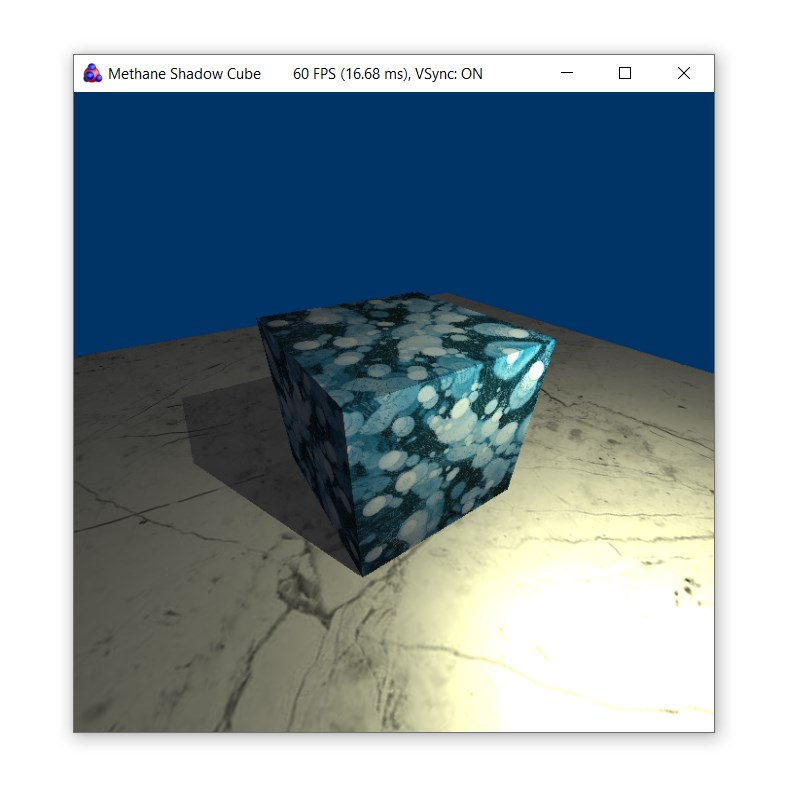

# Shadow Cube Tutorial

| Windows (DirectX 12) | MacOS (Metal) |
| -------------------- | ------------- |
|  |  |

This tutorial demonstrates using two render passes for rendering shadows additionally to textured cube.
Tutorial demonstrates using of the following Methane Kit features additionally to features demonstrated in [TexturedCube](../02-TexturedCube) tutorial:
- TBD...

## Application and Frame Class Definitions

`ShadowCubeApp` class is declared in header file [ShadowCubeApp.h](ShadowCubeApp.h).
Private section of the `ShadowCubeApp` class contains declaration of shader argument structures, 
which layout is matching definition of the equally named structures in [HLSL shader code](#shadow-cube-shaders):
- `Constants` structure data is stored in the `m_scene_constants` and is uploaded into the `Graphics::Buffer` object `m_const_buffer_ptr` 
which is one per application since its data is constant for all frames.
- `SceneUniforms` structure data is stored in the `m_scene_uniforms` and is uploaded into the `Graphics::Buffer` objects in 
per-frame `ShadowCubeFrame` structures each with it's own state of volatile uniform values.
- `MeshUniforms` structure data contains model/mvp matrices and shadow mvp+transform matrix stored in 4 instances:
uniforms for shadow and final passes stored in `TexturedMeshBuffers` objects one for cube mesh in `m_cube_buffers_ptr` 
and one for floor mesh in `m_floor_buffers_ptr`.

[MeshBuffers.hpp](../../../Modules/Graphics/Extensions/Include/Methane/Graphics/MeshBuffers.hpp) implements auxiliary class
`TexturedMeshBuffers<UniformsType>` which is managing vertex, index, uniforms buffers and texture with data for particular
mesh drawing passed to constructor as a reference to [BaseMesh<VType>]((../../../Modules/Graphics/Primitives/Include/Methane/Graphics/Mesh/BaseMesh.hpp)) object.

```cpp
#pragma once

#include <Methane/Kit.h>
#include <Methane/UserInterface/App.hpp>

namespace Methane::Tutorials
{

namespace gfx = Methane::Graphics;

struct ShadowCubeFrame final : gfx::AppFrame
{
    ...    
};

using UserInterfaceApp = UserInterface::App<ShadowCubeFrame>;

class ShadowCubeApp final : public UserInterfaceApp
{
   ...

private:
    struct SHADER_STRUCT_ALIGN Constants
    {
        SHADER_FIELD_ALIGN gfx::Color4f   light_color;
        SHADER_FIELD_PACK  float          light_power;
        SHADER_FIELD_PACK  float          light_ambient_factor;
        SHADER_FIELD_PACK  float          light_specular_factor;
    };

    struct SHADER_STRUCT_ALIGN SceneUniforms
    {
        SHADER_FIELD_ALIGN gfx::Vector4f  eye_position;
        SHADER_FIELD_ALIGN gfx::Vector3f  light_position;
    };

    struct SHADER_STRUCT_ALIGN MeshUniforms
    {
        SHADER_FIELD_ALIGN gfx::Matrix44f model_matrix;
        SHADER_FIELD_ALIGN gfx::Matrix44f mvp_matrix;
        SHADER_FIELD_ALIGN gfx::Matrix44f shadow_mvpx_matrix;
    };

    using TexturedMeshBuffersBase = gfx::TexturedMeshBuffers<MeshUniforms>;
    class TexturedMeshBuffers : public TexturedMeshBuffersBase
    {
    public:
        using TexturedMeshBuffersBase::TexturedMeshBuffersBase;

        void                SetShadowPassUniforms(const MeshUniforms& uniforms) noexcept        { m_shadow_pass_uniforms = uniforms; }
        const MeshUniforms& GetShadowPassUniforms() const noexcept                              { return m_shadow_pass_uniforms; }
        const gfx::Resource::SubResources& GetShadowPassUniformsSubresources() const noexcept   { return m_shadow_pass_uniforms_subresources; }

    private:
        MeshUniforms                m_shadow_pass_uniforms{};
        gfx::Resource::SubResources m_shadow_pass_uniforms_subresources{
            { reinterpret_cast<Data::ConstRawPtr>(&m_shadow_pass_uniforms), sizeof(MeshUniforms) }
        };
    };

    ...

    const float                 m_scene_scale;
    const Constants             m_scene_constants;
    SceneUniforms               m_scene_uniforms{ };
    gfx::Resource::SubResources m_scene_uniforms_subresources{
        { reinterpret_cast<Data::ConstRawPtr>(&m_scene_uniforms), sizeof(SceneUniforms) }
    };
    gfx::Camera                 m_view_camera;
    gfx::Camera                 m_light_camera;
    Ptr<gfx::Buffer>            m_const_buffer_ptr;
    Ptr<gfx::Sampler>           m_texture_sampler_ptr;
    Ptr<gfx::Sampler>           m_shadow_sampler_ptr;
    Ptr<TexturedMeshBuffers>    m_cube_buffers_ptr;
    Ptr<TexturedMeshBuffers>    m_floor_buffers_ptr;
    
    ...
};

} // namespace Methane::Tutorials
```

## Graphics Resources Initialization

## Frame Rendering Cycle

## Shadow Cube Shaders

```cpp
#include "..\..\..\Common\Shaders\Primitives.hlsl"

struct VSInput
{
    float3 position         : POSITION;
    float3 normal           : NORMAL;
#ifdef ENABLE_TEXTURING
    float2 texcoord         : TEXCOORD;
#endif
};

struct PSInput
{
    float4 position         : SV_POSITION;
    float3 world_position   : POSITION0;
    float3 world_normal     : NORMAL;
#ifdef ENABLE_SHADOWS
    float4 shadow_position  : POSITION1;
#endif
#ifdef ENABLE_TEXTURING
    float2 texcoord         : TEXCOORD;
#endif
};

struct Constants
{
    float4 light_color;
    float  light_power;
    float  light_ambient_factor;
    float  light_specular_factor;
};

struct SceneUniforms
{
    float4   eye_position;
    float3   light_position;
};

struct MeshUniforms
{
    float4x4 model_matrix;
    float4x4 mvp_matrix;
#ifdef ENABLE_SHADOWS
    float4x4 shadow_mvpx_matrix;
#endif
};

ConstantBuffer<Constants>     g_constants       : register(b1);
ConstantBuffer<SceneUniforms> g_scene_uniforms  : register(b2);
ConstantBuffer<MeshUniforms>  g_mesh_uniforms   : register(b3);

#ifdef ENABLE_SHADOWS
Texture2D                     g_shadow_map      : register(t0);
SamplerState                  g_shadow_sampler  : register(s0);
#endif

#ifdef ENABLE_TEXTURING
Texture2D                     g_texture         : register(t1);
SamplerState                  g_texture_sampler : register(s1);
#endif

PSInput CubeVS(VSInput input)
{
    const float4 position   = float4(input.position, 1.0F);

    PSInput output;
    output.position         = mul(g_mesh_uniforms.mvp_matrix, position);
    output.world_position   = mul(g_mesh_uniforms.model_matrix, position).xyz;
    output.world_normal     = normalize(mul(g_mesh_uniforms.model_matrix, float4(input.normal, 0.0)).xyz);
#ifdef ENABLE_SHADOWS
    output.shadow_position  = mul(g_mesh_uniforms.shadow_mvpx_matrix, position);
#endif
#ifdef ENABLE_TEXTURING
    output.texcoord         = input.texcoord;
#endif

    return output;
}

float4 CubePS(PSInput input) : SV_TARGET
{
    const float3 fragment_to_light             = normalize(g_scene_uniforms.light_position - input.world_position);
    const float3 fragment_to_eye               = normalize(g_scene_uniforms.eye_position.xyz - input.world_position);
    const float3 light_reflected_from_fragment = reflect(-fragment_to_light, input.world_normal);

#ifdef ENABLE_SHADOWS
    float3       light_proj_pos = input.shadow_position.xyz / input.shadow_position.w;
    const float  current_depth  = light_proj_pos.z - 0.0001F;
    const float  shadow_depth   = g_shadow_map.Sample(g_shadow_sampler, light_proj_pos.xy).r;
    const float  shadow_ratio   = current_depth > shadow_depth ? 1.0F : 0.0F;
#else
    const float  shadow_ratio   = 0.f;
#endif

#ifdef ENABLE_TEXTURING
    const float4 texel_color    = g_texture.Sample(g_texture_sampler, input.texcoord);
#else
    const float4 texel_color    = { 0.8F, 0.8F, 0.8F, 1.f };
#endif

    const float4 ambient_color  = texel_color * g_constants.light_ambient_factor;
    const float4 base_color     = texel_color * g_constants.light_color * g_constants.light_power;

    const float  distance       = length(g_scene_uniforms.light_position - input.world_position);
    const float  diffuse_part   = clamp(dot(fragment_to_light, input.world_normal), 0.0, 1.0);
    const float4 diffuse_color  = base_color * diffuse_part / (distance * distance);

    const float  specular_part  = pow(clamp(dot(fragment_to_eye, light_reflected_from_fragment), 0.0, 1.0), g_constants.light_specular_factor);
    const float4 specular_color = base_color * specular_part / (distance * distance);

    return ColorLinearToSrgb(ambient_color + (1.f - shadow_ratio) * (diffuse_color + specular_color));
}
```

## CMake Build Configuration

