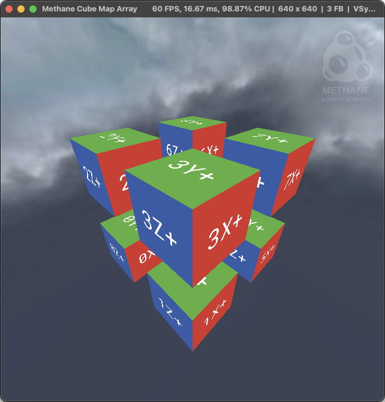
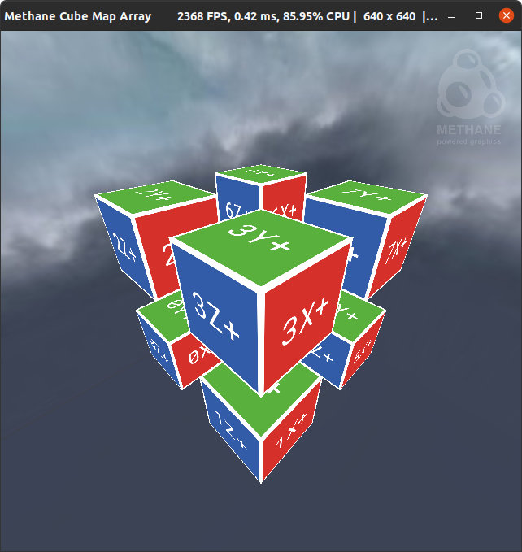

# Cube Map Array Tutorial

| Windows (DirectX 12) | MacOS (Metal) | Linux (Vulkan)                                                  |
| -------------------- | ------------- |-----------------------------------------------------------------|
|  |  |  |

This tutorial demonstrates cube-map array texturing with Methane Kit:
  - [CubeMapArrayApp.h](CubeMapArrayApp.h)
  - [CubeMapArrayApp.cpp](CubeMapArrayApp.cpp)
  - [TextureLabeler.h](CubeMapArrayApp.h)
  - [TextureLabeler.cpp](CubeMapArrayApp.cpp)
  - [Shaders/CubeMapArray.hlsl](Shaders/CubeMapArray.hlsl)
  - [Shaders/CubeMapArrayUniforms.h](Shaders/CubeMapArrayUniforms.h)

Tutorial demonstrates the following rendering techniques:
  - Loading face images to cube map texture and using it for sky-box rendering in background;
  - Creating cube-map array render target texture;
  - Rendering text labels to the faces of cube-map array texture using separate render passes;
  - Instanced rendering of multiple cubes displaying all faces of the pre-rendered cube-map array texture.
