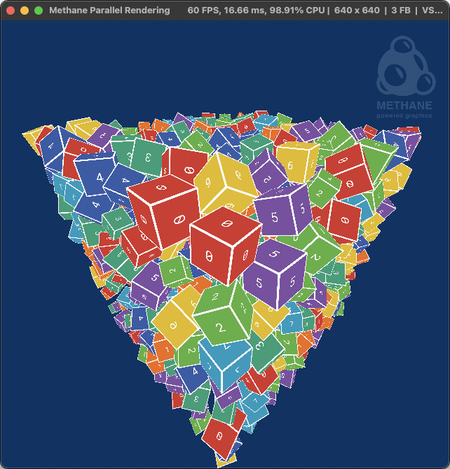

# Parallel Rendering Tutorial

| Windows (DirectX 12) | MacOS (Metal) | Linux (Vulkan)                                                  |
| -------------------- | ------------- |-----------------------------------------------------------------|
|  |  |  |

This tutorial demonstrates multi-threaded rendering with 'ParallelRenderCommandList' to the single render pass with Methane Kit:
  - [ParallelRenderingApp.h](ParallelRenderingApp.h)
  - [ParallelRenderingApp.cpp](ParallelRenderingApp.cpp)
  - [Shaders/ParallelRendering.hlsl](Shaders/ParallelRendering.hlsl)
  - [Shaders/ParallelRenderingUniforms.h](Shaders/ParallelRenderingUniforms.h)
