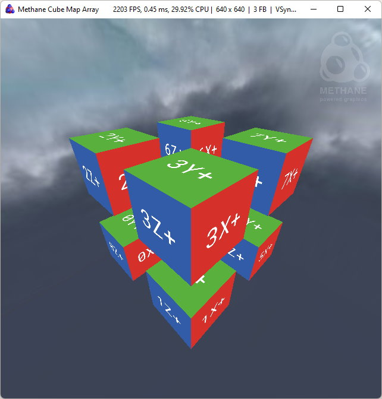

# Methane Tutorials

| <pre><b>Name / Link</b></pre>                                 | <pre><b>Screenshot</b></pre>                                                                         | <pre><b>Description</b>                                   </pre>                                              |
|---------------------------------------------------------------|------------------------------------------------------------------------------------------------------|---------------------------------------------------------------------------------------------------------------|
| 1. [Hello Triangle](/Apps/Tutorials/01-HelloTriangle)         |              | Colored triangle rendering in 130 lines of code.                                                              |
| 2. [Hello Cube](/Apps/Tutorials/02-HelloCube)                 |                          | Colored cube rendering in 220 lines of code.                                                                  |
| 3. [Textured Cube](/Apps/Tutorials/03-TexturedCube)           |                 | Textured cube introduces buffers and textures usage along with program bindings.                              |
| 4. [Shadow Cube](/Apps/Tutorials/04-ShadowCube)               |                       | Shadow cube introduces multi-pass rendering with render passes.                                               |
| 5. [Typography](/Apps/Tutorials/05-Typography)                |                        | Typography demonstrates animated text rendering with dynamic font atlas updates using Methane UI.             |
| 6. [Cube-Map Array](/Apps/Tutorials/06-CubeMapArray)          |                | Cube-map array texturing along with sky-box rendering is demonstrated in this tutorial.                       |
| 7. [Parallel Rendering](/Apps/Tutorials/07-ParallelRendering) |  | Parallel rendering of the textured cube instances to the single render pass is demonstrated in this tutorial. |
