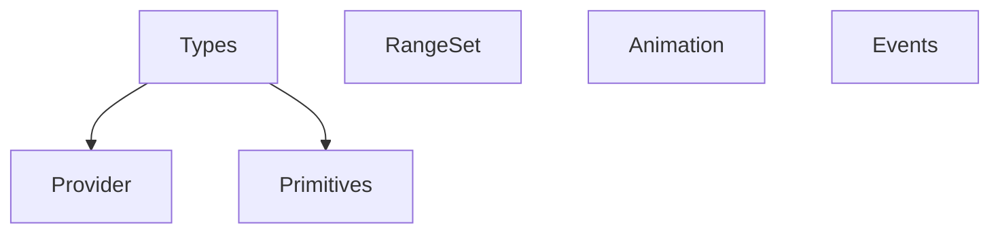

# Methane Data

## Modules

Code of these modules is located in `Methane::Data` namespace:

- [Types](Types) - data storage types like `Chunk`, `Point`, `Rect`
- [RangeSet](RangeSet) - scalar range type `Range` and std::set adaptation `RangeSet`
- [Events](Events) - observer pattern with virtual callback interface,
implemented in `Emitter` and `Receiver` base template classes.
- [Primitives](Primitives) - primitive data algorithms
- [IProvider](IProvider) - data provider interface `IProvider` and
its implementations, including `FileProvider` and `ResourceProvider`.
- [Animation](Animation) - classes with basic animations management logic.

## Intra-Domain Module Dependencies

