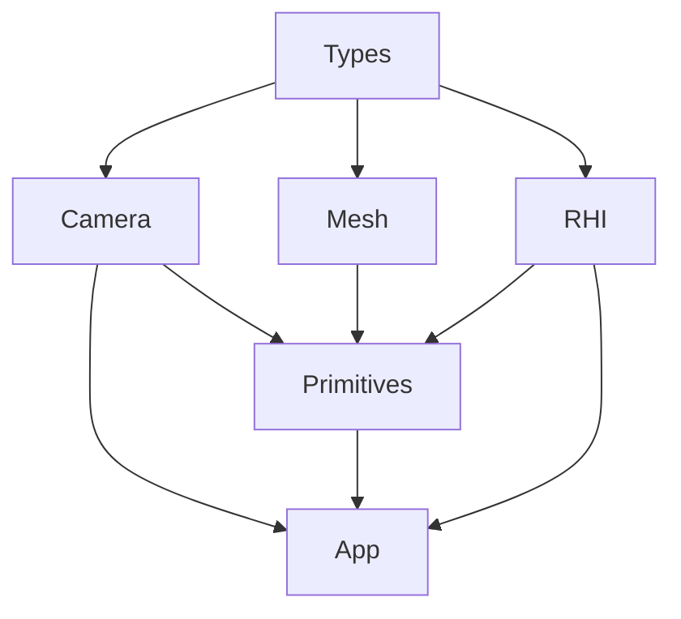
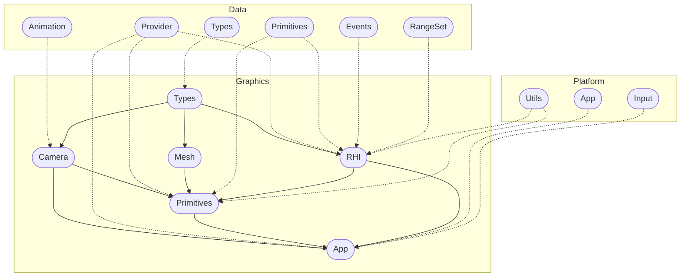

# Methane Graphics

## Modules

Code of these modules is located in `Methane::Graphics` namespace:

- [Types](Types) - primitive graphics gfx_type like `Color`, `Point`, `Rect`, `Volume`.
- [Camera](Camera) - base perspective/orthogonal camera model, arc-ball camera and interactive action camera.
- [Mesh](Mesh) - procedural generated mesh data for quad, cube, sphere, icosahedron and uber-mesh.
- [RHI](RHI) - Rendering Hardware Interface, abstraction API for native graphic APIs (DirectX, Vulkan and Metal).
- [Primitives](Primitives) - graphics extensions like `ImageLoader`, `ScreenQuad`, `SkyBox`, `MeshBuffers`, etc.
- [App](App) - base graphics application class implementation.

## Intra-Domain Module Dependencies

## Cross-Domain Module Dependencies

## Unit Tests Coverage

See [Graphics Tests description](/Tests/Graphics/README.md) for details on unit tests coverage.

