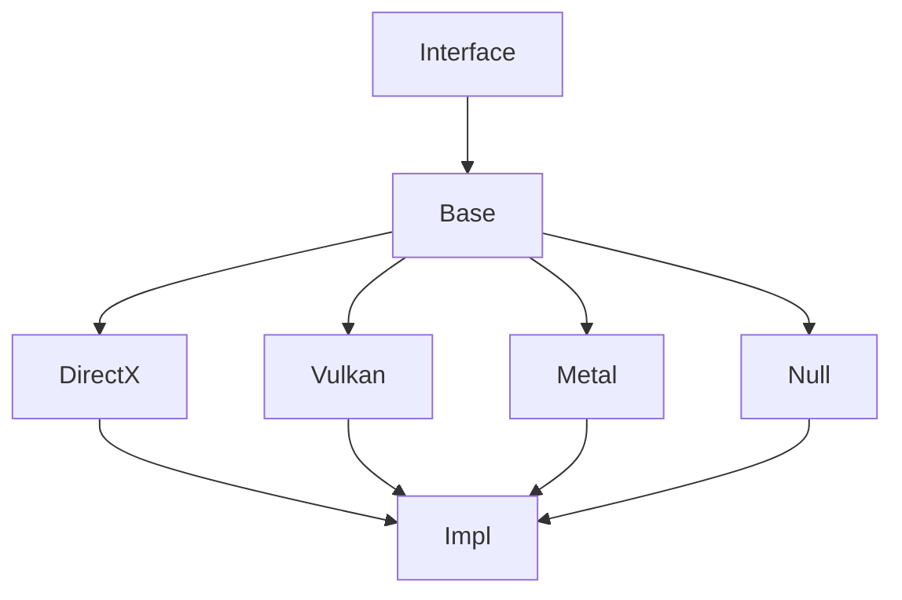

# Methane Graphics RHI

**RHI** is a commonly used acronym for **Rendering Hardware Interface**,
an abstraction API of the low-level graphic APIs. Code of these modules is located in `Methane::Graphics::RHI` namespace:
- [Interface](Interface) module contains a set of common RHI data structures and
public virtual interfaces, which can be used in application code.
- [Impl](Impl) modules contains PIMPL classes used as convenience wrappers above
final graphics API implementation, which can be optionally inlined for performance.
These PIMPL classes can be also used in application code with more convenience and
performance than virtual interfaces. Tutorial applications are implemented with PIMPL clases.
- [Base](Base) implementation module with common logic reused by all native API implementations.
- Final RHI implementations with native graphics API:
  - [DirectX](DirectX) 12 API implementation module for Windows.
  - [Vulkan](Vulkan) API implementation module for Linux and Windows.
  - [Metal](Metal) API implementation module for MacOS, iOS and tvOS.
  - [Null](Null) API implementation is used internally for unit-tests development.

Native Graphics API implementation is selected automatically in CMake depending on
operating system and is controlled using variable `METHANE_GFX_API`.
DirectX API is selected on Windows by default, but can be changed to Vulkan
using CMake option `METHANE_GFX_VULKAN_ENABLED`.

## Intra-Domain Module Dependencies

## Public Interfaces

[Interface](Interface) module implements a set of [RHI object-oriented interfaces](Interface/Include/Methane/Graphics/RHI),
which make modern graphics programming easy and convenient in a platform and API independent way.
[RHI PIMPL classes](Impl/Methane/Graphics/RHI) are providing the same functionality with more convenience and performance.

## Unit Tests Coverage

See [Graphics RHI Tests description](/Tests/Graphics/RHI/README.md) for details on unit tests coverage.
