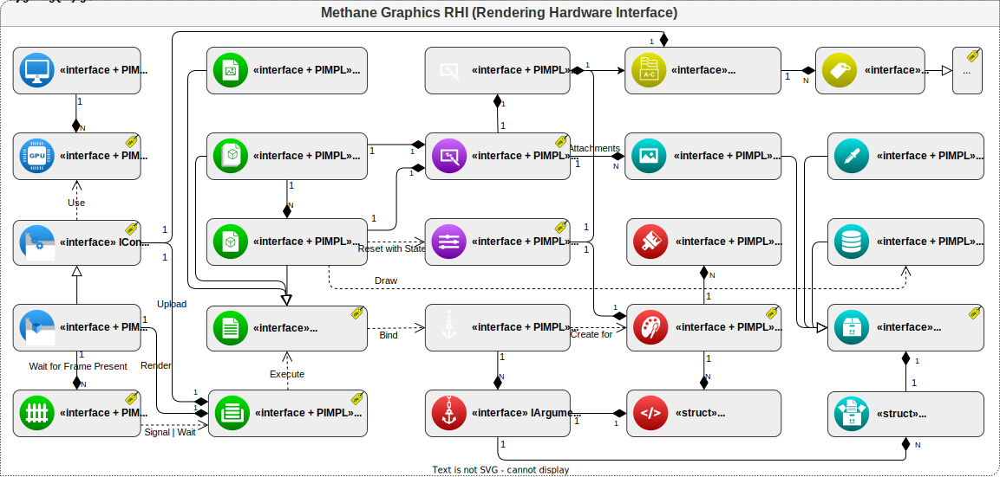

# Methane Graphics RHI

**RHI** is a commonly used acronym for **Rendering Hardware Interface**, an abstraction API of the low-level graphic APIs.

## Public Interfaces

[Interface](Interface) module implements a set of [public object-oriented interfaces](Interface/Include/Methane/Graphics),
which make modern graphics programming easy and convenient in a platform and API independent way.

## Base implementation

[Base](Base) implementation module with common logic reused by all native implementations.

## Native Graphics API implementations

### DirectX 12

[DirectX](DirectX) 12 implementation module for Windows.

### Metal

[Metal](Metal) implementation module for MacOS, iOS and tvOS.

### Vulkan

[Vulkan](Vulkan) implementation module for Linux.