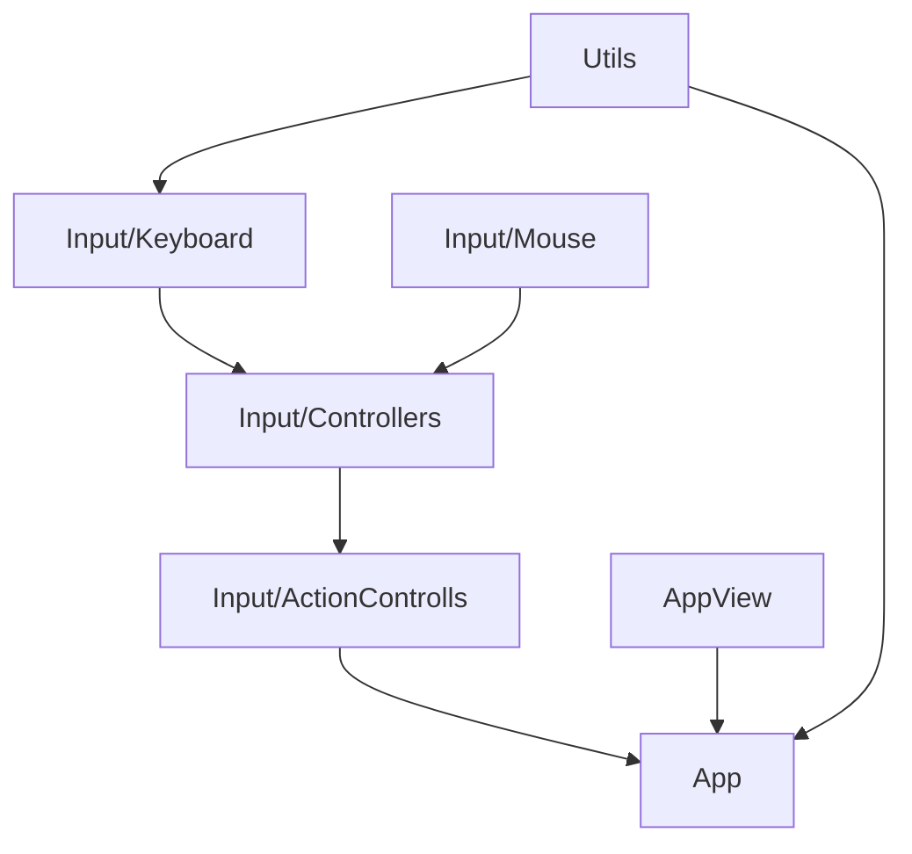
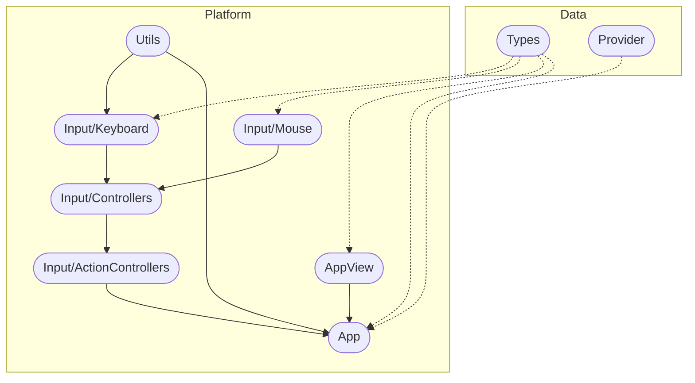

# Methane Platform

## Modules

Code of these modules is located in `Methane::Platform` namespace:

- [AppView](AppView) - application view and environment platform-abstraction classes
- [App](App) - application platform-abstraction class and platform-specific implementations
- [Input](Input) - application input with mouse and keyboard and platform-specific handling implementations.
- [Utils](Utils) - platform utilities

## Intra-Domain Modules Dependencies

## Cross-Domain Modules Dependencies

