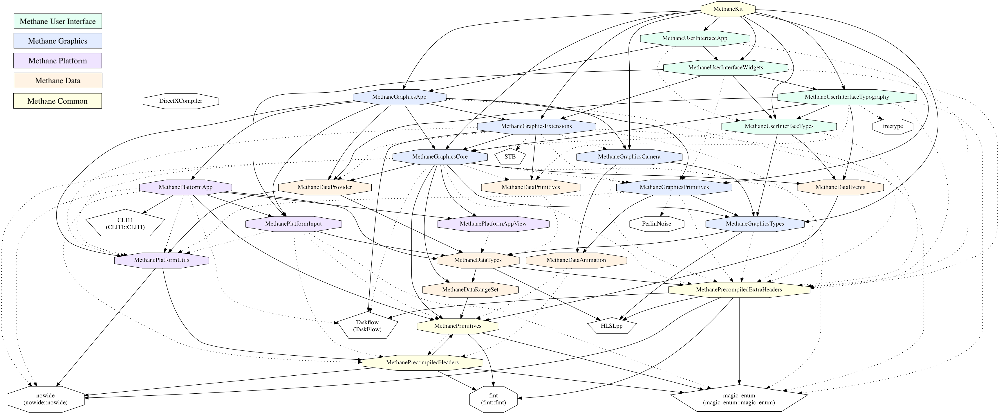

# Methane Kit Modules

## High-Level Architecture

Methane Kit architecture is clearly distributing library modules between 5 layers from low to high level of abstraction:
- [External](../Externals) external libraries and tools
- [Common](Common) libraries
- [Data](Data) processing libraries
- [Platform](Platform) abstraction libraries
- [Graphics](Graphics) API abstraction libraries
- [User Interface](UserInterface) libraries

## Modules Relations Diagram

Diagram generated with CMake using integrated GraphViz support shows detailed relations between CMake modules.

