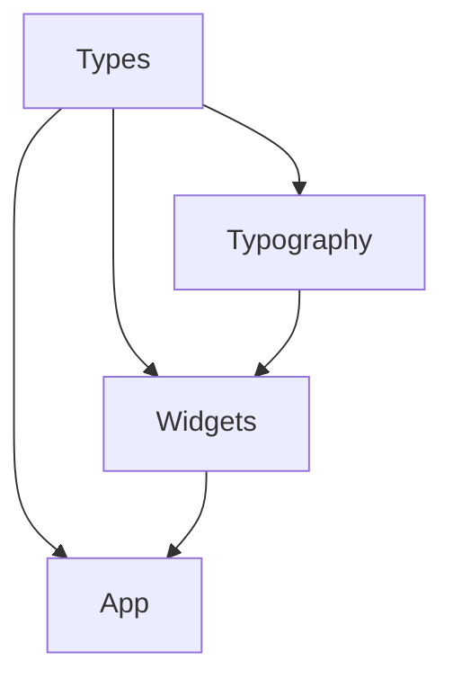
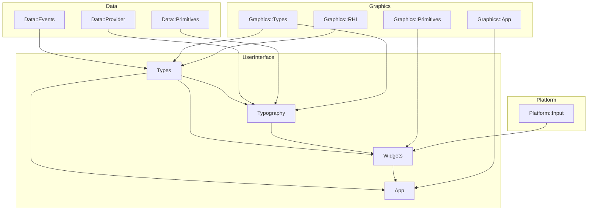

# Methane User Interface

## Modules

Code of these modules is located in `Methane::UserInterface` namespace:

- [Types](Types) - primitive user interface types like `UnitPoint`, `UnitRect`, `Context`, `Item`
- [Typography](Typography) - font rendering and text layout classes
- [Widgets](Widgets) - user interface widgets (work in progress)
- [App](App) - base user interface application class

## Intra-Domain Module Dependencies

## Cross-Domain Module Dependencies

