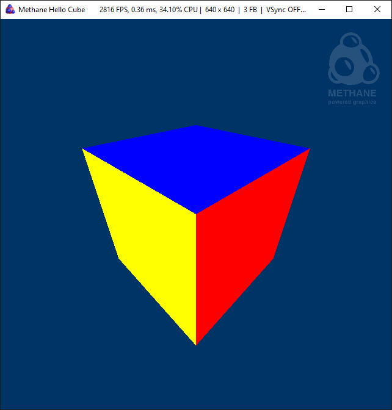

# Methane Kit 

[](https://gitpod.io/#https://github.com/egorodet/MethaneKit)
[](https://egorodet.visualstudio.com/MethaneKit/_build/latest?definitionId=5&branchName=master)
[](https://sonarcloud.io/dashboard?id=egorodet_MethaneKit_Windows)
[](https://github.com/egorodet/MethaneKit/actions/workflows/codeql-analysis.yml)

**Easy to use modern 3D graphics rendering abstraction API and cross-platform application framework:**
- **Builds on top of modern native 3D graphics APIs**: DirectX 12 on Windows, Metal on MacOS and Vulkan on Linux.
- **Simplifies modern graphics programming** with object-oriented medium-level graphics API inspired by simplicity of Apple Metal. Common shaders code in HLSL 6 is used on all platforms.
- **Provides cross-platform application framework** with CMake build toolchain, platform-independent application foundation classes and native-GUI layer for Windows, Linux and MacOS.

Download [release builds](https://github.com/egorodet/MethaneKit/releases) with pre-built samples, tutorials and tests to try them out. 
Check latest build status, tests, code coverage and analysis results or get build artifacts from [Azure Pipelines](https://egorodet.visualstudio.com/MethaneKit/_build?view=runs) CI and [Sonar Cloud](https://sonarcloud.io/organizations/egorodet-github).
See [Building from Sources](#building-from-sources) topic for manual build instructions and start learning [Methane Graphics Core](Modules/Graphics/Core) API with [Hello Triangle](/Apps/Tutorials/01-HelloTriangle) and other tutorials documentation.

[](https://gitpod.io/#https://github.com/egorodet/MethaneKit)

|     Platform     | Graphics API |  Master Build Status  |  Develop Build Status  |
| ---------------- | -------------| --------------------- | ---------------------- |
|  **MacOS** |  Metal | [](https://egorodet.visualstudio.com/MethaneKit/_build/latest?definitionId=5&branchName=master) | [](https://egorodet.visualstudio.com/MethaneKit/_build/latest?definitionId=5&branchName=develop) |
|  **Windows x64** |  DirectX 12 | [](https://egorodet.visualstudio.com/MethaneKit/_build/latest?definitionId=5&branchName=master) | [](https://egorodet.visualstudio.com/MethaneKit/_build/latest?definitionId=5&branchName=develop) |
|  **Windows x86** |  DirectX 12 | [](https://egorodet.visualstudio.com/MethaneKit/_build/latest?definitionId=5&branchName=master) | [](https://egorodet.visualstudio.com/MethaneKit/_build/latest?definitionId=5&branchName=develop) |
|  **Windows x64** |  Vulkan<sup><sup>wip</sup> | [](https://egorodet.visualstudio.com/MethaneKit/_build/latest?definitionId=5&branchName=master) | [](https://egorodet.visualstudio.com/MethaneKit/_build/latest?definitionId=5&branchName=develop) |
|  **Windows x86** |  Vulkan<sup><sup>wip</sup> | [](https://egorodet.visualstudio.com/MethaneKit/_build/latest?definitionId=5&branchName=master) | [](https://egorodet.visualstudio.com/MethaneKit/_build/latest?definitionId=5&branchName=develop) |
|  **Linux** |  Vulkan<sup><sup>wip</sup></sup> | [](https://egorodet.visualstudio.com/MethaneKit/_build/latest?definitionId=5&branchName=master) | [](https://egorodet.visualstudio.com/MethaneKit/_build/latest?definitionId=5&branchName=develop) |

[Static code analysis](#static-code-analysis) scans are performed as a part of automated CI build process on master and develop branches
with up-to-date results published on [Sonar Cloud](https://sonarcloud.io/organizations/egorodet-github).

|     Platform     | Sonar Quality Gate |  Master Scan Status  |  Develop Scan Status  |
| ---------------- | ------------------ | -------------------- | --------------------- |
|  **MacOS** Metal | [](https://sonarcloud.io/dashboard?id=egorodet_MethaneKit_MacOS) | [](https://egorodet.visualstudio.com/MethaneKit/_build/latest?definitionId=5&branchName=master) | [](https://egorodet.visualstudio.com/MethaneKit/_build/latest?definitionId=5&branchName=develop) |
|  **Windows** DirectX | [](https://sonarcloud.io/dashboard?id=egorodet_MethaneKit_Windows) | [](https://egorodet.visualstudio.com/MethaneKit/_build/latest?definitionId=5&branchName=master) | [](https://egorodet.visualstudio.com/MethaneKit/_build/latest?definitionId=5&branchName=develop) |
|  **Linux** Vulkan | [](https://sonarcloud.io/dashboard?id=egorodet_MethaneKit_Linux) | [](https://egorodet.visualstudio.com/MethaneKit/_build/latest?definitionId=5&branchName=master) | [](https://egorodet.visualstudio.com/MethaneKit/_build/latest?definitionId=5&branchName=develop) |

[](https://sonarcloud.io/dashboard?id=egorodet_MethaneKit_Windows)
[](https://sonarcloud.io/dashboard?id=egorodet_MethaneKit_Windows)
[](https://sonarcloud.io/dashboard?id=egorodet_MethaneKit_Windows)
[](https://sonarcloud.io/dashboard?id=egorodet_MethaneKit_Windows)
[](https://sonarcloud.io/dashboard?id=egorodet_MethaneKit_Windows)
[](https://sonarcloud.io/dashboard?id=egorodet_MethaneKit_Windows)
[](https://sonarcloud.io/dashboard?id=egorodet_MethaneKit_Windows)
[](https://github.com/egorodet/MethaneKit)


<p align="center"><i><a href="https://github.com/egorodet/MethaneKit/tree/master/Apps/Samples/Asteroids">Asteroids sample</a> demonstrating multi-threaded rendering with Methane Graphics API</i></p>

## Getting Started

### High-Level Architecture

Methane Kit architecture is clearly distributing library modules between 5 layers from low to high level of abstraction.


### Graphics Core Interfaces

[Methane Graphics Core](Modules/Graphics/Core) module implements a set of public object-oriented interfaces, 
which make modern graphics programming easy and convenient in a platform and API independent way.


### Tutorials

Start learning Methane Graphics API with [Hello Triangle](/Apps/Tutorials/01-HelloTriangle) tutorial documentation
and continue with others.

| <pre><b>Name / Link</b></pre> | <pre><b>Screenshot</b></pre> | <pre><b>Description</b>                                         </pre> |
| ----------------------------- | ---------------------------- | ---------------------------------------------------------------------- |
| 1. [Hello Triangle](/Apps/Tutorials/01-HelloTriangle) |  | Colored triangle rendering in 100 lines of code. |
| 2. [Hello Cube](/Apps/Tutorials/02-HelloCube) |  | Colored cube rendering in 200 lines of code with vertex and index buffers. |
| 3. [Textured Cube](/Apps/Tutorials/03-TexturedCube) |  | Textured cube introduces buffers, textures and samplers usage with Phong shading.<br/>* _Vulkan is not supported yet._ |
| 4. [Shadow Cube](/Apps/Tutorials/04-ShadowCube) |  | Shadow cube introduces multi-pass rendering with render passes.<br/>* _Vulkan is not supported yet._ |
| 5. [Typography](/Apps/Tutorials/05-Typography) |  | Typography demonstrates animated text rendering with dynamic font atlas updates using Methane UI.<br/>* _Vulkan is not supported yet._ |

### Samples

Methane samples demonstrate advanced techniques and usage scenarios with more complex implementation than tutorials above.

| <pre><b>Name / Link</b></pre> | <pre><b>Screenshot</b></pre> | <pre><b>Description</b>                                         </pre> |
| ----------------------------- | ---------------------------- | ---------------------------------------------------------------------- |
| [Asteroids](/Apps/Samples/Asteroids) |  | Benchmark demonstrating parallel render commands encoding in a single render pass for the large number of heterogeneous asteroid objects processed in multiple threads.<br/>* _Vulkan is not supported yet._ |

### Features

- **Cross-platform application & input classes**: Windows, MacOS and Linux are supported
  - **CMake modules** for convenient application build configuration, adding shaders and embedded resources
  - **HLSL-6 Shaders** serving all graphics APIs converted to native shader language and compiled in build time with SPIRV-Cross & DirectXCompiler
  - **HLSL++ Math** library with [HLSL-like syntax](https://docs.microsoft.com/en-us/windows/desktop/direct3dhlsl/dx-graphics-hlsl-reference) in C++
    and vector-instruction optimizations for different platforms
- **Modern Graphics API abstractions**: based on DirectX 12, Metal and Vulkan APIs
  - Render state and program configuration with compact initialization syntax
  - Program binding objects implement efficient binding of shader arguments to resources
  - Automatic resource state tracking used for automatic resource transition barriers setup
  - Resources are automatically retained from destroying while in use on GPU with shared pointers in command list state
  - Command list execution state tracking with optional GPU timestamps query on completion
  - Parallel render command list for multi-threaded render commands encoding in single render pass
  - Multiple command queues execution on GPU with synchronization using fences
  - Private GPU resources asynchronously updated through the upload command list and shared resource
  - Registry of named graphics objects enabling reuse of render states and graphics resources between renderer objects
- **Graphics primitives and extensions**:
  - Graphics application base class with per-frame resource management and frame buffers resizing enable effective triple buffering
  - Camera primitive and interactive arc-ball camera
  - Procedural mesh generation for quad, box, sphere, icosahedron and uber-mesh
  - Perlin Noise generator
  - Screen-quad and sky-box rendering extension classes
  - Texture loader (currently implemented with STB, planned for replacement with OpenImageIO)
- **User Interface**:
  - UI application base class with integrated HUD, logo badge and help/parameters text panels
  - Typography library for fonts loading, dynamic atlas updating, text rendering & layout
  - Widgets library (under development)
- **Platform Infrastructure**:
  - Base application with window management and input handling for Windows, MacOS and Linux
  - Events mechanism connecting emitters and receivers via callback interfaces
  - Animations subsystem
  - Embedded resource providers
- **Integrated debugging and profiling capabilities**:
  - Library instrumentation for performance analysis with [trace profiling tools](#trace-profiling-tools)
  - Debug names for all GPU objects and debug regions for graphics API calls for use with [frame profiling tools](#frame-profiling-and-debugging-tools)
- **Continuous integration** with automated multi-platform builds, unit-tests and
  [Sonar Cloud](https://sonarcloud.io/dashboard?id=egorodet_MethaneKit_Windows) static code analysis
  in [Azure Pipelines](https://egorodet.visualstudio.com/MethaneKit/)

For detailed features description and development plans please refer to [Modules documentation](Modules).

## Building from Sources 

### Prerequisites

- **Common**
  - Git (required to pull sub-modules)
  - CMake 3.18 or later
- **Windows**
  - Windows 10 RS5 (build 1809) or later
  - Visual Studio 2019 with MSVC v142 or later
  - Windows 10 SDK latest
- **MacOS**
  - MacOS 10.15 "Catalina" or later
  - XCode 11 or later with command-line tools
- **Linux**
  - Ubuntu 20.04 or later
  - GCC 9 or later
  - LCov, X11 & XCB libraries
  ```console
  sudo apt-get update && sudo apt-get install lcov xcb libx11-dev libx11-xcb-dev
  ```

### Fetch Sources

**IMPORTANT!**
- <ins>Do not download source code via Zip archive</ins>, since it does not include content of 
[Externals](https://github.com/egorodet/MethaneExternals/tree/master) submodules.
Use `git clone` command as described below.
- Consider using <ins>short path for repository location on Windows</ins> (for example `c:\Git`),
which may be required to resolve problem with support of paths longer than 260 symbols in some Microsoft build tools.

#### First time initialization

```console
git clone --recurse-submodules https://github.com/egorodet/MethaneKit.git
cd MethaneKit
```

#### Update sources to latest revision

```console
cd MethaneKit
git pull && git submodule update --init --recursive
```

### Build

####  Windows Build with Visual Studio 2019

Start Command Prompt, go to MethaneKit root directory (don't forget to pull dependent submodules as [described above](#fetch-sources))
and either start auxiliary build script [Build/Windows/Build.bat](Build/Windows/Build.bat) or build with CMake command line:

```console
set OUTPUT_DIR=Build\Output\VisualStudio\Win64-DX
cmake -S . -B %OUTPUT_DIR%\Build -G "Visual Studio 16 2019" -A x64 -DCMAKE_INSTALL_PREFIX="%cd%\%OUTPUT_DIR%\Install"
cmake --build %OUTPUT_DIR%\Build --config Release --target install
```

Alternatively root [CMakeLists.txt](CMakeLists.txt) can be opened directly in Visual Studio or 
[any other IDE with native CMake support](#development-environments) and [built using CMake presets](#cmake-presets).

[Methane Graphics Core](Modules/Graphics/Core) is built using **DirectX 12** graphics API by default on Windows. 
Vulkan graphics API can be used instead by adding cmake generator option `-DMETHANE_GFX_VULKAN_ENABLED:BOOL=ON` or 
by running `Build/Windows/Build.bat --vulkan`.

Run built applications from the installation directory `Build\Output\VisualStudio\Win64-DX\Install\Apps`

####  MacOS Build with XCode

Start Terminal, go to MethaneKit root directory (don't forget to pull dependent submodules as [described above](#fetch-sources))
and either start auxiliary build script [Build/Unix/Build.sh](Build/Unix/Build.sh) or build with CMake command line:

```console
OUTPUT_DIR=Build/Output/XCode
cmake -S . -B $OUTPUT_DIR/Build -G Xcode -DCMAKE_OSX_ARCHITECTURES="arm64;x86_64" -DCMAKE_INSTALL_PREFIX="$(pwd)/$OUTPUT_DIR/Install"
cmake --build $OUTPUT_DIR/Build --config Release --target install
```

Note that starting with XCode 12 and Clang 12 build architectures have to be specified explicitly
using CMake generator command line option `-DCMAKE_OSX_ARCHITECTURES="arm64;x86_64"` to build the fat binary.
This option should be omitted with earlier versions of Clang on macOS.

Alternatively root [CMakeLists.txt](CMakeLists.txt) can be opened directly in Visual Studio or 
[any other IDE with native CMake support](#development-environments) and [built using CMake presets](#cmake-presets).

[Methane Graphics Core](Modules/Graphics/Core) is built using **Metal** graphics API on MacOS by default.
Vulkan graphics API can be used instead by adding cmake generator option `-DMETHANE_GFX_VULKAN_ENABLED:BOOL=ON` or
by running `Build/Unix/Build.sh --vulkan`, but it requires Vulkan SDK installation with MoltenVK driver implementation
on top of Metal, which is not currently supporting all extensions required by Methane Kit.

Run built applications from the installation directory `Build/Output/XCode/Install/Apps`.

####  Linux Build with Unix Makefiles

Start Terminal, go to MethaneKit root directory (don't forget to pull dependent submodules as [described above](#fetch-sources))
and either start auxiliary build script [Build/Unix/Build.sh](Build/Unix/Build.sh) or build with CMake command line:

```console
OUTPUT_DIR=Build/Output/Linux
cmake -S . -B $OUTPUT_DIR/Build -G "Unix Makefiles" -DCMAKE_INSTALL_PREFIX="$(pwd)/$OUTPUT_DIR/Install"
cmake --build $OUTPUT_DIR/Build --config Release --target install --parallel 8
```

[Methane Graphics Core](Modules/Graphics/Core) is built using **Vulkan** graphics API on Linux.

Alternatively root [CMakeLists.txt](CMakeLists.txt) can be opened directly in 
[any IDE with native CMake support](#development-environments) and [built using CMake presets](#cmake-presets).

Run built applications from the installation directory `Build/Output/Linux/Install/Apps`.
Note that in Ubuntu Linux even GUI applications should be started from "Terminal" app, 
because of `noexec` permission set on user's home directory by security reasons.

#### CMake Options

Build options listed in table below can be used in cmake generator command line:
```console
cmake -G [Generator] ... -D[BUILD_OPTION_NAME]:BOOL=[ON|OFF]
```

| Build Option Name                               | Initial Value           | Default Preset          | Profiling Preset        | Description             |
| ----------------------------------------------- | ----------------------- | ----------------------- | ----------------------- | ----------------------- |
| <sub>METHANE_GFX_VULKAN_ENABLED</sub>           | <sub><b>OFF</b></sub>   | <sub><b>...</b></sub>   | <sub><b>...</b></sub>   | <sub>Enable Vulkan graphics API instead of platform native API</sub> |
| <sub>METHANE_APPS_BUILD_ENABLED</sub>           | <sub><b>ON</b></sub>    | <sub><b>ON</b></sub>    | <sub><b>ON</b></sub>    | <sub>Enable applications build</sub> |
| <sub>METHANE_TESTS_BUILD_ENABLED</sub>          | <sub><b>ON</b></sub>    | <sub><b>ON</b></sub>    | <sub><b>OFF</b></sub>   | <sub>Enable tests build</sub> |
| <sub>METHANE_CHECKS_ENABLED</sub>               | <sub><b>ON</b></sub>    | <sub><b>ON</b></sub>    | <sub><b>ON</b></sub>    | <sub>Enable runtime checks of input arguments</sub> |
| <sub>METHANE_RUN_TESTS_DURING_BUILD</sub>       | <sub><b>ON</b></sub>    | <sub><em>OFF</em></sub> | <sub><em>OFF</em></sub> | <sub>Enable test auto-run after module build</sub> |
| <sub>METHANE_UNITY_BUILD_ENABLED</sub>          | <sub><b>ON</b></sub>    | <sub><b>ON</b></sub>    | <sub><b>ON</b></sub>    | <sub>Enable unity build speedup for some modules</sub> |
| <sub>METHANE_CODE_COVERAGE_ENABLED</sub>        | <sub><em>OFF</em></sub> | <sub><em>OFF</em></sub> | <sub><em>OFF</em></sub> | <sub>Enable code coverage data collection with GCC and Clang</sub>  |
| <sub>METHANE_SHADERS_CODEVIEW_ENABLED</sub>     | <sub><em>OFF</em></sub> | <sub><b>ON</b></sub>    | <sub><b>ON</b></sub>    | <sub>Enable shaders code symbols viewing in debug tools</sub>  |
| <sub>METHANE_OPEN_IMAGE_IO_ENABLED</sub>        | <sub><em>OFF</em></sub> | <sub><em>OFF</em></sub> | <sub><em>OFF</em></sub> | <sub>Enable using OpenImageIO library for images loading</sub> |
| <sub>METHANE_COMMAND_DEBUG_GROUPS_ENABLED</sub> | <sub><em>OFF</em></sub> | <sub><b>ON</b></sub>    | <sub><b>ON</b></sub>    | <sub>Enable command list debug groups with frame markup</sub>  |
| <sub>METHANE_LOGGING_ENABLED</sub>              | <sub><em>OFF</em></sub> | <sub><em>OFF</em></sub> | <sub><em>OFF</em></sub> | <sub>Enable debug logging</sub> |
| <sub>METHANE_SCOPE_TIMERS_ENABLED</sub>         | <sub><em>OFF</em></sub> | <sub><em>OFF</em></sub> | <sub><b>ON</b></sub>    | <sub>Enable low-overhead profiling with scope-timers</sub> |
| <sub>METHANE_ITT_INSTRUMENTATION_ENABLED</sub>  | <sub><em>OFF</em></sub> | <sub><b>ON</b></sub>    | <sub><b>ON</b></sub>    | <sub>Enable ITT instrumentation for trace capture with Intel GPA or VTune</sub> |
| <sub>METHANE_ITT_METADATA_ENABLED</sub>         | <sub><em>OFF</em></sub> | <sub><em>OFF</em></sub> | <sub><b>ON</b></sub>    | <sub>Enable ITT metadata for tasks and events like function source locations</sub> |
| <sub>METHANE_GPU_INSTRUMENTATION_ENABLED</sub>  | <sub><em>OFF</em></sub> | <sub><em>OFF</em></sub> | <sub><b>ON</b></sub>    | <sub>Enable GPU instrumentation to collect command list execution timings</sub> |
| <sub>METHANE_TRACY_PROFILING_ENABLED</sub>      | <sub><em>OFF</em></sub> | <sub><em>OFF</em></sub> | <sub><b>ON</b></sub>    | <sub>Enable realtime profiling with Tracy</sub> |
| <sub>METHANE_TRACY_PROFILING_ON_DEMAND</sub>    | <sub><em>OFF</em></sub> | <sub><em>OFF</em></sub> | <sub><b>ON</b></sub>    | <sub>Enable Tracy data collection on demand, after client connection</sub> |

#### CMake Presets

[CMake Presets](CMakePresets.json) can be used to configure and build project with a set of predefined options (CMake 3.20 is required):
```console
cmake --preset [ConfigPresetName]
cmake --build --preset [BuildPresetName] --target install
```

Configure preset names `[ConfigPresetName]` can be listed with `cmake --list-presets` and are constructed according to the next schema using compatible kets according to preset matrix:
```console
[ConfigPresetName] = [VS2019|Xcode|Make|Ninja]-[Win64|Win32|Win|Lin|Mac]-[DX|VK|MTL]-[Default|Profile|Scan]
```

| Preset Matrix | VS2019    | Xcode     | Make      | Ninja     |   
|---------------|-----------|-----------|-----------|-----------|
| Win64         | DX / VK   | -         | -         | -         |
| Win32         | DX / VK   | -         | -         | -         |
| Win           | -         | -         | -         | DX / VK   |
| Mac           | -         | MTL       | -         | MTL       |
| Lin           | -         | -         | VK        | VK        |

Build preset names `[BuildPresetName]` can be listed with `cmake --list-presets build` and are constructed according to the same schema, but `Default` suffix should be replaced with `Debug` or `Release` configuration name. Only compatible configure and build presets can be used together either with the same name, or with `Debug` or `Release` instead of `Default`. `Ninja` presets should be used from 
"x64/x86 Native Tools Command Prompt for VS2019" command line environment on Windows or directly from Visual Studio.

[Azure Pipelines](https://egorodet.visualstudio.com/MethaneKit/_build?view=runs) CI builds are configured with these CMake presets.
CMake presets can be also used in [VS2019 and VS Code](https://devblogs.microsoft.com/cppblog/cmake-presets-integration-in-visual-studio-and-visual-studio-code/)
to reproduce CI builds on the development system with a few configuration options in IDE UI.

## Supported Development Tools

### Development Environments

<a href="https://www.jetbrains.com/?from=MethaneKit" target="_blank"></a>
- Microsoft Visual Studio 2019
  - Solutions and projects build (generate with [Build.bat](/Build/Windows/Build.bat))
  - CMake native build support (pre-configured with [CMakePresets.json](/CMakePresets.json))
- Apple XCode
  - XCode workspace and projects (generate with [Build.sh](/Build/Unix/Build.sh))
- Microsoft VS Code and [GitPod](https://gitpod.io/#https://github.com/egorodet/MethaneKit) (pre-configured with [CMakePresets.json](/CMakePresets.json) and [.vscode/settings.json](/.vscode/settings.json))
- Jet Brains CLion (pre-configured with [.idea](/.idea))
- Qt Creator with CMake native support

Methane Kit is being developed with support of [Jet Brains](https://www.jetbrains.com/?from=MethaneKit) development tools.
Open source project development license is provided free of charge to all key contributors of Methane Kit project.

### Static Code Analysis

Methane Kit comes with continuous C++ static code and code coverage analysis performed as a part of automated CI "Scan" builds
with up-to-date results published on [Sonar Cloud](https://sonarcloud.io/organizations/egorodet-github)
separately for all supported platforms.

| Master Scan Results  | Windows       | MacOS        | Linux        |     
| -------------------- | ------------- |------------- |------------- |
| Scan Build Status    | [](https://egorodet.visualstudio.com/MethaneKit/_build/latest?definitionId=5&branchName=master) | [](https://egorodet.visualstudio.com/MethaneKit/_build/latest?definitionId=5&branchName=master) | [](https://egorodet.visualstudio.com/MethaneKit/_build/latest?definitionId=5&branchName=master) | 
| Quality Gate         | [](https://sonarcloud.io/dashboard?id=egorodet_MethaneKit_Windows) | [](https://sonarcloud.io/dashboard?id=egorodet_MethaneKit_MacOS) | [](https://sonarcloud.io/dashboard?id=egorodet_MethaneKit_Linux) |
| Maintainability      | [](https://sonarcloud.io/dashboard?id=egorodet_MethaneKit_Windows) | [](https://sonarcloud.io/dashboard?id=egorodet_MethaneKit_MacOS) | [](https://sonarcloud.io/dashboard?id=egorodet_MethaneKit_Linux) |
| Reliability          | [](https://sonarcloud.io/dashboard?id=egorodet_MethaneKit_Windows) | [](https://sonarcloud.io/dashboard?id=egorodet_MethaneKit_MacOS) | [](https://sonarcloud.io/dashboard?id=egorodet_MethaneKit_Linux) | 
| Security             | [](https://sonarcloud.io/dashboard?id=egorodet_MethaneKit_Windows) | [](https://sonarcloud.io/dashboard?id=egorodet_MethaneKit_MacOS) | [](https://sonarcloud.io/dashboard?id=egorodet_MethaneKit_Linux) | 
| Technical Debt       | [](https://sonarcloud.io/dashboard?id=egorodet_MethaneKit_Windows) | [](https://sonarcloud.io/dashboard?id=egorodet_MethaneKit_MacOS) | [](https://sonarcloud.io/dashboard?id=egorodet_MethaneKit_Linux)
| Bugs                 | [](https://sonarcloud.io/dashboard?id=egorodet_MethaneKit_Windows) | [](https://sonarcloud.io/dashboard?id=egorodet_MethaneKit_MacOS) | [](https://sonarcloud.io/dashboard?id=egorodet_MethaneKit_Linux) | 
| Vulnerabilities      | [](https://sonarcloud.io/dashboard?id=egorodet_MethaneKit_Windows) | [](https://sonarcloud.io/dashboard?id=egorodet_MethaneKit_MacOS) | [](https://sonarcloud.io/dashboard?id=egorodet_MethaneKit_Linux)
| Code Smells          | [](https://sonarcloud.io/dashboard?id=egorodet_MethaneKit_Windows) | [](https://sonarcloud.io/dashboard?id=egorodet_MethaneKit_MacOS) | [](https://sonarcloud.io/dashboard?id=egorodet_MethaneKit_Linux) |
| Duplicated Lines     | [](https://sonarcloud.io/dashboard?id=egorodet_MethaneKit_Windows) | [](https://sonarcloud.io/dashboard?id=egorodet_MethaneKit_MacOS) | [](https://sonarcloud.io/dashboard?id=egorodet_MethaneKit_Linux) | 
| Tests Coverage       | [](https://sonarcloud.io/dashboard?id=egorodet_MethaneKit_Windows) | [](https://sonarcloud.io/dashboard?id=egorodet_MethaneKit_MacOS) | [](https://sonarcloud.io/dashboard?id=egorodet_MethaneKit_Linux) |
| Lines of Code        | [](https://sonarcloud.io/dashboard?id=egorodet_MethaneKit_Windows) | [](https://sonarcloud.io/dashboard?id=egorodet_MethaneKit_MacOS) | [](https://sonarcloud.io/dashboard?id=egorodet_MethaneKit_Linux) |

### Trace Profiling Tools

Methane Kit contains integrated instrumentation of all libraries for performance analysis with trace collection using following tools.
Please refer to [Methane Instrumentation](Modules/Common/Instrumentation) document for more details on trace collection instructions and related build options.

| [Tracy Frame Profiler](https://github.com/wolfpld/tracy) | [Intel Graphics Trace Analyzer](https://software.intel.com/en-us/gpa/graphics-trace-analyzer) |
| -------------------- | ----------------------------- |
|  |  |

### Frame Profiling and Debugging Tools

- [Intel Graphics Frame Analyzer](https://software.intel.com/en-us/gpa/graphics-frame-analyzer)
- [Apple XCode Metal Debugger](https://developer.apple.com/documentation/metal/basic_tasks_and_concepts/viewing_your_gpu_workload_with_the_metal_debugger)
- [RenderDoc](https://renderdoc.org)
- [Microsoft PIX](https://devblogs.microsoft.com/pix/)
- [NVidia Nsight Graphics](https://developer.nvidia.com/nsight-graphics)

## External Dependencies

All external dependencies of Methane Kit are listed in [MethaneExternals](https://github.com/egorodet/MethaneExternals) repository. See [MethaneExternals/README.md](https://github.com/egorodet/MethaneExternals/blob/master/README.md) for more details.

## License

Methane Kit is distributed under [Apache 2.0 License](LICENSE): it is free to use and open for contributions!

*Copyright 2019-2021 © Evgeny Gorodetskiy* [](https://twitter.com/egorodet)
