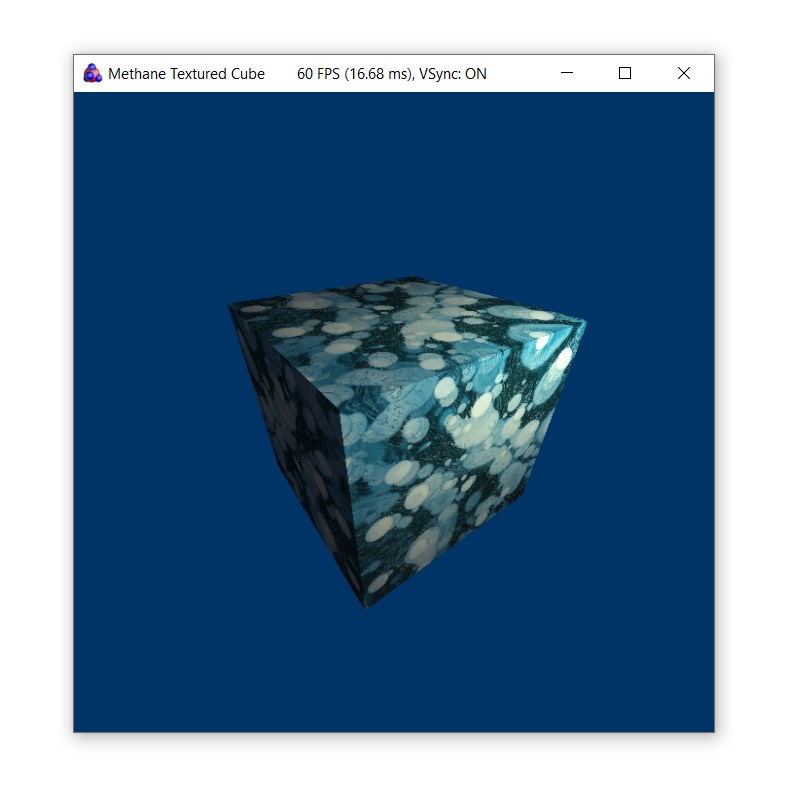

# Methane Kit 

[](https://gitpod.io/#https://github.com/egorodet/MethaneKit)
[](LICENSE)
[](https://github.com/egorodet/MethaneKit/issues)
[](https://gitter.im/MethaneKit/community?utm_source=badge&utm_medium=badge&utm_campaign=pr-badge&utm_content=badge)

**Easy to use modern 3D graphics abstraction API in C++17 for cross-platform applications development:**
- **Builds on top of modern native 3D graphics APIs**: DirectX 12 on Windows and Metal on MacOS, Vulkan on Linux will be enabled soon.
- **Simplifies modern graphics programming** with object-oriented higher-level graphics API inspired by simplicity of Apple's Metal and common shaders code in HLSL 6.
- **Provides cross-platform application infrastructure** from CMake-based toolchain to platform independent application and user input classes.

Click **"Open in Gitpod" button** above to explore Methane Kit codebase right away in a familiar VSCode-like IDE environment in your web-browser with navigation by symbols and cloud-build.
Download [release builds](https://github.com/egorodet/MethaneKit/releases) with built samples and tutorials to try them out.
Also you can get [Azure Pipelines](https://egorodet.visualstudio.com/MethaneKit/_build?view=runs) **build artifacts** to test latest versions from `develop` branch. For manual build instruction see topic [Building from Sources](#building-from-sources) described below. Start learning Methane Graphics API with [Hello Triangle](/Apps/Tutorials/01-HelloTriangle) tutorial documentation.

|     Platform     | Graphics API |  Master Build Status  |  Develop Build Status  |
| ---------------- | -------------| --------------------- | ---------------------- |
|  **Windows x64** |  DirectX 12 | [](https://egorodet.visualstudio.com/MethaneKit/_build/latest?definitionId=5&branchName=master) | [](https://egorodet.visualstudio.com/MethaneKit/_build/latest?definitionId=5&branchName=develop) |
|  **Windows x86** |  DirectX 12 | [](https://egorodet.visualstudio.com/MethaneKit/_build/latest?definitionId=5&branchName=master) | [](https://egorodet.visualstudio.com/MethaneKit/_build/latest?definitionId=5&branchName=develop) |
|  **MacOS** |  Metal | [](https://egorodet.visualstudio.com/MethaneKit/_build/latest?definitionId=5&branchName=master) | [](https://egorodet.visualstudio.com/MethaneKit/_build/latest?definitionId=5&branchName=develop) |
|  **Linux** |  Vulkan<sup><sup>soon</sup></sup> | [](https://egorodet.visualstudio.com/MethaneKit/_build/latest?definitionId=5&branchName=master) | [](https://egorodet.visualstudio.com/MethaneKit/_build/latest?definitionId=5&branchName=develop) |

[Static code analysis](#static-code-analysis) scans are performed as a part of automated CI build process on master and develop branches
with up-to-date results published on [Sonar Cloud](https://sonarcloud.io/organizations/egorodet-github).

|     Platform     | Sonar Quality Gate |  Master Scan Status  |  Develop Scan Status  |
| ---------------- | ------------------ | -------------------- | --------------------- |
|  **Windows** | [](https://sonarcloud.io/dashboard?id=egorodet_MethaneKit_Windows) | [](https://egorodet.visualstudio.com/MethaneKit/_build/latest?definitionId=5&branchName=master) | [](https://egorodet.visualstudio.com/MethaneKit/_build/latest?definitionId=5&branchName=develop) |
|  **MacOS** | [](https://sonarcloud.io/dashboard?id=egorodet_MethaneKit_MacOS) | [](https://egorodet.visualstudio.com/MethaneKit/_build/latest?definitionId=5&branchName=master) | [](https://egorodet.visualstudio.com/MethaneKit/_build/latest?definitionId=5&branchName=develop) |
|  **Linux** | [](https://sonarcloud.io/dashboard?id=egorodet_MethaneKit_Linux) | [](https://egorodet.visualstudio.com/MethaneKit/_build/latest?definitionId=5&branchName=master) | [](https://egorodet.visualstudio.com/MethaneKit/_build/latest?definitionId=5&branchName=develop) |

[](https://sonarcloud.io/dashboard?id=egorodet_MethaneKit_Windows)
[](https://sonarcloud.io/dashboard?id=egorodet_MethaneKit_Windows)
[](https://sonarcloud.io/dashboard?id=egorodet_MethaneKit_Windows)
[](https://sonarcloud.io/dashboard?id=egorodet_MethaneKit_Windows)
[](https://sonarcloud.io/dashboard?id=egorodet_MethaneKit_Windows)
[](https://sonarcloud.io/dashboard?id=egorodet_MethaneKit_Windows)
[](https://sonarcloud.io/dashboard?id=egorodet_MethaneKit_Windows)
[](https://www.codacy.com/app/egorodet/MethaneKit?utm_source=github.com&amp;utm_medium=referral&amp;utm_content=egorodet/MethaneKit&amp;utm_campaign=Badge_Grade)
[](https://www.codefactor.io/repository/github/egorodet/methanekit)
[](https://github.com/egorodet/MethaneKit)


<p align="center"><i><a href="https://github.com/egorodet/MethaneKit/tree/master/Apps/Samples/Asteroids">Asteroids sample</a> demonstrating multi-threaded rendering with Methane Graphics API</i></p>

## Getting Started

## High-Level Architecture

Methane Kit architecture is clearly distributing library modules between 5 layers from low to high level of abstraction.


## Graphics Core Interfaces

[Methane Graphics Core](Modules/Graphics/Core) module implements a set of public object-oriented interfaces, 
which make modern graphics programming easy and convenient in a platform and API independent way.


### Features

- **Cross-platform application & input classes**: Windows & MacOS are supported, Linux is coming soon
  - **CMake modules** for convenient application build configuration, adding shaders and embedded resources
  - **HLSL-6 Shaders** serving all graphics APIs converted to native shader language and compiled in build time with SPIRV-Cross & DirectXCompiler
- **Modern Graphics API abstractions**: DirectX 12 & Metal are supported, Vulkan is coming soon
  - Render state and program configuration with compact initialization syntax
  - Program binding objects partially initialized with help of shader reflection implement efficient binding of shader arguments to resources
  - Automatic resource state tracking used for resource transition barriers setup
  - Resources are automatically retained from destroying while they in use on GPU with shared pointers in command list state
  - Command list execution state tracking with optional GPU timestamps query on completion
  - Parallel render command list for multi-threaded render commands encoding in single render pass
  - Multiple command queues execution on GPU with synchronization using fences
  - Private GPU resources asynchronously updated via shared resource implicitly through the upload command list
  - Registry of named graphics objects used for reusing render states and graphics resources between UI items
- **Graphics primitives and extensions**:
  - Graphics application base class with per-frame resource management, frame buffers resizing and other routine operations
  - Camera primitive and interactive arc-ball camera
  - Procedural mesh generation for quad, box, sphere, icosahedron and uber-mesh
  - Perlin Noise generation
  - Screen-quad and sky-box rendering extension classes
  - Texture image loader currently implemented with STB (planned for replacement with OpenImageIO, partially supported under the hood)
- **User Interface**:
  - UI application base class with integrated HUD, logo badge and help/parameters text panels
  - Typography library for fonts loading, dynamic atlas updating, text rendering & layout
  - Widgets library (under development)
- **Application infrastructure**:
  - Events mechanism connecting emitters and receivers via callback interfaces
  - Animations subsystem
  - Embedded resource providers
  - Range Set implementation
- **Integrated API instrumentation** for performance analysis with [trace profiling tools](#trace-profiling-tools)
- **Continuous integration** with automated multi-platform builds, unit-tests and 
[Sonar Cloud](https://sonarcloud.io/dashboard?id=egorodet_MethaneKit_Windows) static code analysis
in [Azure Pipelines](https://egorodet.visualstudio.com/MethaneKit/)

For detailed features description and development plans please refer to [Modules documentation](Modules).

### Tutorials

Start learning Methane Graphics API with [Hello Triangle](/Apps/Tutorials/01-HelloTriangle) tutorial documentation. Other tutorials will be documented soon.

| <pre><b>Name / Link</b></pre> | <pre><b>Screenshot</b></pre> | <pre><b>Description</b>                                         </pre> |
| ----------------------------- | ---------------------------- | ---------------------------------------------------------------------- |
| [Hello Triangle](/Apps/Tutorials/01-HelloTriangle) |  | Colored triangle rendering in just 120 lines of code! |
| [Textured Cube](/Apps/Tutorials/02-TexturedCube) |  | Textured cube introduces buffers and textures usage along with program bindings. |
| [Shadow Cube](/Apps/Tutorials/03-ShadowCube) |  | Shadow cube introduces multi-pass rendering with render passes. |
| [Typography](/Apps/Tutorials/04-Typography) |  | Typography demonstrates animated text rendering with dynamic font atlas updates using Methane UI. |

### Samples

Methane samples demonstrate advanced techniques and usage scenarios with a more complex implementation than tutorials above.

| <pre><b>Name / Link</b></pre> | <pre><b>Screenshot</b></pre> | <pre><b>Description</b>                                         </pre> |
| ----------------------------- | ---------------------------- | ---------------------------------------------------------------------- |
| [Asteroids](/Apps/Samples/Asteroids) |  | Benchmark demonstrating parallel render commands encoding in a single render pass for the large number of heterogeneous asteroid objects processed in multiple threads. |

## Building from Sources 

### Prerequisites

- **Common**
  - Git (required to pull sub-modules)
  - CMake 3.16 or later
- **Windows**
  - Windows 10 RS5 (build 1809) or later
  - Visual Studio 2019 with MSVC v142 or later
  - Windows 10 SDK
- **MacOS**
  - MacOS 10.13 "El Capitan" or later
  - XCode 9 or later with command-line tools
- **Linux**
  - Ubuntu 18.04 or later

### Fetch Sources

**IMPORTANT!**
- <ins>Do not download source code via Zip archive</ins>, since it does not include content of 
[Externals](https://github.com/egorodet/MethaneExternals/tree/master) submodules.
Use `git clone` command as described below.
- Consider using <ins>short path for repository location on Windows</ins> (for example `c:\Git`),
which may be required to resolve problem with support of paths longer than 260 symbols in some Microsoft build tools.

#### First time initialization

```console
git clone --recurse-submodules https://github.com/egorodet/MethaneKit.git
cd MethaneKit
```

#### Update sources to latest revision

```console
cd MethaneKit
git pull && git submodule update --init --recursive
```

### Build

####  Windows Build with Visual Studio 2019

Start Command Prompt, go to MethaneKit root directory (don't forget to pull dependent submodules as [described above](#fetch-sources))
and either start auxiliary build script [Build/Windows/Build.bat](Build/Windows/Build.bat) or build with CMake command line:

```console
mkdir Build\Output\VisualStudio\Build && cd Build\Output\VisualStudio\Build
cmake -G "Visual Studio 16 2019" -A x64 -DCMAKE_INSTALL_PREFIX="%cd%\..\Install" "..\..\..\.."
cmake --build . --config Release --target install
```

Alternatively you can open root [CMakeLists.txt](CMakeLists.txt) directly in Visual Studio or [any other IDE of choice](#development-environments)
with native CMake support and build it with Ninja using provided configurations in [CMakeSettings.json](CMakeSettings.json).

Run built applications from the installation directory `Build\Output\VisualStudio\Install\Apps`

####  MacOS Build with XCode

Start Terminal, go to MethaneKit root directory (don't forget to pull dependent submodules as [described above](#fetch-sources))
and either start auxiliary build script [Build/Posix/Build.sh](Build/Posix/Build.sh) or build with CMake command line:

```console
mkdir -p Build/Output/XCode/Build && cd Build/Output/XCode/Build
cmake -H../../../.. -B. -G Xcode -DCMAKE_OSX_ARCHITECTURES="arm64;x86_64" -DCMAKE_INSTALL_PREFIX="$(pwd)/../Install"
cmake --build . --config Release --target install
```

Note that starting with XCode 12 and Clang 12 build architectures have to be specified explicitly
using CMake generator command line option `-DCMAKE_OSX_ARCHITECTURES="arm64;x86_64"` to build the fat binary.
This option can be omitted with earlier versions of Clang on macOS.

Alternatively you can open root [CMakeLists.txt](CMakeLists.txt) and build it from [any IDE with native CMake support](#development-environments).

Run built applications from the installation directory `Build/Output/XCode/Install/Apps`

####  Linux Build with Unix Makefiles

Build on Linux is supported with "Unix Makefiles" generator.
But Linux platform abstraction layer and Vulkan graphics API abstraction implementations are currently stubbed,
so in spite of it builds fine, do not expect anything to work on Linux now besides unit-tests.

```console
mkdir -p Build/Output/Linux/Build && cd Build/Output/Linux/Build
cmake -H../../../.. -B. -G "Unix Makefiles" -DCMAKE_INSTALL_PREFIX="$(pwd)/../Install"
cmake --build . --config Release --target install
```

#### CMake Build Options

Build options can be configured in cmake generator command line:
```console
cmake -G [Generator] ... -D[BUILD_OPTION_NAME]:BOOL=ON
```

| Build Option Name                               | Default Value           | Release Build           | Profiling Build         | Description             |
| ----------------------------------------------- | ----------------------- | ----------------------- | ----------------------- | ----------------------- |
| <sub>METHANE_APPS_BUILD_ENABLED</sub>           | <sub><b>ON</b></sub>    | <sub><b>ON</b></sub>    | <sub><b>ON</b></sub>    | <sub>Enable applications build</sub> |
| <sub>METHANE_TESTS_BUILD_ENABLED</sub>          | <sub><b>ON</b></sub>    | <sub><b>ON</b></sub>    | <sub><b>ON</b></sub>    | <sub>Enable tests build</sub> |
| <sub>METHANE_CHECKS_ENABLED</sub>               | <sub><b>ON</b></sub>    | <sub><b>ON</b></sub>    | <sub><b>ON</b></sub>    | <sub>Enable runtime checks of input arguments</sub> |
| <sub>METHANE_RUN_TESTS_DURING_BUILD</sub>       | <sub><b>ON</b></sub>    | <sub><em>OFF</em></sub> | <sub><em>OFF</em></sub> | <sub>Enable test auto-run after module build</sub> |
| <sub>METHANE_UNITY_BUILD_ENABLED</sub>          | <sub><b>ON</b></sub>    | <sub><b>ON</b></sub>    | <sub><b>ON</b></sub>    | <sub>Enable unity build speedup for some modules</sub> |
| <sub>METHANE_CODE_COVERAGE_ENABLED</sub>        | <sub><em>OFF</em></sub> | <sub><em>OFF</em></sub> | <sub><em>OFF</em></sub> | <sub>Enable code coverage data collection with GCC and Clang</sub>  |
| <sub>METHANE_SHADERS_CODEVIEW_ENABLED</sub>     | <sub><em>OFF</em></sub> | <sub><b>ON</b></sub>    | <sub><b>ON</b></sub>    | <sub>Enable shaders code symbols viewing in debug tools</sub>  |
| <sub>METHANE_USE_OPEN_IMAGE_IO</sub>            | <sub><em>OFF</em></sub> | <sub><em>OFF</em></sub> | <sub><em>OFF</em></sub> | <sub>Enable using OpenImageIO library for images loading</sub> |
| <sub>METHANE_COMMAND_DEBUG_GROUPS_ENABLED</sub> | <sub><em>OFF</em></sub> | <sub><b>ON</b></sub>    | <sub><b>ON</b></sub>    | <sub>Enable command list debug groups with frame markup</sub>  |
| <sub>METHANE_LOGGING_ENABLED</sub>              | <sub><em>OFF</em></sub> | <sub><em>OFF</em></sub> | <sub><em>OFF</em></sub> | <sub>Enable debug logging</sub> | 
| <sub>METHANE_SCOPE_TIMERS_ENABLED</sub>         | <sub><em>OFF</em></sub> | <sub><em>OFF</em></sub> | <sub><b>ON</b></sub>    | <sub>Enable low-overhead profiling with scope-timers</sub> |
| <sub>METHANE_ITT_INSTRUMENTATION_ENABLED</sub>  | <sub><em>OFF</em></sub> | <sub><b>ON</b></sub>    | <sub><b>ON</b></sub>    | <sub>Enable ITT instrumentation for trace capture with Intel GPA or VTune</sub> |
| <sub>METHANE_ITT_METADATA_ENABLED</sub>         | <sub><em>OFF</em></sub> | <sub><em>OFF</em></sub> | <sub><b>ON</b></sub>    | <sub>Enable ITT metadata for tasks and events like function source locations</sub> |
| <sub>METHANE_GPU_INSTRUMENTATION_ENABLED</sub>  | <sub><em>OFF</em></sub> | <sub><em>OFF</em></sub> | <sub><b>ON</b></sub>    | <sub>Enable GPU instrumentation to collect command list execution timings</sub> |
| <sub>METHANE_TRACY_PROFILING_ENABLED</sub>      | <sub><em>OFF</em></sub> | <sub><em>OFF</em></sub> | <sub><b>ON</b></sub>    | <sub>Enable realtime profiling with Tracy</sub> |
| <sub>METHANE_TRACY_PROFILING_ON_DEMAND</sub>    | <sub><em>OFF</em></sub> | <sub><em>OFF</em></sub> | <sub><b>ON</b></sub>    | <sub>Enable Tracy data collection on demand, after client connection</sub> |

## Supported Development Tools

### Development Environments

<a href="https://www.jetbrains.com/?from=MethaneKit" target="_blank"></a>
- Microsoft Visual Studio 2019
  - Solutions and projects build (generate with [Build.bat](/Build/Windows/Build.bat))
  - Ninja build with CMake native support (pre-configured with [CMakeSettings.json](/CMakeSettings.json))
- Apple XCode 11
  - XCode workspace and projects (generate with [Build.sh](/Build/Posix/Build.sh))
- Microsoft VS Code and [GitPod](https://gitpod.io/#https://github.com/egorodet/MethaneKit) (pre-configured with [.vscode/settings.json](/.vscode/settings.json))
- Jet Brains CLion (pre-configured with [.idea](/.idea))
- Jet Brains ReSharper C++ (pre-configured with [Folder.DotSettings](/Folder.DotSettings))
- Qt Creator with CMake native support

Methane Kit is being developed with support of [Jet Brains](https://www.jetbrains.com/?from=MethaneKit) development tools.
Open source project development license is provided free of charge to all key contributors of Methane Kit project.

### Static Code Analysis

Methane Kit comes with continuous C++ static code and code coverage analysis performed as a part of automated CI "Scan" builds
with up-to-date results published on [Sonar Cloud](https://sonarcloud.io/organizations/egorodet-github)
separately for all supported platforms.

| Master Scan Results  | Windows       | MacOS        | Linux        |     
| -------------------- | ------------- |------------- |------------- |
| Scan Build Status    | [](https://egorodet.visualstudio.com/MethaneKit/_build/latest?definitionId=5&branchName=master) | [](https://egorodet.visualstudio.com/MethaneKit/_build/latest?definitionId=5&branchName=master) | [](https://egorodet.visualstudio.com/MethaneKit/_build/latest?definitionId=5&branchName=master) | 
| Quality Gate         | [](https://sonarcloud.io/dashboard?id=egorodet_MethaneKit_Windows) | [](https://sonarcloud.io/dashboard?id=egorodet_MethaneKit_MacOS) | [](https://sonarcloud.io/dashboard?id=egorodet_MethaneKit_Linux) |
| Maintainability      | [](https://sonarcloud.io/dashboard?id=egorodet_MethaneKit_Windows) | [](https://sonarcloud.io/dashboard?id=egorodet_MethaneKit_MacOS) | [](https://sonarcloud.io/dashboard?id=egorodet_MethaneKit_Linux) |
| Reliability          | [](https://sonarcloud.io/dashboard?id=egorodet_MethaneKit_Windows) | [](https://sonarcloud.io/dashboard?id=egorodet_MethaneKit_MacOS) | [](https://sonarcloud.io/dashboard?id=egorodet_MethaneKit_Linux) | 
| Security             | [](https://sonarcloud.io/dashboard?id=egorodet_MethaneKit_Windows) | [](https://sonarcloud.io/dashboard?id=egorodet_MethaneKit_MacOS) | [](https://sonarcloud.io/dashboard?id=egorodet_MethaneKit_Linux) | 
| Technical Debt       | [](https://sonarcloud.io/dashboard?id=egorodet_MethaneKit_Windows) | [](https://sonarcloud.io/dashboard?id=egorodet_MethaneKit_MacOS) | [](https://sonarcloud.io/dashboard?id=egorodet_MethaneKit_Linux)
| Bugs                 | [](https://sonarcloud.io/dashboard?id=egorodet_MethaneKit_Windows) | [](https://sonarcloud.io/dashboard?id=egorodet_MethaneKit_MacOS) | [](https://sonarcloud.io/dashboard?id=egorodet_MethaneKit_Linux) | 
| Vulnerabilities      | [](https://sonarcloud.io/dashboard?id=egorodet_MethaneKit_Windows) | [](https://sonarcloud.io/dashboard?id=egorodet_MethaneKit_MacOS) | [](https://sonarcloud.io/dashboard?id=egorodet_MethaneKit_Linux)
| Code Smells          | [](https://sonarcloud.io/dashboard?id=egorodet_MethaneKit_Windows) | [](https://sonarcloud.io/dashboard?id=egorodet_MethaneKit_MacOS) | [](https://sonarcloud.io/dashboard?id=egorodet_MethaneKit_Linux) |
| Duplicated Lines     | [](https://sonarcloud.io/dashboard?id=egorodet_MethaneKit_Windows) | [](https://sonarcloud.io/dashboard?id=egorodet_MethaneKit_MacOS) | [](https://sonarcloud.io/dashboard?id=egorodet_MethaneKit_Linux) | 
| Tests Coverage       | [](https://sonarcloud.io/dashboard?id=egorodet_MethaneKit_Windows) | [](https://sonarcloud.io/dashboard?id=egorodet_MethaneKit_MacOS) | [](https://sonarcloud.io/dashboard?id=egorodet_MethaneKit_Linux) |
| Lines of Code        | [](https://sonarcloud.io/dashboard?id=egorodet_MethaneKit_Windows) | [](https://sonarcloud.io/dashboard?id=egorodet_MethaneKit_MacOS) | [](https://sonarcloud.io/dashboard?id=egorodet_MethaneKit_Linux) |

### Trace Profiling Tools

Methane Kit contains integrated instrumentation of all libraries for performance analysis with trace collection using following tools.
Please refer to [Methane Instrumentation](Modules/Common/Instrumentation) document for more details on trace collection instructions and related build options.

| [Tracy Frame Profiler](https://github.com/wolfpld/tracy) | [Intel Graphics Trace Analyzer](https://software.intel.com/en-us/gpa/graphics-trace-analyzer) |
| -------------------- | ----------------------------- |
|  |  |

### Frame Profiling and Debugging Tools

- [Intel Graphics Frame Analyzer](https://software.intel.com/en-us/gpa/graphics-frame-analyzer)
- [Apple XCode Metal Debugger](https://developer.apple.com/documentation/metal/basic_tasks_and_concepts/viewing_your_gpu_workload_with_the_metal_debugger)
- [RenderDoc](https://renderdoc.org)
- [Microsoft PIX](https://devblogs.microsoft.com/pix/)
- [NVidia Nsight Graphics](https://developer.nvidia.com/nsight-graphics)

## External Dependencies

All external dependencies of Methane Kit are listed in [MethaneExternals](https://github.com/egorodet/MethaneExternals) repository. See [MethaneExternals/README.md](https://github.com/egorodet/MethaneExternals/blob/master/README.md) for more details.

## License

Methane Kit is distributed under [Apache 2.0 License](LICENSE): it is free to use and open for contributions!

*Copyright 2019-2020 © Evgeny Gorodetskiy* [](https://twitter.com/egorodet)
